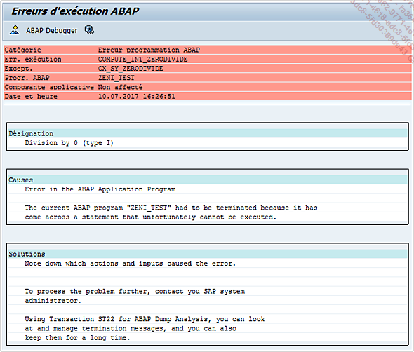

# **TESTS UNITAIRES**

Une fois le [DEVELOPPEMENT](04_Développement.md) terminé, il doit être testé de deux manières :

- **Techniquement**

  Afin de s'assurer qu'il n'y a pas d'erreurs de _syntaxe_ lors de l'exécution du programme.

  Sur **SAP**, cette notion s'appelle un [DUMP](../07_Dump/01_Dump.md) et ne peut pas être détectée lors de la _compilation_ du programme.

  

      Dans la majorité des cas, les descriptions des [DUMPS](../07_Dump/01_Dump.md) sont en anglais ou en allemand.

  Il suffira alors de corriger le problème.

- **Fonctionnellement**

  Ici, il faudra vérifier que les données retournées sont présentes et cohérentes. Il s'agit d'une analyse assez globale respectant la _documentation fonctionnelle_. Toujours dans l'exemple ci-dessus, il suffira de vérifier que les documents de vente retournés aient bien des clients appartenant au pays de l'écran de sélection et/ou que les produits de ces documents soient ceux sélectionnés dans le [SCREEN](../15_Screen/README.md).
