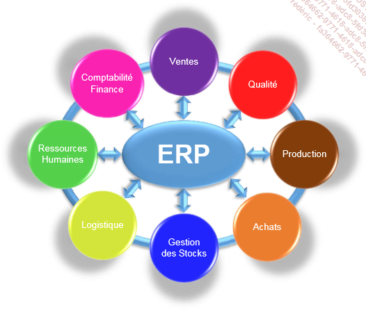
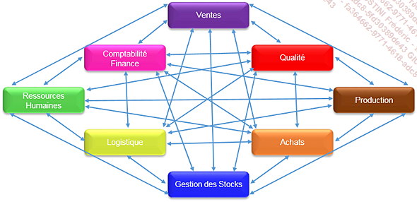
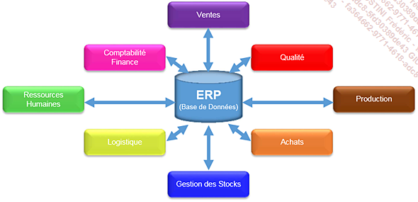

# **SAP**

**SAP** a été créé en Allemagne et son acronyme signifie _Systeme, Anwendungen und Produkte in der Datenverarbeitung_ (ou en anglais _Systems, Applications and Products for data processing_), traduit par _Systèmes, Applications et Produits de traitement de l’information_ en français.

C'est un _Progiciel de Gestion Intégré_ (**PGI** en français ou [ERP]() en anglais pour _Enterprise Ressource Planning_) développé par l'éditeur **SAP AG**. Dans l'informatique de gestion, on tend à favoriser l'emploi d'[ERP]() plutôt que de **PGI**, la suite de ce chapitre utilisera donc le terme en anglais.

Un [ERP]() est un système où les différents _départements_ d'une entreprise peuvent échanger des données entre eux en temps réel. Ainsi, une information délivrée par une entité X pourra être immédiatement captée par l'entité Y. Ces données étant à jour instantanément, il sera plus facile de répondre à une demande d'un _client_, d'un _fournisseur_..., mais aussi grâce à une information fiable et précise, de prendre des décisions stratégiques commerciales primordiales pour la stabilité et le développement de l'entreprise.

Exemple d'une entreprise avec [ERP]() ayant des _départements ventes_, _qualité_, _production_...

Pour bien comprendre l'importance de ce procédé, il serait utile de reprendre l'exemple précédent, mais de le représenter cette fois-ci sans système [ERP]().

Dans un tel schéma, il n'y a pas réellement de cohésion dans le traitement de l'information. Chaque _département_ utilisant un logiciel adapté à ses besoins, la mise à disposition des données d'une entité pour une autre n'est pas sans risques.

Par exemple, un point de vente (qui peut être matérialisé par un magasin de voitures) vend un véhicule à un acheteur. Il emet alors un bon de commande. L'étape suivante est de ressaisir manuellement ces informations par le _département de Comptabilité_ pour l'édition de la facture, puis une ressaisie pour la gestion des stocks et enfin de nouveau par le _département du transport logistique_ pour livraison.

Ce mode de fonctionnement comporte des problématiques : les erreurs de saisie peuvent être fréquentes entraînant comme conséquence une incohérence des données entre les _départements_. Dans l'exemple de la vente de la voiture, les informations de la facture pourraient être différentes de celles du bon de commande. Ainsi, les données pourraient ne pas être correctement actualisées, manquantes, voire redondantes, provoquant de nombreux problème dans la gestion des stocks par exemple, ou encore augmentant la difficulté pour le _département financier_ à clôturer son bilan.

Il serait cependant possible d'installer une interface entre les logiciels de chaque _département_, facilitant ainsi les échanges des données, mais une fois de plus cette solution comporte certains inconvénients. En effet, la manutention sur un des systèmes (mise à jour, correction, remplacement...) pourrait impacter les autres sytèmes des autres _départements_ rendant ainsi chaque opération de ce type assez délicate et fastidieuse.

En reprenant l'exemple précédent, mais cette fois-ci avec un système [ERP](), le schéma de la solution utilisée par l'entreprise serait comme celui indiqué en début de chapitre, à savoir :

Dans ce cas, tout est organisé autour d'un système central sous forme d'une [BASE DE DONNEES](). Les informations traitées sont partagées et accessibles à tous les _départements_, il n'y a plus de risque de données manquantes ou redondantes, elles sont toujours à jour, car saisies une seule fois. Ainsi pour reprendre l'exemple du point de vente, lors d'une [TRANSACTION](../03_Programmation/03_Transactions.md), le _bon de commande_ est saisi une seule fois et est transmis immédiatement aux _départements_ concernés (comptabilité, et gestion des stocks).

Aujourd'hui, de plus en plus d'entreprise utilisent le modèle [ERP]() et dans cette catégorie, **SAP** est le progiciel le plus utilisé.

Présente dans de nombreux pays, il ne cesse de s'accroître en gagnant de plus en plus d'utilisateurs dans le monde avec des solutions adaptées pour les moyennes et grandes entreprises.

De ce fait, le langage _ABAP_ est un langage ayant une position dominante dans l'informatique de gestion.
