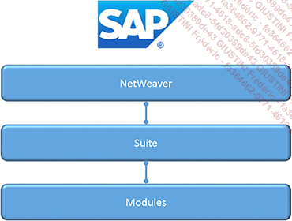

# **ARCHITECTURE**

D'un point de vue simplifié, l'architecture **SAP** peut être représentée de la façon suivante :

Elle est constituée de trois couches :

- [NETWEAVER]() (1ère couche) : plateforme technique représentant l'architecture orientée service (**SOA** en anglais pour _Services Oriented Architecture_)

- La seconde est la suite utilisée regroupant les services de la solution **SAP** définis selon le besoin de l'entreprise

- La troisième couche est celle des modules qui est un sous-ensemble indépendant regroupant fonctionnalités, programmes et base de données.

Plusieurs options techniques existent concernant le [NETWEAVER]() :

- **SAP [NETWEAVER PROCESS INTEGRATION]()** (**PI**) :

  Composant permettant d'améliorer les échanges d'informations entre **SAP** et externes (comme pour les interfaces...)

- **SAP [NETWEAVER BUSINESS WAREHOUSE]()** (**BW**) :

  Est un outil de _reporting_ et d'_analyse des informations_ **SAP** et externes. Il permet d'intégrer et de consolider les données de l'entreprise, et donc de mettre en avant des décisions stratégiques nécessaires par une meilleure organisation des flux et des processus.

- **SAP [NETWEAVER MOBILE]()** :

  offre aux _clients_ et aux _collaborateurs_, un accès à **SAP** grâce à des applications spécialement développées pour les technologies mobiles.

- **SAP [NETWEAVER COMPOSITION ENVIRONMENT]()** (**CE**) :

  Il permet de créer et d'exécuter des applications principalement en **Java**, consultables via un site internet (portal) ou mobile (conjointement avec **SAP Mobile**)

- **SAP [ENTERPRISE PORTAL]()** :

  Grâce à un navigateur web, permet à un utilisateur (_collaborateur_, _client_, _partenaire_...) d'accéder au système **SAP** après authentification (utilisateur/mot de passe)

- **SAP [APPLICTION SERVER]()** ou **SAP [WEB APPLICATION SERVER]()** (**WebAS**)

  qui est le serveur des applications et serveur web pour **SAP**. C'est le composant central de la solution.

Comme presque la totalité des entreprises utilisent cette dernière option, il serait intéressant d'en détailler sa structure. **WebAS**, plus communément désigné comme **SAP Business Suite**, comporte également plusieurs suites :

- **SAP [CRM]()** (**Customer Relationship Management**)

  Soit gestion de la _relation client_, est une solution faite pour les partie commerciale d'une société. Elle met à disposition des équipes vente, par exemple, un outil permettant d'entreprendre, de développer et d'entretenir les relations avec le _clients_ ; le _marketing_ pourra l'utiliser pour aligner les processus marketing sur la stratégie commerciale, et ainsi gérer la demande des _clients_, et augmenter le retour sur investissement.

- **SAP [ERP]()** (**Enterprise Resource Planning**) :

  Comme vu dans la section précédente, permet de centraliser toutes les informations des différents départements d'une entreprise (achats, production...)

- **SAP [PLM](../18_Modules/Module_PLM/README.md)** (**Product LifeCycle Management**) :

  Traduit par **Gestion du cycle de vie des produits**, permet de créer et suivre un produit tout au long de sa vie, de son cahier des charges/conception jusqu'à son obsolescence/remplacement. Il définit aussi son mode de fabrication, de distribution, de stockage...

- **SAP [SCM]()** (**Supply Chain Management**) :

  Ou **Gestion de la chaîne logistique**, a pour but d'augmenter la réactivité du traitement de la _demande client_ (de la plannification de cette demande à la gestion des stocks) en mettant en place un réseau de distribution complexe, mais rapide.

- **SAP [SRM]()** (**Supplier Relationship Management**) :

  est une solution permettant à l'entreprise d'identifier les fournisseurs potentiels selon leur coût, leur capacité de production, les délais de livraison, la garantie de qualité... afin d'optimliser le processus d'approvisionnement.

      L'apprentissage du langage ABAP s'effectuera sur une architecture Web AS avec la solution SAP ERP. Il est temps maintenant de voie la dernière couche de cette architecture : les modules.
