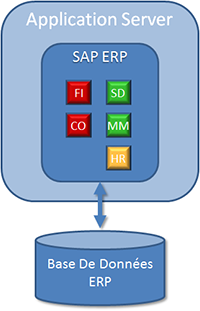

# **MODULES**

Les _modules_ sont des ensembles d'[OBJETS](../14_Classes/01_ABAP_Object/01_ABAP_Object.md) **SAP**, découpés par domaine fonctionnel. Il est possible de distinguer trois grandes familles : _Finance_, Logistique et _Ressources Humaines_.

Des _modules_ dits techniques existent également comme _BASIS_ et bien évidemment _ABAP_.

La suite de ce chapitre donnera un aperçu des _modules_ principaux. Bien entendu, il en existe beaucoup, mais ceux qui seront évoqués sont les plus communs.

### FINANCE

Comme son nom l'indique, elle regroupe toutes les fonctionnalités liées aux _capitaux_ (entrants et sortants)... et est principalement composée des _modules_ suivants :

- [FI](../18_Modules/Module_FI/README.md) comme **Financial** ou **Finance** :

  Il permet de gérer et de représenter toutes les données de la comptabilité générale, fournisseur, client, bancaire...

- [CO](../18_Modules/Module_CO/README.md) pour **Controlling** ou **Contrôle de gestion** :

  Ici, il s'agit de comptabilité analytique et budgétaire comme le contrôle des frais généraux, le contrôle des coûts...

- [TR](../18_Modules/Module_TR/README.md) pour **Treasury** :

  Pour gérer la trésorerie et la gestion financière (paiments...)

- [IM](../18_Modules/Module_IM/README.md) (**Investissements Management**) :

  pour mesurer et gérer les investissements financiers de l'entreprise.

### LOGISTIQUE

Rassemble tous les services liés à l'organisation d'une entreprise (transports, ventes, stocks) dont l'essentiel des _modules_ dont :

- [SD](../18_Modules/Module_SD/README.md) (**Sales and Distribution** - **administration des ventes**) :

  Concerne le secteur de la vente comme la gestion des appels d'offres, les commandes, la facturation, la livraison, et ma détermination des prix.

- [MM](../18_Modules/Module_MM/README.md) (**Material Management**) :

  Gère tout ce qui est en rapport avec le stock et l'approvisionnement : achat, réception de marchandises, inventaires...

- [PP](../18_Modules/Module_PP/README.md) (**Production Planning**) :

  Permet de planifier et de contrôler les activités de la production telles que plannification de la fabrication, vente et production et coput de revient des produits.

- [QM](../18_Modules/Module_QM/README.md) (**Quality Management**) :

  Lié aux _modules_ [PP]() et/ou [MM]() avec contrôle qualité, plannification et plans d'inspection.

- [PM](../18_Modules/Module_PM/README.md) (**Plan Maintenance**) :

  Plannification, traitement, exécution des tâches.

### RH

Enfin la partie **Ressources Humaines** est en vérité un _module_ à lui tout seul, permettant de traiter et gérer les informations liées au domaine RH : données de base du personnel, gestion des salaires, temps de travail, frais de déplacement, etc. Mais aussi gestion des compétences, des séminaires, du recrutement...

    Tous ces modules sont indépendants : ils ont leurs propres programmes, TABLES, FONCTIONS... et agissent comme des fonctionnalités que l'entrepruse peut ou non installer.

### TECHNIQUES

Pour finir, on trouve les _modules_ techniques :

- **BASIS** :

  Regroupant toutes les fonctions de **SAP** (installation d'un serveur **SAP**, gestion de l'espace mémoire, des bases de données...).

- **ABAP** :

  qui concerne donc toute la partie programmation **SAP**.

Ce sont en fait des éléments fondateurs de la plateforme technique **SAP**.

_Exemple d'un système **SAP** simple_

Ce système est composé d'un serveur d'application avec la solution **SAP** [ERP]() relié à sa propre base de données et quelques _modules_ comme [FI](../18_Modules/Module_FI/README.md), [CO](../18_Modules/Module_CO/README.md), [SD](../18_Modules/Module_SD/README.md), [MM](../18_Modules/Module_MM/README.md) et [HR](../18_Modules/Module_HR/README.md).

Cependant, l'[ARCHITECTURE](02_Architecture.md) peut très vitre devenir beaucoup plus complexe lorsque plusieurs plateformes techniques sont installées.

_Exemple d'une architecture plus complexe_

Le serveur d'application est toujours présent sauf que cette fois, il incorpore la solution **SAP** [ERP]() (avec les _modules_ [FI](../18_Modules/Module_FI/README.md), [CO](../18_Modules/Module_CO/README.md), [SD](../18_Modules/Module_SD/README.md), [MM](../18_Modules/Module_MM/README.md) et [HR](../18_Modules/Module_HR/README.md)) avec SAP [SCM]() (et le module [APO]()). Deux autres plateformes techniques ont été installées : [PI]() permettant à **SAP** [ERP]() d'échanger des données avec un système externe (qui peut être basé sur du **Java**, **C++**, **Delphi**...), et [BW]() pouvant communiquer avec **SAP** [ERP]() et **SAP** [SCM]().

Chaque système utilise sa propre base de données (principalement **Oracle**) et ce schéma est encore largement utilisé par une majorité d'entreprises. Sauf que **SAP** a développé sa propre base de données : [HANA]().

[HANA]() est une plateforme de données unique et commune à toutes les solutions **SAP**, pouvant être installé aussi bien sur site (serveur local) qu'en nuage ([CLOUD]()). C'est une base de données en mémoire (**in-memory**) et donc stockée et compressée sur la mémoire vive du système, favorisant ainsi un traitement beaucoup plus rapide des informations et éliminant ainsi l'indexation des données. De plus, cette solution diminue les coûts de maintenance et de gestion.

Ainsi, pour reprandre l'exemple ci-dessus, l'architecture ressemblera à ceci :

La suite de ce cours se basera sur une solution **SAP** [ERP]() (ou **ECC** - **ERP Central Component**) de dernier niveau (**Ehp7** plus précisément) liée à une base de données [HANA]().
