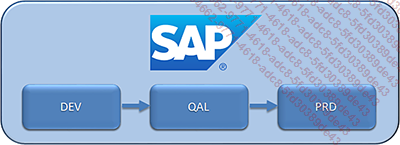
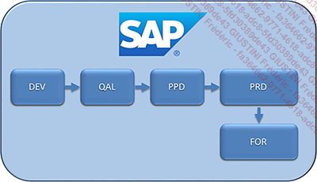
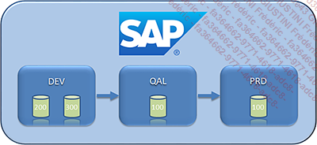
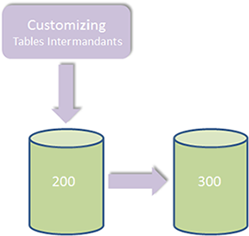
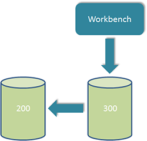

# **MANDANT**

Un _mandant_ (ou _client_) est un identifiant propre à chaque système permettant de diviser les données d’une [BASE DE DONNEES]() entre ces mêmes systèmes.

Pour bien comprendre cette notion, il est nécessaire de continuer l’architecture de **SAP**. Il a été défini dans le chapitre précédent (cf. [02_ARCHITECTURE](../02_Architecture/02_Architecture.md)) que la composition **SAP** pouvait être schématisée en trois couches. Cependant, il existe une autre division entre la suite et les [MODULES](../02_Architecture/03_Modules.md) : les systèmes de connexion. Il s’agit d’une stratégie propre à l’entreprise pour intégrer dans son système les nouveaux développements et les nouvelles données. En règle générale, une suite **SAP ECC** (ou **SAP** [ERP]()) peut être divisée en trois systèmes de connexion :

- Un **système de développement** : pour toute la partie programmation et configuration des données de référence (master data) avec [TESTS UNITAIRES](../01_Programmation/05_Tests_unitaires.md) dont techniques pour s’assurer qu’il n’y ait pas de [DUMP](../07_Dump/01_Dump.md) (cf. [TESTS UNITAIRES](../01_Programmation/05_Tests_unitaires.md)). Ce système a en général peu de données.

- Un **système de qualité** permettant à la partie _fonctionnelle_ d’effectuer des tests plus poussés.

- Un **système de production**, système ultime utilisé par tous les _utilisateurs_ de l’application.

Cependant, certaines entreprises adoptent une _architecture_ système plus complexe pour répondre au mieux aux attentes d’un projet notamment s’il est de niveau international.

_Exemple d’une architecture projet beaucoup plus complexe_

Il s’agit d’une suite **SAP ECC** avec comme système de connexion :

- Un **système de développement** (**DEV**) pour, comme défini plus haut, le développement et la configuration de **SAP**.

- Un **système de qualité** (**QAL**) pour les tests avec plus de données.

- Un **système de pré-production** (**PPD**), identique à la production, s’assurant ainsi que les nouveaux développements ou configurations n’iront pas altérer ceux déjà existants (tests de non-régression).

- Un **système de production** (**PRD**).

- Un **système de formation** (**FOR**), identique à celui de la production afin de, comme son nom l’indique, former les utilisateurs à manipuler **SAP** avec des données issues du système de production.

En détaillant le système de développement, il est possible, en règle générale, d’en dénombrer deux :

- Un **mandant de** [WORKBENCH]() (terme en anglais regroupant tous les objets de développement **ABAP** : [PROGRAMMES](), [FONCTIONS](../13_Fonctions/01_Type.md), [CLASSES](../14_Classes/README.md), [SMARTFORMS](), [TABLES](../09_Tables_DB/01_Tables.md)...).

- Un **mandant de configuration** (ou [CUSTOMIZING]()) pour les données de référence (master data).

Il est bien évidemment possible d’en inclure d’autres comme un mandant de bac à sable, isolé des autres _mandants_ où le _développeur_ ou le _fonctionnel_ peuvent travailler et tester des sujets sensibles sans impacter les autres traitements ; comme il est également possible aussi d’en n’avoir qu’un seul.

L’utilité d’avoir deux _mandants_ réside dans le fait qu’ayant un _client_ consacré, les données peuvent plus facilement être mises à jour par celles de la production et ce, sans altérer les développements en cours.

Aussi, les autres systèmes de connexion en possèdent un seul, car les mises à jour consisteront à tout rafraîchir en même temps ([WORKBENCH]() + [CUSTOMIZING]()).

Pour que la notion de _mandant_ soit la plus complète possible, il est à noter une petite précision concernant le [CUSTOMIZING]() : défini comme la configuration et le paramétrage de **SAP**, il s’agit donc de mettre à jour les [TABLES STANDARDS](../10_Tables_Internes/02_Type_Standard.md) des données de référence de **SAP**.

Cependant, il faut différencier deux types de tables :

- Les **tables de customizing mandant-dépendantes**, c’est-à-dire que lorsqu’une information contenue dans une table de ce type est mise à jour dans le `mandant 200` (comme par exemple les conditions de prix), une action manuelle (représentée par l’écran dans le schéma ci-dessous), est nécessaire afin de la copier sur le _mandant du [WORKBENCH]()_ (`mandant 300`) et ainsi pouvoir être utilisée par un programme _ABAP_.

- Les **tables de customizing intermandants** : pour celles-ci, les données sont copiées automatiquement sur tous les _mandants_ du système de développement.

- Enfin, les **objets du [WORKBENCH]()** ([PROGRAMMES](), [FONCTIONS](../13_Fonctions/01_Type.md)...) sont intermandants et sont copiés automatiquement sur tous les _mandants_ du système de développement.

    Les tables de customizing intermandants ou mandant-dépendantes se différencient par l’utilisation ou non du champ MANDT lors de la création d’une table (cf. Dictionnaire de Données (DDIC) SE11).
