# **CONNEXION**

**SAP** se caractérise par une configuration client/serveur dont la connexion peut se faire de plusieurs façons : via Internet (**SAP** [NETWEAVER MOBILE](), **SAP** [ENTERPRISE MOBILE]()...), ou via un logiciel tiers : le **SAP Logon** et plus récemment **Eclipse**.

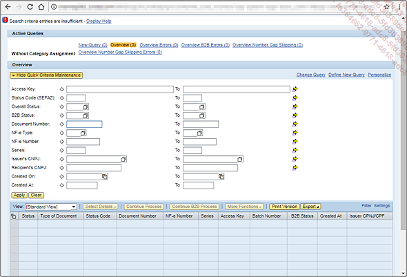

_Exemple avec une fenêtre **SAP** dans un navigateur Internet (type [SAP PORTAL]())_

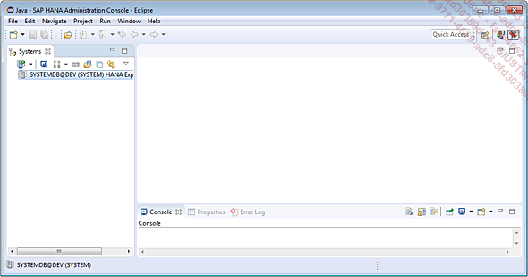

_Exemple de connexion avec **Eclipse**_

    La connexion avec le SAP Logon étant utilisée dans la majorité des cas, la suite utilisera uniquement celle-ci.

Lors de l’ouverture du **SAP Logon**, il est possible de voir la liste des systèmes de connexion installés, comme vu dans la section précédente.

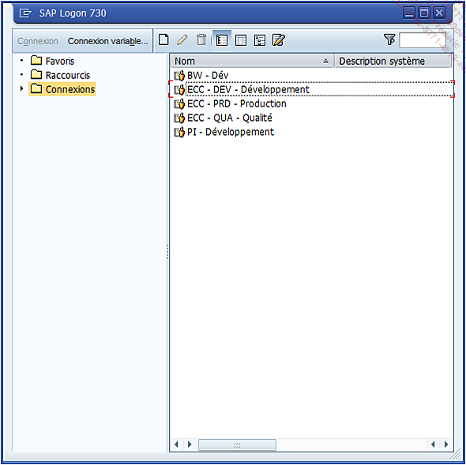

_Exemple d’un **SAP Logon** avec un accès aux systèmes de développement de **BW**, **ECC**, et **PI**, et aux systèmes de qualité et de production de **ECC**_

La fenêtre se divise en trois parties :

- **Volet de droite** : liste toutes les connexions **SAP**.

- **Volet de gauche** : affiche l’_arborescence_ des connexions (organisée en favoris, raccourcis, ou par défaut par connexions avec possibilité de créer des sous-répertoires...).

- **Barre d’outils** dont les actions sont les suivantes :

  - **Connexion** : connexion au système sélectionné dans le volet de droite.

  - **Connexion variable**... : création d’un nouveau système de connexion.

  - **Nouveau**, **Traiter** et **Supprimer** les systèmes de connexion.

  - **Vue Explorateur** : vue par défaut utilisé dans l’exemple ci-dessus.

  - **Vue de liste** : tout lister sans organisation en répertoires et sous-répertoires

  - **Vue arborescente**.

  - **Afficher/Masquer zone de commentaire** : permet de laisser des annotations pour un système.

  - **Zone de recherche/filtre**.

Les propriétés d’une connexion sur **SAP** sont assez simples.

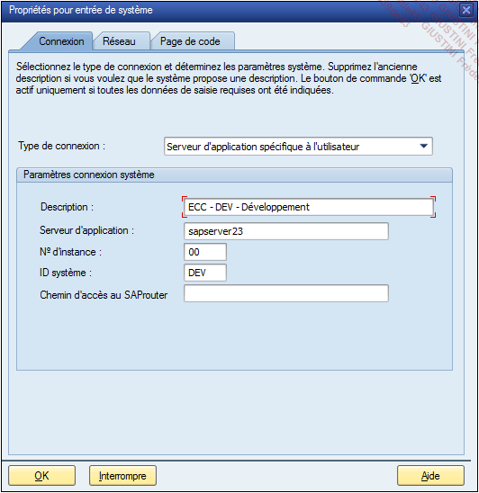

Il y a tout d’abord le **Type de connexion** : **Sélection des groupes/serveurs** utilisés pour des systèmes un peu plus complexes comme celui de la production, ou **Serveur d’application spécifique à l’utilisateur**, le plus utilisé, dont les détails sont les suivants :

- **Description** de la connexion.

- **Serveur d’application** représenté par une adresse IP ou par le nom d’un serveur distant.

- **Numéro d’instance** de **SAP**.

- **Numéro de système** (ces deux derniers paramètres sont définis durant l’installation de SAP pour identifier les différents serveurs d’application).

- **Chemin d’accès du SAP routeur** (champ optionnel), station hôte de connexion, assez peu utilisé, mais dont le principal avantage est de ne pas nécessiter de connexion VPN en parallèle et surtout de bénéficier d’une connexion beaucoup plus rapide.

Le deuxième onglet, **Réseau** regroupe quelques options relatives à la connexion Internet dont la principale **Secure Network Communication** (Sécurisation des Communications de Données ou SNC) est un protocole de sécurité supplémentaire. Pour se connecter à une session **SAP**, il est nécessaire d’avoir un nom d’_utilisateur_ et un _mot de passe_. Grâce à cette option ces identifiants sont aussi vérifiés par un logiciel tiers.

Ainsi, le **SNC** peut être configuré de plusieurs manières :

    1. Sécuriser uniquement l’authentification à SAP.

    2. Détecter et protéger les flux de données entre deux systèmes (Protection de l’intégrité), surtout utilisé lorsqu’un programme externe (sous Java, C++, Delphi...) appelle une fonction RFC sous SAP pour créer, modifier ou supprimer une donnée (cf. 13_Fonctions - Paramètres).

    3. Encrypter tout flux de données entre deux systèmes (Protection de la confidentialité).

    4. Combiner les trois options avec l’option de sécurité maximum (option par défaut).

Aussi, il est possible de ne pas utiliser l’écran de connexion de **SAP**, et de se connecter uniquement et directement avec les identifiants du **SNC** en cochant l’option **Connexion SNC** avec _utilisateur_/_mot de passe_ (**sans Single Sign-On**).

La connexion avec **SNC** se fait très souvent pour le système de production. Cet environnement étant extrêmement sensible, il est primordial de sécuriser au maximum l’authentification et les transferts entre systèmes.

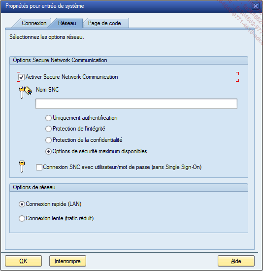

La dernière option, **Options de réseau**, permettra de définir si la vitesse de connexion du réseau est rapide ou lente, indiquant ainsi la nécessité ou non de charger toutes les fonctions relatives au **SAP Logon** (aide à la saisie, menus de navigation différents...).

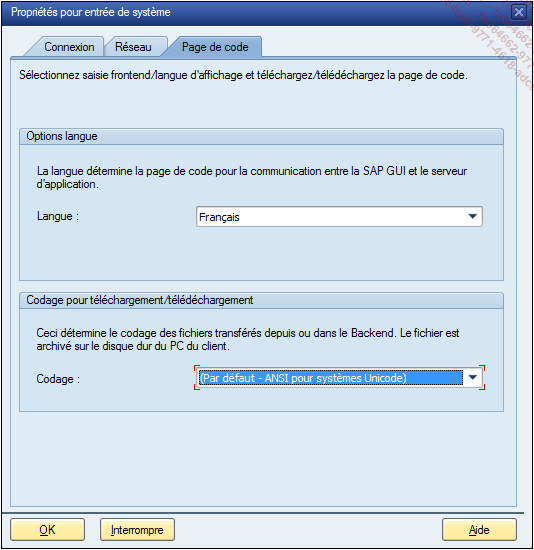

Enfin, le dernier onglet **Page de code** va permettre de définir la langue par défaut de la session **SAP** et le codage utilisé lors de transfert de fichiers.

De retour à la liste des systèmes de connexion, un double clic sur celui de développement par exemple ouvrira une fenêtre **SAP** pour entrer les identifiants.

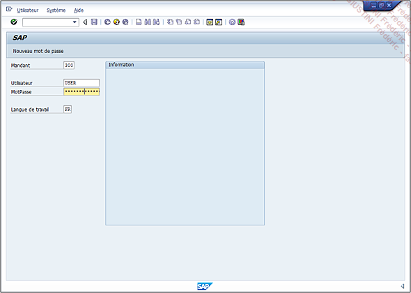

Elle est composée de quatre champs obligatoires :

- **[MANDANT](./01_Mandant.md)**

- **Utilisateur**

- **Mot de passe**

- **Langue de travail**

> Le bouton **Nouveau mot de passe** comme son nom l’indique, permet de modifier l’identifiant de sécurité.

> La barre de menus ainsi que la barre d’outils au-dessus du titre **SAP** ne sont pas utilisables (fonctions grisées ou impossible de les exécuter).

Une fois les champs renseignés s’ouvre la fenêtre d’accueil **SAP**.

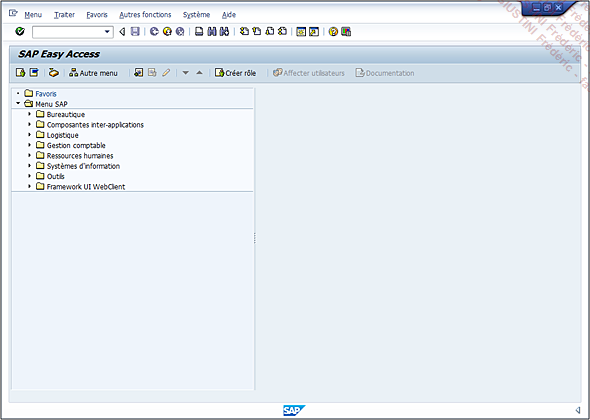

Elle peut être segmentée en plusieurs parties.

Tout en haut se trouve la barre de menus dont les principales fonctions seront développées lors du traitement de la barre d’outils. Ses fonctionnalités sont variables selon les écrans **SAP**, à part les menus **Système** et **Aide**.

Le menu **Système** regroupe toutes les options basiques de **SAP** allant de la création d’une nouvelle fenêtre, à la fermeture de celle-ci en passant par l’affichage des impressions lancées par l’_utilisateur_ (**ordres spool**), les informations du _système de connexion_ (**statut**), le lancement du _débogage_ et les autres utilitaires techniques situés dans la partie Utilitaires...

> Une fonction importante à retenir est située dans le menu **Système - Valeurs utilisateur - Données utilisateur**. Elle regroupe tous les paramètres généraux de l’identifiant (format de la date, de l’heure, décimales, séparateur de milliers...).

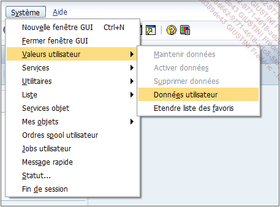

En dessous se situe la barre de commandes, commune à tous les écrans, composée par ces outils :

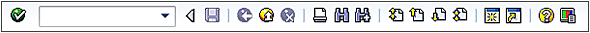

- **Bouton Suite** pour confirmer l’action optée dans la zone de commande.

- **Zone de commande** comme citée précédemment permet de réaliser deux types d’opérations :

  1. Opérations sur les appels de [TRANSACTION](03_Transactions.md) nommées ici par `XXXXX` :

     - **Ouvrir** une [TRANSACTION](03_Transactions.md) dans la même fenêtre (appelée également mode) avec `/N`

       /nxxxxx

     - **Ouvrir** une [TRANSACTION](03_Transactions.md) dans une nouvelle fenêtre ou un nouveau mode avec `/O`

       /oxxxxx

     - **Ouvrir** une [TRANSACTION](03_Transactions.md) dans la même fenêtre sans passer par l’écran initial de la transaction appelée par `/*`, pour connaissance car très peu utilisé

       /\*xxxxx

  2. Opérations sur les [TRANSACTIONS](03_Transactions.md) en cours :

     - **Terminer** la [TRANSACTION](03_Transactions.md) en cours et revenir à la fenêtre d’accueil : `/N`

     - **Ouvrir** la liste de tous les modes en cours (naviguer entre eux, créer ou supprimer) : `/O`

     - **Fermer** la fenêtre en cours : `/I`

     - **Clore** une session : /nend (avec message de confirmation) ou /nex (sans message entraînant une perte de tous travaux en cours non sauvegardés)

     - **Continuer** le traitement en mode debugger : `/H`

- **Flèche** pour masquer ou afficher la zone de commande.

- **Sauvegarde**.

- **Retour arrière** .

- **Fin de session** (retour à l’écran initial de la [TRANSACTION](03_Transactions.md)).

- **Annulation de la session** (retour à la fenêtre d’accueil SAP).

- **Impression**.

- **Rechercher une occurrence**.

- **Continuer à chercher l’occurrence**.

- **Aller à la première page**.

- **Page précédente**.

- **Page suivante**.

- **Aller à la dernière page**.

- **Créer un nouveau mode**.

- **Création d’un raccourci SAP**.

- **Aide générale**.

- **Menu de la configuration des fenêtres SAP** (visualisation, contrôle de volume, langue d’affichage...), et surtout création d’un raccourci.

      La création d’un raccourci SAP va permettre de créer un accès rapide à une transaction, une commande système (/H pour lancer le débugger par exemple), ou un état (comprendre par exécution d’un programme ABAP), en local ou dans la partie Raccourcis du SAP Logon.

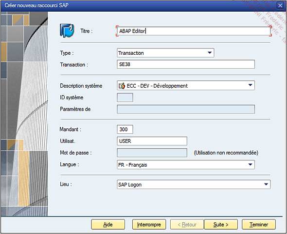

Vient ensuite le titre de l’écran, puis la barre d’outils, propre à chaque [TRANSACTION](03_Transactions.md), qui se présente sous cette forme.

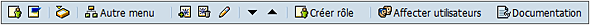

Grâce à elle, il est possible de :

- Basculer entre le **Menu utilisateur** et le **Menu SAP** (modification de l’affichage de l’arborescence).

  **Menu - Menu utilisateur** [Ctrl][F10]

  **Menu - Menu SAP** [Ctrl][F11]

- Accéder à la boîte des e-mails (**SAP Business Workplace** qui ne fonctionne qu’avec les e-mails envoyés sous **SAP** ne permettant donc pas la gestion avec d’autres serveurs de messagerie).

  **Menu - Business Workplace** [Ctrl][F12]

- **Afficher le menu d’un rôle**, ici le rôle est à comprendre comme objet d’autorisation, ainsi il est possible d’afficher dans l’arborescence toutes les [TRANSACTIONS](03_Transactions.md) utilisant un rôle sélectionné.

  **Menu - Afficher menu d’un rôle** [Shift][F5]

- Ajouter une [transaction](03_Transactions.md) comme favori, la supprimer ou la modifier.

  **Favoris - Créer** [Ctrl][Shift][F6]

  **Favoris - Supprimer** [Shift][F2]

  **Favoris - Modifier** [Ctrl][Shift][F3]

- Déplacer le favori sélectionné vers le bas ou vers le haut.

  **Favoris - Déplacer - Vers le haut** [Ctrl][Shift][F1]

  **Favoris - Déplacer - Vers le bas** [Ctrl][Shift][F2]

- **Créer un rôle** / objet d’autorisation.

  **Menu - Créer rôle** [Ctrl][Shift][F12]

- **Affecter un rôle** à un utilisateur.

  **Autres fonctions - Affecter utilisateurs** [Ctrl][Shift][F9]

- Le **documenter** (Documentation).

Tout en bas de l’écran se situe la barre de message, suivie de la barre d’état qui regroupe des informations sur le serveur et la navigation de **SAP** (temps de réponse, délai d’interprétation...).

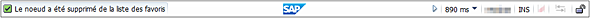

Enfin, la partie centrale de l’écran est le menu utilisateur ou menu **SAP** regroupant toutes les [TRANSACTIONS](03_Transactions.md) du système et pour bien comprendre cette notion, la section suivante va s’y attarder un peu.

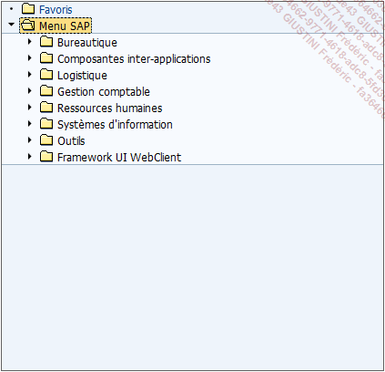
