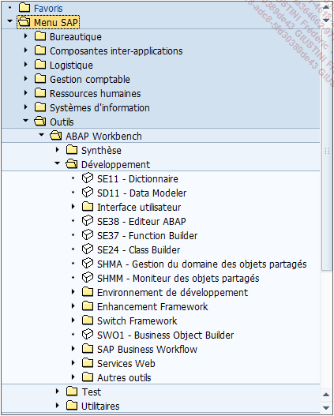
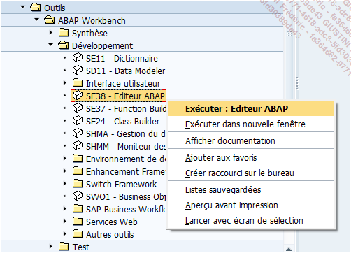
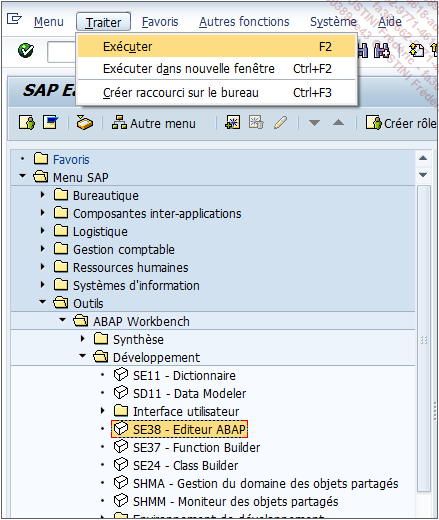
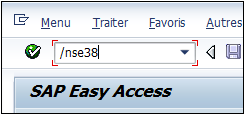

# **TRANSACTIONS**

Comme il a été évoqué dans la section précédente, une [TRANSACTION](../help/01_TCODE.md) (_code de transaction_ ou [TCODE](../help/01_TCODE.md)) est un _identifiant_ **SAP** pour exécuter divers traitements. Ils peuvent être de l’ordre d’une exécution de programme, de l’ouverture d’un éditeur, de la création d’une facture... Il existe des milliers de _transactions_ et elles sont organisées par catégories correspondant aux [MODULES](../02_Architecture/03_Modules.md) ([FI](../18_Modules/Module_FI/README.md), [SD](../18_Modules/Module_SD/README.md), [MM](../18_Modules/Module_MM/README.md)...) dont voici une toute petite liste des plus utilisées (uniquement les fonctionnelles) :

| **t-code** | **Transaction**                                                   |
| ---------- | ----------------------------------------------------------------- |
| `SPRO`     | Transaction pour les fonctionnels (regroupement des paramétrages) |
| `MM01`     | Création de code produit                                          |
| `XD01`     | Création de client                                                |
| `XK01`     | Création de fournisseur                                           |
| `VA01`     | Création de commande client                                       |
| `ME21N`    | Création de commande d'achat                                      |
| `VL01N`    | Création d'une livraison                                          |
| `VF01`     | Création d'une facture                                            |
| `MIRO`     | Facture fournisseur                                               |
| `MIGO`     | Mouvement de stock                                                |
| `SCC1`     | Copie des données entre les mandants                              |

    En règle générale, les transactions se terminant par 01 signifient création, 02 modification et 03 affichage. Ainsi, la VA01 va créer une commande client, VA02 va la modifier et VA03 l’afficher.

Concernant les _transactions_ techniques, il en existe bien évidemment plusieurs et celles qui seront utilisées dans ce livre se situent dans la partie **Menu SAP - Outils - ABAP [WORKBENCH]() - Développement**.

Les plus utilisées seront les suivantes :
s
| **T-CODE** | **Transaction** |
| ------------ | ----------------------------------------------------------------------------------------------------------------------------------------- |
| `SE38` | Editeur ABAP |
| `SE80` | Editeur ABAP |
| `SE11` | [DDIC](../08_SE11/01_SE11.md) - utilisé pour tout ce qui est création et gestion des [DBTAB](../09_Tables_DB/01_Tables.md), structures... |
| `SE37` | Editeur de [FONCTIONS](../13_Fonctions/01_Type.md) |
| `SE24` | Editeur de [CLASSES](../14_Classes/README.md) |
| `SMARTFORMS` | Editeur de [SMARTFORMS]() |
| `SE41` | Editeur de Menu (barre d'outils) |
| `SE51` | Editeur d'Ecran |
| `SE91` | Gestion des [MESSAGES]() |
| `ST22` | [DUMP](../07_Dump/01_Dump.md) listing |
| `SE01` | [ORDRES DE TRANSPORT](05_Ordres_de_Transport.md) listing |

Enfin, quelques _transactions Basis_ sont également à connaître pour débloquer certaines situations :

| **t-code** | **Transaction**                                                                        |
| ---------- | -------------------------------------------------------------------------------------- |
| `SM04`     | User Listing                                                                           |
| `SM12`     | List of blocked entries                                                                |
| `STATS`    | Enregistre et analyse tous les processus lancés, et en cours pour un utilisateur donné |
| `SM37`     | [JOBS]() listing                                                                       |
| `ST05`     | Trace toutes opérations de base de données lors d'une exécution de programme           |
| `STMS`     | Gestion des [ORDRES DE TRANSPORT](05_Ordres_de_Transport.md)                           |

    Petit rappel : comme vu au chapitre 02_Architecture - Les modules, l’équipe Basis s’occupe de tout ce qui est installation des serveurs, performances système, base de données...

Une _transaction_ peut être appelée de plusieurs manières (exemple avec l’appel de l’_éditeur ABAP_ `SE38`\*\*) :

- Via la fenêtre d’accueil, dans le menu **SAP**.

  - Par un double clic sur la ligne de l’éditeur.

  - En affichant les fonctions de l’item et en sélectionnant **Exécuter**.

    

  - Avec le menu déroulant **Traiter - Exécuter** (ou Exécuter dans nouvelle fenêtre).

    

  - Via la zone de commande :

    - **`SE38`** (si l’on se trouve directement dans la fenêtre d’accueil).

    - **`/nSE38`** pour terminer la _transaction_ en cours et en exécuter une nouvelle dans la même fenêtre.

    - **`/oSE38`** ou **`/*SE38`** pour ne pas terminer la _transaction_ en cours et en exécuter une nouvelle dans une autre fenêtre.

    

        L’appel d’une transaction dans la zone de commande peut s’écrire en utilisant les majuscules ou les minuscules, il n’y a aucune incidence de casse.

Maintenant que l’_éditeur ABAP_ est ouvert, il serait intéressant de s’attarder sur la présentation de cet écran pour ensuite programmer les premières lignes de code en _ABAP_.
