# **HELLO WORLD**

En arrivant sur l’_éditeur ABAP_, la barre de menus et la barre d’outils sont différentes. Comme cela a déjà été évoqué auparavant, ces deux composantes de l’écran **SAP** varient selon les [TRANSACTIONS](03_Transactions.md).

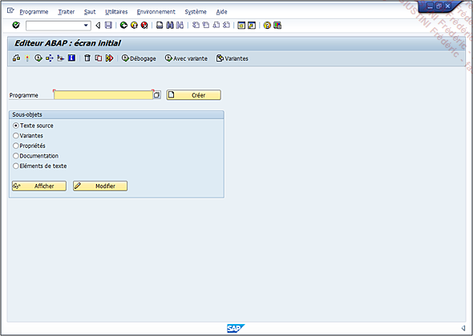

Les fonctionnalités de la barre d’outils de l’_éditeur ABAP_ sont donc les suivantes (de gauche à droite) :


- **Contrôler** le programme et vérifier qu’il n’y ait pas d’erreur de syntaxe. Il est à noter plusieurs contrôles existants, dont les principaux sont :

  - **Contrôle basique** (dit de syntaxe)

  - **Contrôle de programme étendu** (ou via la [TRANSACTION `SLIN`]()) qui permet une vérification plus poussée (chaînes de caractères, instructions obsolètes...)

  - **Code Inspector** vérifiera quant à lui la performance du programme, la sécurité...

  `Programme - Contrôler - Syntaxe` [Ctrl][F2]

- **Activer** le programme (ou le compiler, terme utilisé dans d’autres langages de programmation), le rendant ainsi exécutable et donc prêt à être testé.

  `Programme - Activer` [Shift][F9]

- **Exécuter** le programme et donc le tester. Là aussi il existe une autre option consistant à exécuter un programme en arrière-plan (à planifier ou immédiatement) ce qui signifie que celui-ci sera traité par un job dont le résultat sera disponible grâce à la [TRANSACTION `SM37`]().

  `Programme - Exécuter - Directement` [F8]

- **Cas d’emploi** sert à lister tous les objets utilisant ce programme que ce soit par appel, par référence...

  `Utilitaires - Cas d’emploi` [Ctrl][Shift][F3]

- **Analyse de l’environnement** liste les objets utilisés par le programme. Il peut s’agir de [CLASSES](../14_Classes/README.md), d’[ELEMENTS DE DONNEES](../08_SE11/07_Elements_de_Donnees.md), de [STRUCTURES](../09_Tables_DB/11_Structures.md)...

  `Utilitaires - Analyse de l’environnement` [Shift][F4]

- **Supprimer**...

  `Programme - Supprimer...` [Shift][F2]

- **Copier**...

  `Programme - Copier...` [Ctrl][F5]

- **Renommer**...

  `Programme - Renommer...` [Ctrl][F6]

- **Débogage** exécutera le programme en mode débugger ;

  `Programme - Exécuter - Débogage` [Shift][F5]

- **Exécution avec variante**. Une variante est un procédé permettant d’enregistrer les valeurs d’un écran de sélection (cf. [17_ORGANISATION - VARIANTES](../15_Screen/05_Variantes/README.md)).

  `Programme - Exécuter - Avec variante` [Shift][F6]

- **Variantes** est utilisée pour créer ledit procédé.

  `Saut - Variantes` [Ctrl][F1]

Sous la zone servant à insérer le nom de programme suivi du bouton **Créer** (**Programme - Créer** [F5]) se situe une liste de choix :

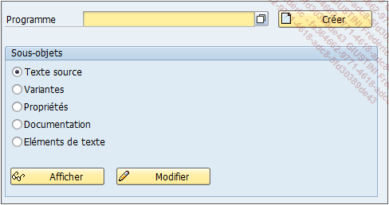

- **Texte Source** pour modifier le code source.

- **Variantes** pour modifier la ou les [VARIANTES](../15_Screen/05_Variantes/README.md) associées au programme.

- **Propriétés** (développé tout de suite après lors de la création du programme).

- **Documentation**

- **Éléments de texte** : regroupe tous les messages, textes... du programme.

      Pour les développements spécifiques ABAP, tous les objets doivent toujours commencer par Z ou Y. Le système SAP bloque toute tentative ne respectant pas cette règle.

Une fenêtre des propriétés du programme apparaît. Plusieurs éléments sont obligatoires, à commencer par le titre (quelconque, pour cet exemple, celui de `Hello World` sera choisi).

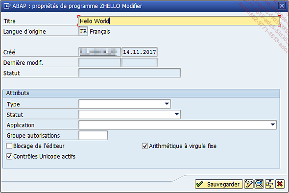

Viennent ensuite les attributs, à commencer par le type de programme. Il y en a bien évidemment plusieurs à savoir :

- **Programme exécutable (1)** : défini comme [REPORT](../16_ALV/01_Report.md) (voir écran suivant) qui peut être appelé directement à partir d’une [TRANSACTION](), via l’_éditeur ABAP_ ([TRANSACTION `SE38`]()) ou par un _programme externe_.

- **Programme Include (I)** : défini comme `INCLUDE`, contient les [ROUTINES](../17_Organisation/01_Organisation_Finale.md) ou les déclarations des [VARIABLES](../04_Variables/01_Variables.md) d’un programme principal. Il est utilisé une fois qu’il a été déclaré via la syntaxe [INCLUDE](../17_Organisation/01_Organisation_Finale.md) (cf. chapitre [17_ORGANISATION]()).

- **Pool de Modules (M)** : définit `PROGRAM`, utilisé lorsqu’un programme peut être composé de plusieurs écrans complexes (un écran principal, un écran résultat, un sous-écran détail...) et ne peut être exécuté qu’à partir d’une [TRANSACTION]() (impossible de l’éxécuter directement via l’_éditeur ABAP_, comme dans la majorité des cas).

- **Groupe de fonctions (F)** : définit `GROUP FUNCTION`, permet de regrouper plusieurs [MODULES FONCTIONS](../13_Fonctions/01_Type.md) sous un programme principal.

- **Pool de sous-programmes (S)** : définit `POOL SS-PROGR.`, contient des [ROUTINES]() de programmes (`FORM`) pouvant être appelées par un programme externe.

- **Pool d’interfaces (J)** : définit le programme comme _interface ABAP_ (cf. chapitre [14_CLASSES - ABAP OBJECT](../14_Classes/01_ABAP_Object/)).

- **Pool de classes (K)** : définit cette fois-ci le programme comme [CLASSE](../14_Classes/README.md) _ABAP_ (cf. chapitre [14_CLASSES - ABAP Objet](../14_Classes/01_ABAP_Object/01_ABAP_Object.md)).

- **TYPE-POOL (T)** : contient des déclarations de [VARIABLES](../04_Variables/01_Variables.md) de type `TYPES` pouvant être appelées par un programme externe.

- **Transformation** (Programme `ST` ou `XSLT` (X)) : permet de _lire_ et/ou de _créer_ des fichiers au format _XML_.

- **Proxy de procédure de base de données (Q)**.

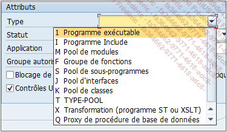

Viennent ensuite trois attributs :

- **Statut**

- **Application**

- **Groupe autorisation**

N’étant pas obligatoires et assez peu utilisés, il n’est pas nécessaire de s’y attarder mais en résumé :

- **Statut** permet de définir de quel genre de programme il s’agit (programme test, système ou pour la production)

- **Application** permet de le catégoriser (gestion des articles, comptabilité analytique...)

- **Groupe d’autorisations**, comme son nom l’indique, authentifie l’_utilisateur_ exécutant le programme afin de vérifier qu’il ait bien les _permissions_ requises pour effectuer cette tâche.

Comme le programme à créer est simple et vise à être exécuté directement via [TRANSACTION](03_Transactions.md) ou _éditeur ABAP_, le type exécutable sera choisi.

Après avoir fait ce choix, deux autres options supplémentaires sont apparues :

- **BD logique** qui contient tout un groupe d’objets (allant de déclarations de [VARIABLES](../04_Variables/01_Variables.md), d’[INCLUDES](../17_Organisation/01_Organisation_Finale.md) jusqu’aux [ECRANS DE SELECTION](../15_Screen/01_Ecran_de_Sélection/README.md))

- **Vers. écran** de sélection pour choisir celui de la **BD** logique à utiliser.

Comme pour les options précédentes, elles seront laissées à blanc.

- l’option **Blocage de l’éditeur** doit être décochée (sinon il serait impossible pour d’autres développeurs de modifier ce programme).

- **Contrôles Unicode actifs et Arithmétique à virgule fixe** doivent rester cochées (cette dernière option contraindrait le développeur à n’utiliser que des nombres entiers).

Au final, l’écran des propriétés devra ressembler à ceci :

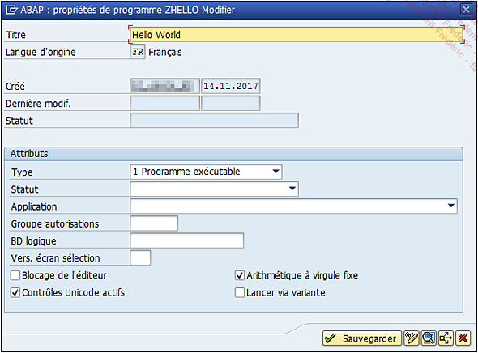

Le chiffre ou la lettre accompagnant les options des attributs est la valeur qu’aura le [CHAMP](../15_Screen/02_Champs/README.md) (`SUBC`) dans la [TABLE](../09_Tables_DB/01_Tables.md) des programmes (`TRDIR`). Cette mise en forme est utilisable dans beaucoup d’autres champs aussi bien techniques que fonctionnels. Pour activer ou désactiver cette option, suivez cette procédure :

1. Dans la barre de commande, cliquez sur **Ajuster mise en forme locale** [Alt][F12].

2. Choisissez **Options**...

   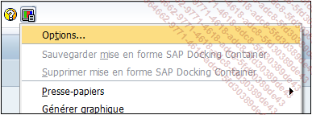

3. La fenêtre **Options SAP GUI** va s’ouvrir et dans l’arborescence de la partie de gauche, ouvrez Conception interaction.

4. Cliquez sur **Visualisation 1**.

5. Enfin, dans la zone de droite, sous-menu **Contrôles**, cochez ou décochez **Afficher clés** dans zones de listes déroulantes.

   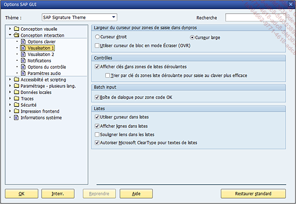

   Une fois toutes les propriétés du programme renseignées, et après avoir cliqué sur **Sauvegarder**, une nouvelle fenêtre apparaît. Cette fois-ci, il sera nécessaire de définir si le programme a pour vocation de rester en local ou s’il devra être transporté dans les systèmes du projet.

   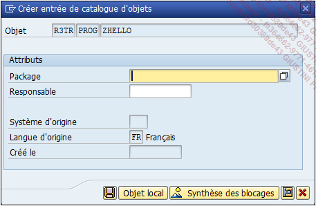

   Que signifie être transporté dans les systèmes du projet ? Il a été établi lors de la section sur le détail du [MANDANT](01_Mandant.md), qu’un projet pouvait avoir plusieurs systèmes : un de _développement_, _qualité_, _pré-production_, _production_... Tous les objets de [WORKBENCH]() comme de [CUZTOMIZING]() sont créés sur celui de _développement_. Afin qu’ils puissent exister sur un système différent, un [ORDRE DE TRANSPORT](05_Ordres_de_Transport.md) est alors créé. Il commence par le nom du _système de développement_ suivi par la lettre `K` puis par une chaîne de six caractères.

   _Exemple_

   `DEVK987213`, `DEVKA43586`

   Un [ORDRE DE TRANSPORT](05_Ordres_de_Transport.md) peut contenir plusieurs objets comme par exemple un développement complet d’une solution avec un programme principal, quatre [INCLUDES](../17_Organisation/01_Organisation_Finale.md), deux créations de [TABLES](../09_Tables_DB/01_Tables.md), une modification de [STRUCTURE](../09_Tables_DB/11_Structures.md), et les objets de texte du programme principal.

   Ainsi, avec la [TRANSACTION `STMS`]() (utilisée par l’_équipe Basis_), il est possible de transporter toute cette solution sur les autres systèmes.

   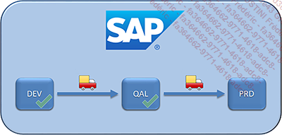

   L’[ORDRE DE TRANSPORT](05_Ordres_de_Transport.md), après avoir été _libéré_ (étape signifiant que toute la solution a été testée sur le _système DEV_ et est prête pour le transport), est copié sur le **système de qualité QAL**. Les _fonctionnels_ vont alors tester la solution puis donner leur validation pour le transport final en **production PRD**.

   Ce cheminement est défini par le _package_ (traduit par _classe de développement_) qui doit être renseigné. Chaque _classe de développement_ spécifie une _route de transport_, mais est aussi utile pour organiser et regrouper les développements :

   _Exemple_

   - **Classe de développement FI** pour tous les programmes standards [FI]() ;

   - **Classe de développement ZFR** pour tous les programmes `Z` d’un pays en particulier ;

   - **Classe de développement ZX** regroupant tous les objets pour un projet `X` ;

   Pour continuer, la **classe de développement ZDEV** sera utilisée pour cet exemple. Il aurait été possible également de le créer en objet local (valeur `&TMP` ou bouton **Objet local**) mais cela impliquerait qu’il ne pourrait pas être transporté sur les autres systèmes.

   Tous les objets techniques (`PROGRAMMES`, [TABLES](../09_Tables_DB/01_Tables.md), [FONCTIONS](../13_Fonctions/01_Type.md)...) créés seront définis en local.

6. Une fois la _classe de développement_ renseignée, une nouvelle fenêtre nous invite à renseigner l’[ORDRE DE TRANSPORT](05_Ordres_de_Transport.md).

   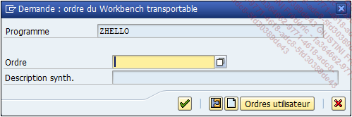

   **SAP** a automatiquement reconnu et défini l’objet pour un ordre de [WORKBENCH]().

7. Ensuite, il suffira de cliquer sur l’icône **Créer ordre** [F8] (icône de la feuille blanche) pour en créer un nouveau, puis sur l’écran suivant, d’en renseigner le libellé sur soixante caractères.

   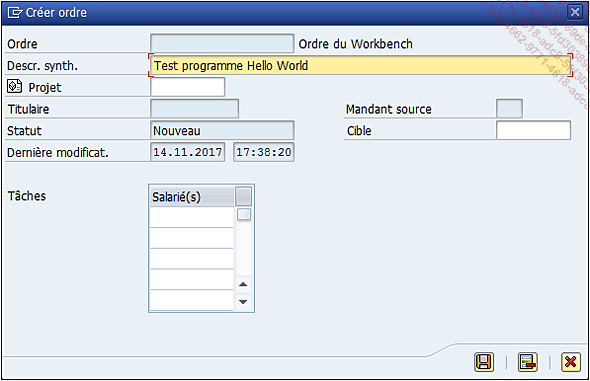

   Une fois cette étape terminée, **SAP** va créer un [ORDRE DE TRANSPORT](05_Ordres_de_Transport.md) avec la description renseignée qui sera finalement affecté au programme.

   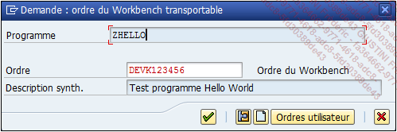

   Il aurait été possible également d’inclure ce programme dans un [ORDRE DE TRANSPORT](05_Ordres_de_Transport.md) existant en cliquant sur le bouton **Ordres utilisateur** (écran de demande d’ordre transportable).

   

   Par un simple double clic, le programme aurait été assigné à un [ORDRE DE TRANSPORT](05_Ordres_de_Transport.md) choisi.

   Maintenant que le programme a été créé, l’_éditeur ABAP_ est ouvert en mode modification. Les premières lignes sont caractérisées par le [CARTOUCHE]() du programme.

   ```JS
   *&--------------------------------------------------------------*
   *& Rapport  ZHELLO
   *&
   *&--------------------------------------------------------------*
   *&
   *&
   *&--------------------------------------------------------------*
   ```

   Non obligatoire et variable selon les _clients_ et les projets, elles regroupent souvent les principales informations d’un programme : auteur, date de création, description brève, date de modification, [ORDRE DE TRANSPORT](05_Ordres_de_Transport.md) associé...

   Comme avec n’importe quel langage de programmation, ce premier programme exécutera le fameux `Hello World`. La ligne suivante sera donc insérée :

   ```JS
   WRITE 'Hello World'.
   ```

   En **ABAP**, chaque syntaxe se termine par un point (.) et non un point-virgule (;) comme dans de nombreux cas.

   Il va falloir vérifier le contenu du programme puis l’`ACTIVER`. Ces options ont déjà été vues dans la présentation de l’écran d’accueil de l’_éditeur ABAP_, mais la barre d’outils ayant changé, quelques fonctionnalités sont à détailler (de gauche à droite) :

   

   - **Ecran précédent** ([Shift][F6]) et **écran suivant** [Shift][F7].

   - **Afficher <-> Modifier** bascule entre les deux modes sans qu’il y ait besoin de repasser par l’écran d’accueil de l’éditeur.

     `Programme - Afficher <-> Modifier` [Ctrl][F1]

   - **Actif <-> Inactif** bascule quant à lui entre les modes _actif_ ou _inactif_. S’il est en cours de développement, le mode _actif_ affichera la dernière version active du programme.

     `Programme - Actif <-> Inactif` [Shift][F8]

   - **Autre objet**... utilisé pour ouvrir un nouveau programme sans repasser par l’écran d’accueil de l’éditeur.

     `Programme - Autre objet...` [Shift][F5]

   - **Étendre** : connu aussi en anglais sous `Enhancement Point`, il s’agit d’insérer des lignes de code dans les programmes standards. Ceux-ci étant totalement bloqués pour modification, **SAP** a néanmoins laissé des espaces utilisables pour apporter quelques modifications ou précisions.

     `Programme - Étendre` [Shift][F4]

   - **Contrôler**

   - **Activer**.

   - **Exécution directe** : même fonction que le bouton Exécuter de l’écran d’accueil de l’éditeur ABAP.

     `Programme - Exécuter - Direct` [F8]

   - **Cas d’emploi**.

   - **Afficher liste d’objets** ouvre un panneau à gauche de l’écran en listant tous les objets liés au programme : [INCLUDES](../17_Organisation/01_Organisation_Finale.md), [ROUTINES](../17_Organisation/01_Organisation_Finale.md), [TRANSACTIONS]()...

     `Utilitaires - Afficher liste d’objets` [Ctrl][Shift][F5]

   - **Afficher fenêtre de navigation** ouvre une petite fenêtre en bas de l’écran avec tous les derniers objets consultés facilitant ainsi la navigation entre ces derniers.

     `Utilitaires - Afficher fenêtre de navigation` [Ctrl][Shift][F4]

   - **Activer/désactiver plein écran** affiche ou masque les deux dernières fonctionnalités (non existant dans les menus déroulants).

   - **Aide à**... affiche une aide **SAP** très complète.

     `Utilitaires - Aide à` [Ctrl][F8]

   - **Définir/supprimer point d’arrêt session** : après avoir sélectionné une ligne puis cette option, une petite icône panneau `STOP` apparaît sur le côté gauche de la ligne. Lorsque le programme s’exécutera et qu’il arrivera à cette ligne marquée, il s’arrêtera pour ouvrir le `DEBUGGER`.

     `Utilitaires - Points d’arrêt - Activer/Supprimer` [Ctrl][Shift][F12]

   - **Définir/supprimer point d’arrêt externe** : fonctionne de la même façon que le `POINT D'ARRET` session sauf qu’il s’agit ici d’un programme externe. Par exemple, lorsque **SAP** fonctionne sous Internet avec **SAP** [PORTAL](), en arrière-plan, des programmes sous **SAP** sont exécutés. Dans ce cas-ci, si le programme doit être analysé en mode [DEBOGGAGE](), il sera nécessaire d’utiliser des [POINT D'ARRET]() externes.

     `Utilitaires - Points d’arrêt utilisateur - Activer/Supprimer point d’arrêt externe` [Ctrl][Shift][F9]

   - **Modèle** est une aide pour certains _objets ABAP_ ([FUNCTIONS](../13_Fonctions/README.md), [CLASSE](../14_Classes/README.md), [METHODES](../14_Classes/03_Méthodes/README.md), [MESSAGES]()...), pour afficher les `PARAMETRES D'ENTREE`, de `SORTIE`, de `TABLES`, `OBLIGATORY` ou `OPTIONAL`, écrire une syntaxe correctement...

     `Traiter - Modèle` [Ctrl][F6]

   - **Pretty Printer** est un outil très utile pour la mise en forme du programme en alignant les [INSTRUCTIONS CONDITIONNELLES](../05_Conditions/README.md), en mettant en majuscules les mots-clés... le rendant ainsi beaucoup plus clair et lisible.

   Comme convenu, le programme va être contrôlé puis activé, et enfin testé en cliquant sur le bouton `Direct` de la barre d’outils ou via la touche raccourci-clavier [F8]. Apparaît maintenant le texte à l’écran :

   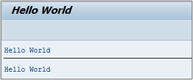
