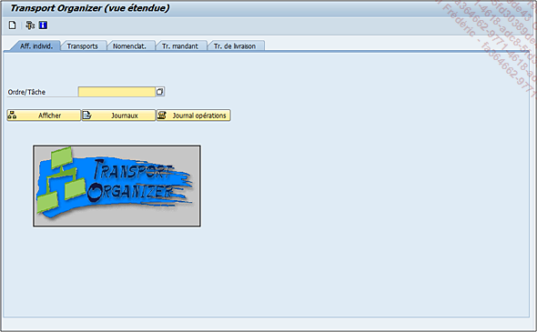
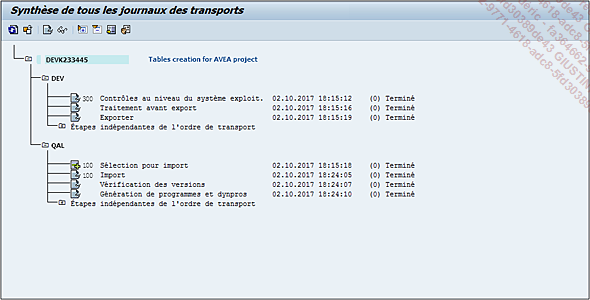
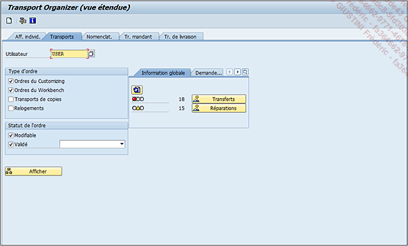
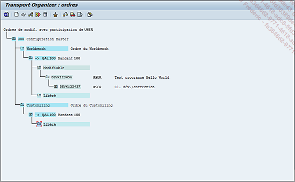
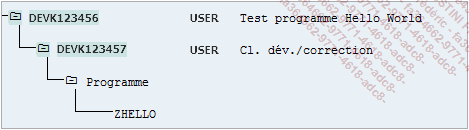
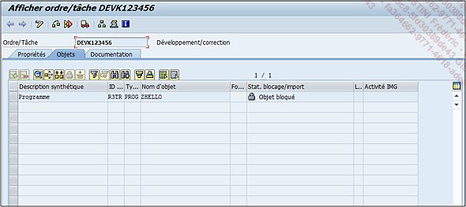

# **ORDRES DE TRANSPORT**

Le programme ayant été activé et testé, il serait intéressant de voir l’_ordre de transport_ associé. Pour ce faire, la [TRANSACTION SE01](03_Transactions.md) est exécutée.

L’écran est composé de cinq onglets, mais seulement les deux premiers vont être vus en détail.

- **Aff. Individ.** (pour affichage individuel) permet de renseigner un _ordre de transport_ connu pour l’afficher, voir son _log de transport_ (**bouton Journaux**), utile lorsque l’_ordre est transporté_ sur les autres systèmes de développement afin de vérifier que tout s’est passé normalement :

  

  Comme indiqué sur l’exemple ci-dessus, l’_ordre de transport_ (_OT_ en abrégé) est passé sur plusieurs systèmes avec, à chaque fois, les étapes nécessaires pour l’_import de l’ordre_, sa _vérification_ et la _génération des programmes_ et `DYNPRO` ([SCREEN](../15_Screen/README.md)). Ces étapes sont valables pour des ordres de [WORKBENCH](), et sont légèrement différentes pour des ordres de [CUSTOMIZING]().

  Enfin Journal opérations qui, comme son nom l’indique, va lister toutes les opérations produites sur l’ordre.

  Pour revenir sur les erreurs de transport, SAP en dénombre quatre sortes :

  | **Code Retour**      | **Erreur**                                                            |
  | -------------------- | --------------------------------------------------------------------- |
  | Code retour 0        | OK                                                                    |
  | Code retour 4        | Warning (alerte), une anomalie est apparue, mais elle est sans danger |
  | Code retour 8        | Erreur durant le processus de transport, action urgente requise       |
  | Code retour 12 et 16 | Erreur système (panne serveur, pb de connexion entre systèmes...)     |

- **Onglet Transports**

  Les écrans finaux étant sensiblement les mêmes, le deuxième onglet sera d’abord détaillé avant de passer à la suite. Celui-ci permet donc de lister tous les _OT_ d’un _utilisateur_ (par défaut, celui de la connexion comme figuré ci-dessous) avec quelques options de filtrage.

  

  Il est possible de dénombrer trois parties principales :

  1. **Type d'ordre** va filtrer sur les différentes catégories de transport, à savoir :

  - **Ordres du** [CUSTOMIZING]()

  - **Ordres du** [WORKBENCH]()

  - **Transports de copies** : ce type d’_OT_ est une sorte de [WORKBENCH]() mais légèrement différent. En effet, alors que ce dernier a pour vocation d’être transporté jusqu’au dernier système à savoir la production, le transport de copies quant à lui, contient la dernière version du programme et un seul système cible (comme la qualité par exemple, afin d’effectuer des tests avec une quantité de données plus significative que ceux du système de développement).

  - **Relogements** : utilisé en général si la _classe de développement_ des objets transportés a été réaffectée.

  2. **Statut de l’ordre** va filtrer le résultat avec les _ordres dits Modifiables_ (en cours de traitement) et/ou _Validés_ (le terme libéré est beaucoup plus utilisé) et/ou _depuis une date choisie_ (Depuis hier, Depuis une semaine, Depuis un mois ou depuis une date choisie).

  3. Une sous-partie composée de deux onglets :

  - **Information globale** donnera un aperçu très rapide des erreurs (voyant rouge) ou des `Warnings` (voyant jaune) qui se sont éventuellement produits pendant le transport des _OT_ de l’utilisateur sur d’autres systèmes avec la possibilité d’en afficher le détail avec les boutons **Transferts** et **Réparations**.

  - Le deuxième sous-onglet **Demandes transport** permet (lorsque l’option est installée, ce qui est assez rare), comme son nom l’indique, de faire une demande de transport directement à l’_équipe Basis_ et d’en assurer son suivi.

Pour la suite, les options ordres de [CUSTOMIZING]() et de [WORKBENCH]() seront cochées ainsi que _Modifiables_ et _Validé_, et le bouton **Afficher** indiquera le résultat.

Une nouvelle fenêtre apparaît, listant donc tous les _ordres de transport_, organisés selon plusieurs critères :

- le **mandant** (200 ou 300)

- le **type d’ordre** ([WORKBENCH]() ou [CUSTOMIZING]())

- le **statut** (Modifiable ou Validé)

Ainsi sous le mandant 300, [WORKBENCH]() et _Modifiable_, se trouve l’_ordre de transport_ récemment créé. Lorsque son arborescence est développée, la tâche apparaît et lorsqu’elle-même est développée, la liste des objets contenus se révèle. Une tâche est donc une sorte de sous-ordre regroupant tous les éléments de l’_OT_. Un _ordre de transport_ peut en contenir une à plusieurs.

Un double clic sur cette tâche en affichera le détail.

Cette nouvelle fenêtre présente une barre d’outils avec les fonctionnalités suivantes :

- **Flèches de navigation**.

- **Afficher <-> Modifier** pour basculer entre le mode modification et affichage au niveau de la tâche, ce bouton est utile pour modifier la liste des objets.

- **Contrôler** : ici pour contrôle la cohérence de l’_ordre de transport_.

  `Ordre/Tâche - Contrôler - Cohérence de l’ordre` [Ctrl][F3]

- **Modifier titulaire**... lorsqu’un programme est modifié par deux développeurs, **SAP** va créer automatiquement une tâche pour chaque développeur pour un même _ordre de transport_ (il n’est pas possible de créer un autre _OT_ s’il en existe déjà un en cours sur l’objet). Il est possible ensuite qu’un des deux développeurs reprenne tout le développement et reprenne donc toutes les tâches à son nom.

  `Ordre/Tâche - Modifier titulaire...` [F5]

- **Libérer** avant de pouvoir transporter un ordre, il faut d’abord _libérer_ sa tâche puis l’**OT** lui-même. Une fois cette étape terminée, l’_équipe Basis_ peut effectuer le transport sur les autres systèmes via la [TRANSACTION STMS](../22_Transactions/TCODE_STMS.md) (impossible sinon) .

  `Ordre/Tâche - Libérer` [Shift][F8]

- **Afficher liste d’objets** qui, comme pour l’_éditeur ABAP_, va afficher l’_ordre de transport_ dans une arborescence.

  `Utilitaires - Afficher liste d’objets` [Ctrl][Shift][F5]

- **Afficher fenêtre de navigation**

  `Utilitaires - Afficher fenêtre de navigation` [Ctrl][Shift][F4]

- **Activer/Désactiver plein écran** (non existant dans les menus déroulants)

- **Manuel en ligne**

  `Saut - Manuel en ligne` [Ctrl][F8]

Ces trois dernières options ont la même fonction que dans l’_éditeur ABAP_.

Dans la partie principale de l’écran, on retrouve un onglet avec les propriétés de la tâche (date de création...) et un deuxième où se trouve la liste des objets contenus dans l’_OT_ (_Objets_). On y retrouve pour chaque ligne :

- Une **Description** synthétique

- Une **identification de programme**, généralement égale à `R3TR` pour **objet global** ou `LIMU` pour **sous-objet de développement**.

  | **ID Prog.** | **Type d'objet** | **Description**      |
  | ------------ | ---------------- | -------------------- |
  | R3TR         | PROG             | Programme ABAP       |
  | R3TR         | DOMA             | Domaine              |
  | R3TR         | DTEL             | Elément de données   |
  | LIMU         | TABD             | Structures et Tables |
  | LIMU         | FUNC             | Fonction             |
  | R3TR         | CLAS             | Classe               |
  | LIMU         | METH             | Méthode              |
  | LIMU         | DYNP             | Dynpro               |
  | ...          | ...              | ...                  |

- **Type d’objet** (voir tableau ci-dessus).

  Liste des différents types d’objets avec leur identification

- **Fonction**, qui pour un objet concernant le contenu d’une table de [CUSTOMIZING]() par exemple, est représentée par un raccourci vers les données insérées, modifiées ou supprimées de ladite table.

- **Statut de blocage/import** car chaque objet contenu dans l’ordre est bloqué dans celui-ci, ce qui signifie que si un deuxième développeur veut modifier un programme bloqué dans un ordre, il ne pourra pas créer son propre _OT_, mais devra utiliser l’ordre courant et donc créer une nouvelle tâche comme décrit un peu avant.

- **Langue** qui doit être utilisée pour l’objet (rarement renseignée).

- L’**Activité IMG** : concerne la configuration de **SAP** et donc des ordres de [CUSTOMIZING]() avec une référence de l’activité exécutée dans la [TRANSACTION SPRO](../22_Transactions/TCODE_SPRO.md).

      Le bouton Modifier donne la possibilité d’ajouter manuellement des objets à la liste, ce qui n’est pas vraiment recommandé ou sinon le faire avec beaucoup de précaution.

Pour terminer, l’onglet **Documentation** permet au développeur ou au fonctionnel d’insérer des commentaires propres à la tâche ou à l’_OT_.

Au niveau de l’ordre en lui-même, on retrouve principalement les mêmes fonctionnalités. La différence ici est que le bouton **Modifier** permet juste de modifier le _titre_ de l’ordre.
