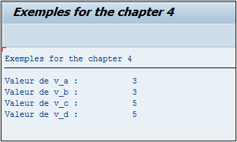

# **OPERATIONS ARITHMETIQUES**

Comme dans tout langage de programmation, les [VARIABLES](./01_Variables.md) numériques (`N`, `I`, `P`...) peuvent être utilisées dans des _opérations arithmétiques_.

## `=` / `MOVE ... TO`

Tout d’abord, pour assigner une valeur à une [VARIABLE](./01_Variables.md), les instructions `MOVE` ou égal `=` sont utilisées.

```JS
DATA: V_A(2) TYPE I,
      V_B(2) TYPE I,
      V_C(2) TYPE I,
      V_D(2) TYPE I.

V_A = 3.
V_B = V_A.

MOVE 5   TO V_C.
MOVE V_C TO V_D.

WRITE:/ 'Valeur de v_a : ', V_A,
      / 'Valeur de v_b : ', V_B,
      / 'Valeur de v_c : ', V_C,
      / 'Valeur de v_d : ', V_D.
```

Quatre variables ont été créées :

- `V_A`
- `V_B`
- `V_C`
- `V_D`

toutes de type entier `I` avec une longueur d’une seule position. Tout d’abord, la valeur `3` sera assignée par un égal `=` à la [VARIABLE](./01_Variables.md) `V_A`, puis la [VARIABLE](./01_Variables.md) `V_B` prendra la valeur de `V_A`.

Dans un deuxième temps, l’instruction `MOVE` va commencer par attribuer la valeur `5` à `V_C`, puis la valeur de `V_C` à `V_D`. Elles sont enfin toutes affichées démontrant ainsi le rôle de chacune de ces instructions.



    Avec le MOVE aussi, il est possible de simplifier son écriture.

```JS
MOVE: 5   TO v_c,
      v_c TO v_d.
```

## **OPERATEURS ARITHMETIQUES**

_Bien évidemment, d’autres opérations existent :_

| **OPERATIONS** | **SIGNE** | **MOTS-CLES**          |
| -------------- | --------- | ---------------------- |
| EGAL           | `=`       | `MOVE`                 |
| ADDITION       | `+`       | `ADD... TO...`         |
| SOUSTRACTION   | `-`       | `SUBSTRACT... FROM...` |
| MULTIPLICATION | `*`       | `MULTIPLY... BY...`    |
| DIVISION       | `/`       | `DIVIDE... BY...`      |

Ainsi

- l’_addition_ se fera avec le signe `+` ou l’instruction `ADD... TO...`

- la _soustraction_ avec le signe `-` ou `SUBSTRACT... FROM...`

- la _multiplication_ avec `*` ou `MULTIPLY... BY...`

- la _division_ avec `/` ou `DIVIDE... BY...`

Les expressions mathématiques sont beaucoup plus utilisées car plus lisibles et beaucoup moins contraignantes que les instructions.

## `+` / `ADD... TO...`

```JS
DATA: v_a(2) TYPE I.

v_a = 5 + 2.
ADD 7 TO v_a.
```

## `-` / `SUBSTRACT... FROM...`

```JS
DATA: v_a(2) TYPE I,
      v_b(2) TYPE I.

v_a = 5 + 2.
v_b = v_a - 3.
SUBTRACT 3 FROM v_b.
```

## `*` / `MULTIPLY... BY...`

```JS
DATA: v_a(2) TYPE I,
      v_b(2) TYPE I,
      v_c(2) TYPE I.

v_a = 5 + 2.
v_b = v_a - 3.
v_c = v_a * v_b.
MULTIPLY v_c BY 2.
```

## `/` / `DIVIDE... BY...`

```JS
DATA: v_a(2) TYPE I,
      v_b(2) TYPE I,
      v_c(2) TYPE I,
      v_d(2) TYPE I.

v_a = 5 + 2.
v_b = v_a - 3.
v_c = v_a * v_b.
v_d = v_c / 2.
DIVIDE v_d BY 7.
```
