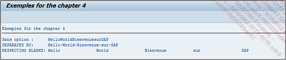

# **CONCATENATE**

```JS
CONCATENATE [ {dobj1 dobj2 ...} | {LINES OF itab} ]
            INTO result
            [IN {BYTE|CHARACTER} MODE]
            [SEPARATED BY sep]
            [RESPECTING BLANKS].
```

## `CONCATENATE`

permet de concaténer plusieurs chaînes de caractères définies par `dobj1`, `dobj2…` ou les lignes d’une [TABLE INTERNE](../10_Tables_Internes/README.md) `LINES OF itab`, et de stocker le résultat dans une [VARIABLE](./01_Variables.md) cible définie après le `INTO`.

_Paramètre(s) supplémentaire(s) optionnel(s) :_

- `IN BYTE MODE` ou `IN CHARACTER MODE`, est un paramètre qui revient assez souvent en `ABAP`. La valeur par défaut sera toujours `IN CHARACTER MODE`. `IN BYTE MODE` est le plus souvent utilisé lors d’un travail avec des [VARIABLES](./01_Variables.md) de type hexadécimal, autant dire assez rarement.

- `SEPARATED BY` renseigne le caractère de séparation entre les chaînes de caractères dans la [VARIABLE](./01_Variables.md) résultat.

- `RESPECTING BLANKS` affiche la chaîne complète y compris les espaces. Par exemple, si la [VARIABLE](./01_Variables.md) de sortie est définie comme une chaîne de caractères de vingt positions, mais que le résultat du `CONCATENATE` est seulement un texte de cinq, le `RESPECTING BLANKS` affichera le texte de cinq caractères puis quinze espaces. Ce procédé est utilisé pour l’envoi de fichiers plats à des banques par exemple et dont le nombre de colonnes de chaque cellule est nécessaire pour être compris et pris en compte par leur système.

_L’exemple suivant démontre bien les différentes possibilités du `CONCATENATE` :_

```JS
CONSTANTS: C_TXT1(20) TYPE C VALUE 'Hello',
           C_TXT2(20) TYPE C VALUE 'World',
           C_TXT3(20) TYPE C VALUE 'Bienvenue',
           C_TXT4(20) TYPE C VALUE 'sur',
           C_TXT5(20) TYPE C VALUE 'SAP'.

DATA: V_RESULT1(50)  TYPE C,
      V_RESULT2(50)  TYPE C,
      V_RESULT3(100) TYPE C.

CONCATENATE C_TXT1 C_TXT2 C_TXT3 C_TXT4 C_TXT5
  INTO V_RESULT1.

CONCATENATE C_TXT1 C_TXT2 C_TXT3 C_TXT4 C_TXT5
  INTO V_RESULT2
  SEPARATED BY ' '.

CONCATENATE C_TXT1 C_TXT2 C_TXT3 C_TXT4 C_TXT5
  INTO V_RESULT3
  RESPECTING BLANKS.

WRITE:/ 'Sans option :     ', V_RESULT1,
      / 'SEPARATED BY:     ', V_RESULT2,
      / 'RESPECTING BLANKS:', V_RESULT3.
```

Cinq [CONSTANTES](./02_Constants.md) de type chaîne de caractères sont créées avec une longueur de vingt positions à chaque fois. Les textes suivants leur sont attribués : `Hello`, `World`, `Bienvenue`, `sur`, et `SAP`. Puis trois [VARIABLES](./01_Variables.md) sont à leur tour déclarées, de type chaîne de caractères également avec une longueur de cinquante positions pour `V_RESULT1` et `V_RESULT2` et de cent pour `V_RESULT3`.

Le premier `CONCATENATE` n’utilisera aucune option afin de se rendre compte de ce que cette instruction effectue seule sans paramètre de mise en forme.

Le deuxième fera la même chose sauf qu’un indicateur de séparation `-` sera défini avec l’option `SEPARATED BY`. Le résultat devra donc donner une chaîne de caractères avec des tirets entre chaque mot.

Enfin le troisième `CONCATENATE` utilisera l’option `RESPECTING BLANKS` affichant ainsi un résultat avec tous les mots séparés par de nombreux espaces.

Les `WRITE` en fin de programme pourront confirmer ce qui vient d’être avancé :


