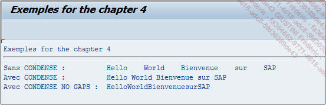

# **CONDENSE**

```JS
CONDENSE TEXT [NO-GAPS].
```

## `CONDENSE`

Cette instruction est très souvent utilisée avec le `CONCATENATE` car elle sépare chaque chaîne de caractères par un `[SPACE]`, en supprimant tous ceux en trop.

_Paramètre(s) supplémentaire(s) optionnel(s) :_

- `NO-GAPS` qui supprime absolument tous les espaces et va donc regrouper tous les mots de la chaîne de caractères.

_L’exemple suivant permet d’éclaircir le rôle du `CONDENSE`._

```JS
CONSTANTS: C_TXT1(20) TYPE C VALUE 'Hello    ',
           C_TXT2(20) TYPE C VALUE '    World    ',
           C_TXT3(20) TYPE C VALUE '    Bienvenue    ',
           C_TXT4(20) TYPE C VALUE '    sur    ',
           C_TXT5(20) TYPE C VALUE '    SAP    '.

DATA:      V_RESULT(50)   TYPE C .

CONCATENATE C_TXT1 C_TXT2 C_TXT3 C_TXT4 C_TXT5
  INTO V_RESULT.

WRITE:/ 'Sans CONDENSE :         ', V_RESULT.

CONDENSE V_RESULT.
WRITE:/ 'Avec CONDENSE :         ', V_RESULT.

CONDENSE V_RESULT NO-GAPS.
WRITE:/ 'Avec CONDENSE NO GAPS : ', V_RESULT.
```

Les cinq [VARIABLES](./01_Variables.md) du programme précédent sont reprises sauf que pour l’exercice, des espaces ont été rajoutés. Dans un premier temps, l’instruction `CONCATENATE` va être utilisée, stockée dans la [VARIABLE](./01_Variables.md) `V_RESULT` et affichée. Ensuite, un `CONDENSE` seul sera effectué sur `V_RESULT` puis affiché et enfin un `CONDENSE...NO-GAPS` sera utilisé pour modifier et afficher la [VARIABLE](./01_Variables.md). Le résultat est le suivant :



Le `CONCATENATE` va grouper les [VARIABLES](./01_Variables.md) `C_TXT*` en laissant des espaces, puis le `CONDENSE` va supprimer tous ceux qui sont en trop en gardant juste celui de séparation, et enfin le `NO-GAPS` va tous les supprimer.
