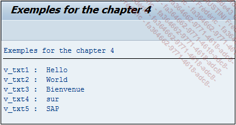

# **SPLIT**

```JS
SPLIT dobj
  AT sep
  INTO { {result1 result2 ...} | {TABLE itab} }
  [IN {BYTE|CHARACTER} MODE].
```

## `SPLIT`

Un `SPLIT` permet de faire l’inverse du [CONCATENATE](./04_Concatenate.md) : il va séparer une chaîne de caractères `dobj` selon le code séparateur défini après le `AT` et stocker le résultat dans des [VARIABLES](./01_Variables.md) de sortie (`result1`, `result2...`) ou dans une [TABLE INTERNE](../10_Tables_Internes/README.md) `itab`.

_Paramètre(s) supplémentaire(s) optionnel(s) :_

- `IN BYTE MODE` ou `IN CHARACTER MODE`, est un paramètre qui revient assez souvent en `ABAP`. La valeur par défaut sera toujours `IN CHARACTER MODE`. `IN BYTE MODE` est le plus souvent utilisé lors d’un travail avec des [VARIABLES](./01_Variables.md) de type hexadécimal, autant dire assez rarement.

```JS
DATA: V_TXT1(20) TYPE C,
      V_TXT2(20) TYPE C,
      V_TXT3(20) TYPE C,
      V_TXT4(20) TYPE C,
      V_TXT5(20) TYPE C.

CONSTANTS: C_STRING(50) TYPE C VALUE 'Hello World Bienvenue sur SAP'.

SPLIT C_STRING
  AT space
  INTO V_TXT1 V_TXT2 V_TXT3 V_TXT4 V_TXT5.

WRITE:/ 'V_TXT1 : ', V_TXT1,
      / 'V_TXT2 : ', V_TXT2,
      / 'V_TXT3 : ', V_TXT3,
      / 'V_TXT4 : ', V_TXT4,
      / 'V_TXT5 : ', V_TXT5.
```

Cette fois-ci, la [CONSTANTE](./02_Constants.md) `C_STRING` contenant une chaîne de caractères de plusieurs mots séparée par un espace, va être divisée et stockée dans les [VARIABLES](./01_Variables.md) `V_TXT\*`. Après exécution, l’écran affiche le résultat suivant :



    Dans la nouvelle version de SAP, il est possible de déclarer les variables directement dans l’instruction. Ainsi l’exemple précédent peut être réécrit de la manière suivante :

```JS
CONSTANTS: C_STRING(50) TYPE c VALUE 'Hello World Bienvenue sur SAP'.

SPLIT C_STRING AT space
      INTO DATA(V_TXT1)
           DATA(V_TXT2)
           DATA(V_TXT3)
           DATA(V_TXT4)
           DATA(V_TXT5).
```

**SAP** va automatiquement créer les [VARIABLES](./01_Variables.md) `V_TXT1`, `V_TXT2`, `V_TXT3`, `V_TXT4`, et `V_TXT5` de type `STRING`. De même pour le résultat dans une [TABLE INTERNE](../10_Tables_Internes/README.md), **SAP** va en créer une de type `STRING` également.

```JS
CONSTANTS: C_STRING(50) TYPE C VALUE 'Hello World Bienvenue sur SAP'.

SPLIT C_STRING AT space INTO TABLE DATA(tab_result).
```

Cette [TABLE INTERNE](../10_Tables_Internes/README.md) aura une liste de champs de type `STRING`.
