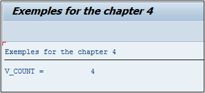
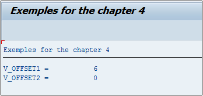
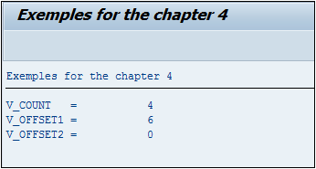
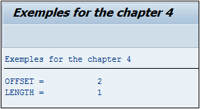

# **FIND**

```JS
FIND [ {FIRST OCCURRENCE} | {ALL OCCURRENCES} OF ] pattern
     IN [section_of] dobj
     [IN {BYTE|CHARACTER} MODE]
     [ {RESPECTING | IGNORING} CASE]
     [MATCH COUNT mcnt]
     { { [MATCH OFFSET moff] [MATCH LENGTH mlen] } | [RESULTS result_tab|result_wa] }.
```

## `FIND`

L’instruction `FIND` recherche une chaîne de caractères modèle `pattern` dans une chaîne de caractères source `IN` `dobj`.

_Deux options sont possibles :_

- soit chercher toutes les occurrences `ALL OCCURRENCES` et stocker le résultat dans une [TABLE INTERNE](../10_Tables_Internes/README.md) `result_tab`

- soit uniquement la première `FIRST OCCURRENCE` et stocker le résultat dans une [STRUCTURE](../10_Tables_Internes/01_Tables_Internes.md) `result_wa`.

_Paramètre(s) supplémentaire(s) optionnel(s) :_

- `IN BYTE MODE` ou `IN CHARACTER MODE`, est un paramètre qui revient assez souvent en `ABAP`. La valeur par défaut sera toujours `IN CHARACTER MODE`. `IN BYTE MODE` est le plus souvent utilisé lors d’un travail avec des [VARIABLES](./01_Variables.md) de type hexadécimal, autant dire assez rarement.

- `RESPECTING`/`IGNORING CASE` indique si la casse de la chaîne de caractères doit être respectée. Par défaut, si cette option n’est pas renseignée, `RESPECTING CASE` est automatiquement choisie.

- `MATCH COUNT` compte le nombre d’occurrences trouvées et sera toujours égal à 1 si l’option `FIRST OCCURRENCE` est choisie.

- `MATCH OFFSET` indique la dernière position du caractère modèle trouvée dans la chaîne source dans le cas du `ALL OCCURRENCES`, sinon ce sera la première position. La position des caractères commence à `0`.

- `MATCH LENGTH` retourne la longueur de la chaîne de caractères modèle. Utiliser le dernier exemple n’est pas très significatif car la longueur de `A` est de 1 mais s’il s’agit d’un cas complexe avec des [VARIABLES](./01_Variables.md) dont les valeurs ne sont pas connues et attribuées dynamiquement, cette option serait utile.

- `RESULTS` est soit une [STRUCTURE](../10_Tables_Internes/01_Tables_Internes.md) contenant le résultat du `REPLACE` `FIRST OCCURRENCE` soit une table `ALL OCCURRENCES` Elle est aussi de la forme `MATCH_RESULT` contenant les [CHAMPS](../15_Screen/02_Champs/README.md) `OFFSET` et `LENGTH`

Si l’option du résultat n’est pas indiquée (dans le cas du `FIRST OCCURRENCE`), la [variable système SY-FDPOS](../help/02_SY-SYSTEM.md) est renseignée, contenant la position dans la chaîne source où a été trouvé le modèle.

_Exemple_

```JS
DATA: V_COUNT TYPE I,
      V_TEXT  TYPE string.

V_TEXT = 'ABADAFAX'.
FIND ALL OCCURRENCES OF 'A' IN V_TEXT MATCH COUNT V_COUNT.

WRITE: 'V_COUNT = ', V_COUNT.
```

La [VARIABLE](./01_Variables.md) `V_COUNT` contiendra la valeur `4`.



- `MATCH OFFSET` indique la dernière position du caractère modèle trouvée dans la chaîne source dans le cas du `ALL OCCURRENCES`, sinon ce sera la première position. La position des caractères commence à `0`.

  _Exemple_

  ```JS
  DATA: V_OFFSET1 TYPE I,
        V_OFFSET2 TYPE I,

        V_TEXT    TYPE STRING.

  V_TEXT = 'ABADAFAX'.

  FIND ALL OCCURRENCES OF 'A' IN V_TEXT MATCH OFFSET V_OFFSET1.
  FIND FIRST OCCURRENCE OF 'A' IN V_TEXT MATCH OFFSET V_OFFSET2.

  WRITE:  'V_OFFSET1 = ', V_OFFSET1,
        / 'V_OFFSET2 = ', V_OFFSET2.
  ```

  Les [VARIABLES](./01_Variables.md) `V_OFFSET1` et `V_OFFSET2` contiendront respectivement les valeurs 6 et 0.

  

  Dans une chaîne de caractères, la première position est `0`, ainsi dans cet exemple, le premier `A` se trouve à la position `0`, soit tout au début, et le dernier à la position `6`. Les [VARIABLES](./01_Variables.md) `V_OFFSET1` et `V_OFFSET2` contiendront respectivement les valeurs `6` et `0`.

- `MATCH LENGTH` retourne la longueur de la chaîne de caractères modèle. Utiliser le dernier exemple n’est pas très significatif car la longueur de `A` est de 1 mais s’il s’agit d’un cas complexe avec des [VARIABLES](./01_Variables.md) dont les valeurs ne sont pas connues et attribuées dynamiquement, cette option serait utile.

- `RESULTS` est soit une [STRUCTURE](../10_Tables_Internes/01_Tables_Internes.md) contenant le résultat du `REPLACE FIRST OCCURRENCE`, soit une table `ALL OCCURRENCES`. Elle est aussi de la forme `MATCH_RESULT` contenant les [CHAMPS](../15_Screen/02_Champs/README.md) `OFFSET` et `LENGTH`

  Petit aparté concernant les résultats : comme pour le `SPLIT`, il est possible de déclarer les [VARIABLES](./01_Variables.md) dans l’instruction. Ainsi les exemples ci-dessus seront de la forme :

  ```JS
  DATA: V_TEXT TYPE STRING.

  V_TEXT = 'ABADAFAX'.

  FIND ALL OCCURRENCES  OF 'A' IN V_TEXT
       MATCH COUNT DATA(V_COUNT).

  FIND ALL OCCURRENCES  OF 'A' IN V_TEXT
       MATCH OFFSET DATA(V_OFFSET1).

  FIND FIRST OCCURRENCE OF 'A' IN V_TEXT
       MATCH OFFSET DATA(V_OFFSET2).

  WRITE: /'V_COUNT   = ', V_COUNT,
         /'V_OFFSET1 = ', V_OFFSET1,
         /'V_OFFSET2 = ', V_OFFSET2.
  ```

  Les [VARIABLES](./01_Variables.md) `V_COUNT`, `V_OFFSET1`, et `V_OFFSET2` seront créées comme un nombre de type `entier`.

  

- `IN section... of...` permet de restreindre la chaîne de caractères cible `dobj` à une partie définie par l’option `OFFSET` (position de départ) et/ou `LENGTH` (longueur de la chaîne cible à partir de la gauche).

  _Exemple_

  ```JS
  DATA V_TEXT TYPE STRING.

  V_TEXT = 'ABADAFAX'.
  FIND FIRST OCCURRENCE OF 'A'
       IN SECTION OFFSET 2 LENGTH 4 OF V_TEXT
       RESULTS DATA(S_RESULT).

  WRITE: /'OFFSET = ', S_RESULT-OFFSET,
         /'LENGTH = ', S_RESULT-LENGTH.
  ```

  Va chercher la première occurrence de la lettre `A` dans la chaîne de caractères cible `ABADAFAX` restreinte à partir de la deuxième position et d’une longueur de quatre positions, soit `ADAF`.

  
