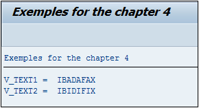
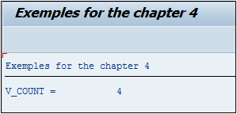
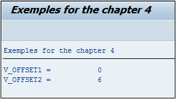

# **REPLACE**

```JS
REPLACE [ {FIRST OCCURRENCE} | {ALL OCCURRENCES} OF] pattern
        IN [section_of] dobj
        WITH new
        [IN {BYTE | CHARACTER} MODE]
        [ {RESPECTING | IGNORING} CASE ]
        [REPLACEMENT COUNT rcnt]
        { { [REPLACEMENT OFFSET roff] [REPLACEMENT LENGTH rlen] } | [RESULTS result_tab|result_wa] }.
```

## `REPLACE`

L’instruction `REPLACE` est identique au [FIND](./07_Find.md) sauf qu’au lieu de chercher uniquement une chaîne de caractères, elle va aussi la remplacer par une autre `WITH new`. Elle possède aussi les options `FIRST OCCURRENCE` (chercher et remplacer la première occurrence trouvée), et `ALL OCCURRENCES` (chercher et remplacer toutes les occurrences trouvées).

_Exemple_

```JS
DATA: V_TEXT1 TYPE STRING,
      V_TEXT2 TYPE STRING.

V_TEXT1 = V_TEXT2 = 'ABADAFAX'.

REPLACE FIRST OCCURRENCE OF 'A' IN V_TEXT1 WITH 'I'.
REPLACE ALL OCCURRENCES  OF 'A' IN V_TEXT2 WITH 'I'.

WRITE: /'V_TEXT1 = ', V_TEXT1,
       /'V_TEXT2 = ', V_TEXT2.
```

La [VARIABLE](./01_Variables.md) `V_TEXT1` aura comme valeur `IBADAFAX` alors que `V_TEXT2` sera égal à `IBIDIFIX`.



_Paramètre(s) supplémentaire(s) optionnel(s) :_

- `IN section... of...` comme pour le `FIND` permet de restreindre la chaîne de caractères cible `dobj` à une partie définie par l’option `OFFSET` (position de départ) et/ou `LENGTH` (longueur de la chaîne cible à partir de la gauche).

- `IN BYTE MODE` ou `IN CHARACTER MODE`, est un paramètre qui revient assez souvent en `ABAP`. La valeur par défaut sera toujours `IN CHARACTER MODE`. `IN BYTE MODE` est le plus souvent utilisé lors d’un travail avec des [VARIABLES](./01_Variables.md) de type hexadécimal, autant dire assez rarement.

- `RESPECTING`/`IGNORING CASE` indique si la casse de la chaîne de caractères doit être respectée. Par défaut, si cette option n’est pas renseignée, `RESPECTING CASE` est automatiquement choisie.

- `REPLACEMENT COUNT` compteur du nombre de remplacements effectués.

_Exemple_

```JS
DATA: V_TEXT TYPE STRING.

V_TEXT = 'ABADAFAX'.

REPLACE ALL OCCURRENCES OF 'A' IN V_TEXT WITH 'I'
        REPLACEMENT COUNT DATA(V_COUNT).

WRITE: 'V_COUNT = ', V_COUNT.
```

La valeur contenue dans la [VARIABLE](./01_Variables.md) `V_COUNT` (créée comme nombre entier) sera égale à `4` et `V_TEXT` aura la nouvelle valeur `IBIDIFIX`.



- `REPLACEMENT OFFSET` renvoie la dernière position modifiée par le `REPLACE` dans la chaîne de caractères source.

_Exemple_

```JS
DATA: V_TEXT1 TYPE STRING,
      V_TEXT2 TYPE STRING.

V_TEXT1 = V_TEXT2 = 'ABADAFAX'.

REPLACE FIRST OCCURRENCE OF 'A' IN V_TEXT1 WITH 'I' REPLACEMENT OFFSET
DATA(V_OFFSET1).

REPLACE ALL OCCURRENCES  OF 'A' IN V_TEXT2 WITH 'I' REPLACEMENT OFFSET
DATA(V_OFFSET2).

WRITE: /'V_OFFSET1 = ', V_OFFSET1,
       /'V_OFFSET2 = ', V_OFFSET2.
```

La [VARIABLE](./01_Variables.md) `V_OFFSET1` aura la valeur `0` étant donné que la première occurrence se situe en tout début de chaîne et donc à la position `0`, alors que `V_OFFSET2` aura comme valeur `6`.



- `REPLACEMENT LENGTH` : comme pour le `MATCH LENGTH` de l’instruction `FIND` cette option retourne la longueur de la chaîne de caractères modèle.

- `RESULTS` est soit une [STRUCTURE](../10_Tables_Internes/01_Tables_Internes.md) contenant le résultat du `REPLACE` `FIRST OCCURRENCE` soit une table `ALL OCCURRENCES` Elle est aussi de la forme `MATCH_RESULT` contenant les [CHAMPS](../15_Screen/02_Champs/README.md) `OFFSET` et `LENGTH`
