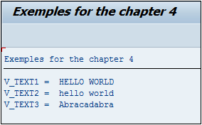

# **TRANSLATE**

```JS
TRANSLATE text {TO {UPPER | LOWER} CASE} | {USING mask}.
```

## `TRANSLATE`

Permet de convertir la casse d’une chaîne de caractères (tout en majuscules `UPPER CASE` ou tout en minuscules `LOWER CASE`) ou bien de convertir la chaîne selon un schéma défini dans un masque.

_Exemple_

```JS
DATA: V_TEXT1 TYPE STRING,
      V_TEXT2 TYPE STRING,
      V_TEXT3 TYPE STRING.

V_TEXT1 = V_TEXT2 = 'Hello World'.
V_TEXT3 = 'Barbcbdbarb'.

TRANSLATE V_TEXT1 TO UPPER CASE.
TRANSLATE V_TEXT2 TO LOWER CASE.

TRANSLATE V_TEXT3 USING 'ABBAabba'.

WRITE: /'V_TEXT1 = ', V_TEXT1,
       /'V_TEXT2 = ', V_TEXT2,
       /'V_TEXT3 = ', V_TEXT3.
```

Trois [VARIABLES](./01_Variables.md) ont été définies, toutes de type `STRING` : les deux premières contiennent le texte `Hello World` alors que la troisième est égale à `Barbcbdbarb`.

Le premier `TRANSLATE` va modifier `V_TEXT1` et aura comme valeur `HELLO WORLD`.

Le deuxième `TRANSLATE` va modifier `V_TEXT2` qui aura comme valeur `hello world`.

Le troisième `TRANSLATE` va utiliser le masque `ABBAabba` sur la [VARIABLE](./01_Variables.md) `V_TEXT3`. Le masque a la logique suivante (il est nécessaire pour comprendre de prendre par paquet de deux lettres) :

- Lorsque la lettre `A` est rencontrée, la changer pour `B`.

- Lorsque la lettre `B` est rencontrée, la changer pour `A`.

- Lorsque la lettre `a` est rencontrée, la changer pour `b`.

- Lorsque la lettre `b` est rencontrée, la changer pour `a`.

Ainsi, suivant cette logique, le texte `V_TEXT3` aura comme valeur finale `Abracadabra`.


