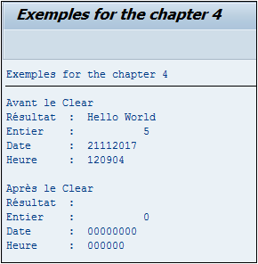

# **CLEAR**

```JS
CLEAR dobj.
```

## `CLEAR`

Instruction commune à tous les types de [VARIABLES](./01_Variables.md) (chaîne de caractères, numérique...) qui permet tout simplement de supprimer leur contenu.

Cet exemple permet de faire un `CLEAR` sur des [VARIABLES](./01_Variables.md) de différents types et de les afficher. Il permet de voir également les valeurs par défaut de chaque type.

```JS
DATA: V_RESULT(50) TYPE C,
      V_INT(5)     TYPE I,
      V_DATE       TYPE D,
      V_HOUR       TYPE T.

V_RESULT = 'Hello World'.
V_INT    = 5.
V_DATE   = SY-DATUM.
V_HOUR   = SY-UZEIT.

WRITE:/ 'Avant le Clear'.
WRITE:/ 'Résultat  : ', V_RESULT.
WRITE:/ 'Entier    : ', V_INT.
WRITE:/ 'Date      : ', V_DATE.
WRITE:/ 'Heure     : ', V_HOUR.

CLEAR: V_RESULT,
       V_INT,
       V_DATE,
       V_HOUR.

WRITE:/.
WRITE:/ 'Après le Clear'.
WRITE:/ 'Résultat  : ', V_RESULT.
WRITE:/ 'Entier    : ', V_INT.
WRITE:/ 'Date      : ', V_DATE.
WRITE:/ 'Heure     : ', V_HOUR.
```


