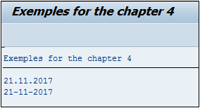

# **REORGANISER**

```JS
Variable[+pos](nbre)
```

## `CONCATENATE +X(Y)`

Afin de pouvoir `extraire` ou `réorganiser` une chaîne de caractères, cette instruction permet de faire une sélection à partir d’une position `pos` sur un nombre de caractères définis `nbre`

La date [SY-DATUM](../help/02_SY-SYSTEM.md) sur **SAP** adopte le format `AAAAMMJJ` Comment faire afin qu’elle réponde au schéma `JJ-MM-AAAA`. Pour ceci, l’instruction [CONCATENATE](./04_Concatenate.md) sera également utilisée.

_Exemple_

```JS
DATA: V_DATE(10) TYPE C.

CONCATENATE SY-DATUM+6(2)
            SY-DATUM+4(2)
            SY-DATUM(4) INTO V_DATE SEPARATED BY '-'.

CONDENSE V_DATE NO-GAPS.

WRITE:/ SY-DATUM,
      / V_DATE.
```

Une variable `V_DATE` est déclarée de type chaîne de caractères de dix positions afin de pouvoir stocker la date finale, puis la date système [SY-DATUM](../help/02_SY-SYSTEM.md) sera travaillée de la façon suivante :

- `SY-DATUM+6(2)` : à la sixième position, prendre deux caractères afin d’obtenir le jour.

- `SY-DATUM+4(2)` : à la quatrième position, prendre deux caractères afin d’extraire le mois.

- `SY-DATUM(4)` : prendre les quatre premiers caractères pour l’année.

Tout ceci sera concaténé [CONCATENATE](./04_Concatenate.md) `INTO V_DATE` avec `SEPARATED BY -`, puis par précaution, tous les espaces seront retirés (`CONDENSE... NO-GAPS`).

_Le résultat final ressemblera au format espéré :_



Pour rappel, la première position d’une chaîne de caractères commence toujours par 0 !
