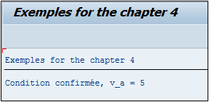
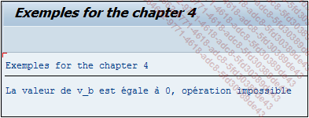

# **IF ... ENDIF**

```JS
IF log_exp1.
  [statement_block1]
[ELSEIF log_exp2.
  [statement_block2]]
...
[ELSE.
  [statement_blockn]]
ENDIF.
```

## `IF`

L’instruction `IF` est une condition permettant de contrôler et de comparer une [VARIABLE](../04_Variables/01_Variables.md) selon une valeur ou une autre [VARIABLE](../04_Variables/01_Variables.md), et d’exécuter un traitement si la condition est vraie.

_Exemple_

```JS
DATA: V_A TYPE I,
      V_B TYPE I,
      V_C TYPE I.

V_B = 3.
V_C = 2.

V_A = V_B + V_C.

IF V_A = 5.
  WRITE:/ 'Condition confirmée, v_a = 5'.
ENDIF.
```

Trois [VARIABLES](../04_Variables/01_Variables.md) ont été créées, `V_A`, `V_B` et `V_C` de type entier. `V_B` prend la valeur `3`, `V_C`, la valeur `2`, quant à `V_A` elle est la somme de `V_B` et `V_C`. Vient ensuite une condition, comparant la variable `V_A` avec la valeur `5`. Si cette condition est valide, le texte `Condition confirmée, v_a = 5` sera affiché.



L’[OPERATEUR DE COMPARAISON](./01_Operateurs_de_Comparaison.md) de cette condition est le signe égal (`=`) mais d’autres existent également sur **SAP**.

## `DUMP`

Il a été vu que l’exécution d’un programme pouvait s’arrêter brutalement et retourner un [DUMP](../07_Dump/01_Dump.md) dû à une division par zéro par exemple.

_Exemple d’un code retournant un [DUMP](../07_Dump/01_Dump.md) lors de l’exécution :_

```JS
DATA: V_A      TYPE I,
      V_B      TYPE I,
      V_RESULT TYPE I.

V_A = 5.
V_B = 0.

V_RESULT = V_A / V_B.
WRITE V_RESULT.
```

Trois [VARIABLES](../04_Variables/01_Variables.md) de type entier ont été créées : `V_A`, `V_B` et `V_RESULT`. La [VARIABLE](../04_Variables/01_Variables.md) `V_A` va contenir la valeur `5` alors que `V_B` sera égale à `0`. La division `V_A` par `V_B` sera ensuite exécutée et stockée dans la [VARIABLE](../04_Variables/01_Variables.md) `V_RESULT`, qui sera par la suite affichée.

Pour éviter que le programme s’arrête brutalement en [DUMP](../07_Dump/01_Dump.md), il suffira de tester la valeur de `V_B` et de s’assurer qu’elle soit strictement supérieure à `0`. Un `ELSE` sera également ajouté afin d’afficher un message d’erreur si la condition n’est pas respectée.

```JS
DATA: V_A      TYPE I,
      V_B      TYPE I,
      V_RESULT TYPE I.

V_A = 5.
V_B = 0.

IF V_B > 0.
  V_RESULT = V_A / V_B.
  WRITE V_RESULT.
ELSE.
  WRITE 'La valeur de v_b est égale à 0, opération impossible'.
ENDIF.
```



## `ELSEIF`

La condition `IF` peut intégrer une variante avec le `ELSEIF` pouvant par exemple tester les différentes valeurs de la [VARIABLE](../04_Variables/01_Variables.md) `V_MONTH` contenant le mois de la [DATE SYSTEME SY-DATUM](../help/02_SY-SYSTEM.md), et afficher un texte adéquat :

```JS
DATA V_MONTH TYPE I.

V_MONTH = SY-DATUM+4(2).

IF V_MONTH = 1.
  WRITE:/'C''est le mois de janvier'.
ELSEIF V_MONTH = 2.
  WRITE:/'C''est le mois de février'.
ELSEIF V_MONTH = 3.
  WRITE:/'C''est le mois de mars'.
ELSEIF V_MONTH = 4.
  WRITE:/'C''est le mois d''avril'.
ELSEIF V_MONTH = 5.
  WRITE:/'C''est le mois de mai'.
ELSE.
  WRITE:/'Autre mois de l''année'.
ENDIF.
```


