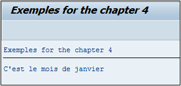

# **AND & OR**

## `AND` / `OR`

Plusieurs conditions peuvent également être testées en même temps grâce au `AND` et `OR`.

_Test sur le mois et le jour pour afficher un texte correspondant :_

```JS
DATA: V_MONTH TYPE i,
      V_DAY   TYPE i.

V_MONTH = SY-DATUM+4(2).
V_DAY   = SY-DATUM+6(2).

IF V_MONTH = 12 OR V_MONTH = 1 OR V_MONTH = 2.
  WRITE:/'C''est l''hiver'.
ELSEIF V_MONTH = 3 OR V_MONTH = 4 OR V_MONTH = 5.
  WRITE:/'C''est le printemps'.
ELSEIF V_MONTH = 6 OR V_MONTH = 7 OR V_MONTH = 8.
  WRITE:/'C''est l''été'.
ELSEIF V_MONTH = 9 OR V_MONTH = 10 OR V_MONTH = 11.
  WRITE:/'C''est l''automne'.
ENDIF.

IF V_MONTH = 1 AND V_DAY = 1.
  WRITE:/'Bonne année'.
ElSEIF V_MONTH = 12 AND V_DAY = 25.
  WRITE:/'Joyeux Noël'.
ELSEIF V_MONTH = 5 AND V_DAY = 1.
  WRITE:/'Bonne fête du travail'.
ELSE.
  WRITE:/'Bonne journée'.
ENDIF.
```

Deux [VARIABLES](../04_Variables/01_Variables.md) `V_MONTH` et `V_DAY` sont créées prenant en compte le mois et le jour de la [DATE SYSTEME SY-DATUM](../help/02_SY-SYSTEM.md). Un premier groupe de conditions va d’abord tester le mois en cours :

- Si le mois est égal à `12`, ou `1` ou `2`, afficher le texte `C’est l’hiver`.

- Sinon s’il s’agit des mois `3`, ou `4` ou `5`, afficher `C’est le printemps`

- Pour `6`, ou `7` ou `8`, afficher `C’est l’été`.

- Et enfin pour les mois `9`, ou `10` ou `11`, afficher le message `C’est l’automne`.

Un deuxième groupe de conditions va tester le mois de l’année et le jour :

- Si le mois est égal à `1` et que le jour est égal à `1` également, afficher `Bonne année`.

- Si le mois de l’année est égal à `12` et le jour à `25`, afficher `Joyeux Noël`.

- Enfin pour le mois `5` et le jour `1`, afficher `Bonne fête du travail`.

- Sinon le programme affichera le texte `Bonne journée`.

Pour la date du test exécuté, le résultat aperçu à l’écran sera le suivant.


