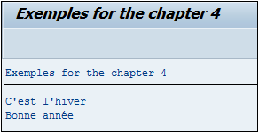

# **CONTAINS ONLY**

## `CO`

`CO` signifie en anglais `Contains Only` et vérifie que la chaîne de caractères `oper1` contient seulement celle contenue dans `oper2`.

```JS
IF oper1 CO oper2.
  ...
ENDIF.
```

_Exemple_

```JS
DATA: c_oper1 TYPE CHAR5 VALUE 'Hello',
      c_oper2 TYPE CHAR5 VALUE 'Hello'.
IF c_oper1 CO c_oper2.
  WRITE:/ 'c_oper1 contient la chaîne de caractères ', c_oper2, ' à la position ', SY-FDPOS.
ELSE.
  WRITE:/ 'c_oper1 ne contient pas la chaîne de caractères ', c_oper2.
ENDIF.
```

Deux [CONSTANTES](../04_Variables/02_Constants.md) `c_oper1` et `c_oper2` ont été créées contenant la valeur `Hello`. Une condition va ensuite vérifier que `c_oper1` contient seulement la chaîne de caractères contenue dans `c_oper2`. Dans ce cas, un message sera retourné indiquant la position du dernier caractère de `c_oper2` trouvée dans `c_oper1`, à savoir `5`, et stocké dans la [VARIABLE SYSTEME SY-FDPOS](../help/02_SY-SYSTEM.md). Si la chaîne de caractères de `c_oper2` est légèrement différente (égale à `Hell` par exemple) alors la condition n’est pas remplie et le programme retournera le message contenu dans le `ELSE`.


