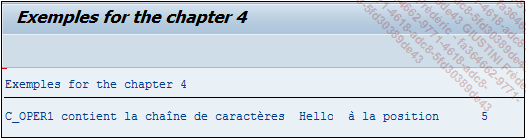

# **CONTAINS NOT ONLY**

## `CN`

`CN` signifie en anglais `Contains Not only` et au contraire de [CO](./04_Contains_Only.md), vérifie que la chaîne de caractères `oper1` n’est pas uniquement composée de celle contenue dans `oper2`.

```JS
IF oper1 CN oper2.
  ...
ENDIF.
```

_Exemple_

```JS
DATA: c_oper1 TYPE CHAR5 VALUE 'Hello',
      c_oper2 TYPE CHAR5 VALUE 'Hell'.

IF c_oper1 CN c_oper2.
  WRITE:/ 'c_oper1 contient la chaîne de caractères ', c_oper2, 'à la position ', SY-FDPOS.
ELSE.
  WRITE:/ 'c_oper1 ne contient pas la chaîne de caractères ', c_oper2.
ENDIF.
```

L’exemple précédent est repris en modifiant la valeur de la constante `c_oper2` pour `Hell`. Dans ce cas, avec l’opérateur `CN`, le programme trouve la chaîne de caractères recherchée et renvoie sa position dans la [VARIABLE SYSTEME SY-FDPOS](../help/02_SY-SYSTEM.md) de la même manière que pour le `CO`, à savoir la dernière position trouvée dans la constante `c_oper1`, ici égale à `4`.


