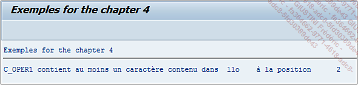

# **CONTAINS ANY**

## `CA`

`CA` signifie en anglais ` Contains Any` et vérifie que la chaîne de caractères `oper1` contient un quelconque caractère de `oper2`.

```JS
IF oper1 CA oper2.
  ...
ENDIF.
```

_Exemple_

```JS
DATA: c_oper1 TYPE CHAR5 VALUE 'Hello',
      c_oper2 TYPE CHAR3 VALUE 'llo'.

IF c_oper1 CA c_oper2.
  WRITE:/ 'c_oper1 contient au moins un caractère contenu dans ', c_oper2, '
à la position ', SY-FDPOS.
ELSE.
  WRITE:/ 'c_oper1 ne contient aucun caractère contenu dans ', c_oper2.
ENDIF.
```

L’exemple précédent est repris en modifiant la valeur de la [CONSTANTE](../04_Variables/02_Constants.md) `c_oper2` pour `’llo’`. Dans ce cas, la condition va vérifier qu’au moins un caractère de la chaîne de `c_oper1` soit contenu dans `c_oper2` puis en retournera sa première position dans la [VARIABLE SYSTEME SY-FDPOS](../help/02_SY-SYSTEM.md), ici égale à 2.


