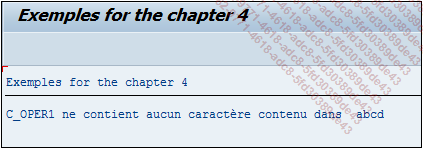

# **NOT ANY**

## `NA`

`NA` signifie en anglais `contains Not Any` et au contraire de [CA](./06_Contains_Any.md), vérifie que `oper1` ne contient aucun caractère contenu dans `oper2`.

```JS
IF oper1 NA oper2.
  ...
ENDIF.
```

_Exemple_

```JS
DATA: c_oper1 TYPE CHAR5 VALUE 'Hello',
      c_oper2 TYPE CHAR4 VALUE 'abcd'.

IF c_oper1 NA c_oper2.
  WRITE:/ 'c_oper1 ne contient aucun caractère contenu dans ', c_oper2.
ELSE.
  WRITE:/ 'c_oper1 contient au moins un caractère contenu dans le texte ', c_oper2.
ENDIF.
```

L’exemple précédent est repris en modifiant la valeur de la constante `c_oper2` pour `abcd`. Dans ce cas, avec l’opérateur `NA`, le programme vérifie qu’aucun caractère n’est contenu dans la constante `c_oper2` et retourne le message correspondant.


