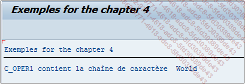

# **CONTAINS STRING**

## `CS`

`CS` signifie en anglais `Contains String` et recherchera dans la chaîne de caractères `oper1`, celle de `oper2`.

```JS
IF oper1 CS oper2.
  ...
ENDIF.
```

_Exemple_

```JS
DATA: c_oper1 TYPE CHAR11 VALUE 'Hello World',
      c_oper2 TYPE CHAR5  VALUE 'World'.

IF c_oper1 CS c_oper2.
  WRITE:/ 'c_oper1 contient la chaîne de caractères ', c_oper2.
ELSE.
  WRITE:/ 'c_oper1 ne contient pas la chaîne de caractères ', c_oper2.
ENDIF.
```

Ici, la constante `c_oper1` contient la chaîne de caractères `Hello World` et `c_oper2`, `World`. La condition vérifiera que `c_oper1` contient la chaîne de caractères contenue dans `c_oper2` et en retournera le message correspondant.



    Il est possible et plus facile d’utiliser la commande FIND vue précédemment, au lieu de la condition CS.
