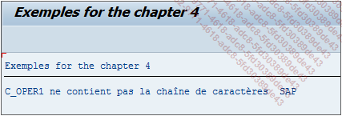

# **NO STRING**

## `NS`

`NS` signifie en anglais contains `No String` et vérifiera que la chaîne de caractères oper1 ne soit pas contenue dans celle de oper2.

```JS
IF oper1 NS oper2.
  ...
ENDIF.
```

_Exemple_

```JS
DATA: c_oper1 TYPE CHAR11 VALUE 'Hello World',
      c_oper2 TYPE CHAR3  VALUE 'SAP'.

IF c_oper1 NS c_oper2.
  WRITE:/ 'c_oper1 ne contient pas la chaîne de caractères ', c_oper2.
ELSE.
  WRITE:/ 'c_oper1 contient la chaîne de caractères ', c_oper2.
ENDIF.
```

Ici, la constante `c_oper1` contient la chaîne de caractères `Hello World` et `c_oper2`, **SAP**. La condition vérifiera que `c_oper1` ne contient pas la chaîne de caractères contenue dans `c_oper2` et en retournera le message correspondant.


