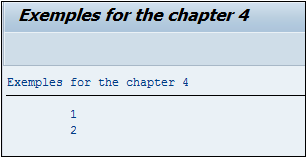
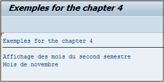

# **CHECK**

```JS
DO 5 TIMES.
  CHECK SY-INDEX < 3.
  WRITE / SY-INDEX.
ENDDO.
```

## `CHECK`

Le `CHECK` est une condition comparant l’état d’une [VARIABLE](../04_Variables/01_Variables.md) avec une autre. Si la condition est vraie alors le programme continue sinon il sort du traitement :

La _boucle_ est initialisée pour être exécutée cinq fois. Un `CHECK` vérifiera si le [SY-INDEX](../help/02_SY-SYSTEM.md) est strictement inférieure à `3`, si oui alors elle sera affichée, sinon le programme passera à la ligne suivante.



Dans le résultat, les valeurs 1 et 2 sont affichées et comme le reste (3, 4 et 5) n’a pas été validé par le `CHECK`, alors il a été mis de côté.

    Le CHECK peut très bien être comparé au IF... ENDIF et peut tout aussi bien être utilisé tel quel, hors d’une boucle :

_Exemple de l’utilisation du `CHECK` hors d’une boucle_

```JS
DATA: V_MONTH TYPE i.

V_MONTH = SY-DATUM+4(2).

CHECK V_MONTH GE 6.

WRITE:/ 'Affichage des mois du second semestre'.

CASE V_MONTH.
  WHEN 6.
    WRITE:/'Mois de juin'.
  WHEN 7.
    WRITE:/'Mois de juillet'.
  WHEN 8.
    WRITE:/'Mois d''août'.
  WHEN 9.
    WRITE:/'Mois de septembre'.
  WHEN 10.
    WRITE:/'Mois d''octobre'.
  WHEN 11.
    WRITE:/'Mois de novembre'.
  WHEN 12.
   WRITE:/'Mois de décembre'.
ENDCASE.
```

Le programme va tout d’abord commencer par vérifier que le mois en cours est supérieur ou égal à `6`, puis avec un `CASE`, il affichera le mois en cours.


