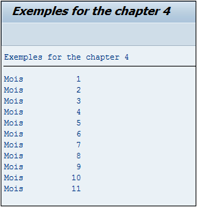

# **WHILE EXIT**

## `EXIT`

```JS
DATA: V_MONTH TYPE I.

V_MONTH = SY-DATUM+4(2).

WHILE SY-INDEX <= 12.
  IF SY-INDEX > V_MONTH.
    EXIT.
  ENDIF.
  WRITE:/'Mois ', SY-INDEX.
ENDWHILE.
```

La _boucle_ a été définie pour être exécutée tant que le [SY-INDEX](../help/02_SY-SYSTEM.md) est inférieure ou égale à `12`. Si la valeur du [SY-INDEX](../help/02_SY-SYSTEM.md) est strictement supérieure au mois en cours (`V_MONTH` défini au préalable via le [SY-DATUM](../help/02_SY-SYSTEM.md)), alors le programme sort de la _boucle_, sinon il affichera le message `Mois` et la valeur de [SY-INDEX](../help/02_SY-SYSTEM.md).


