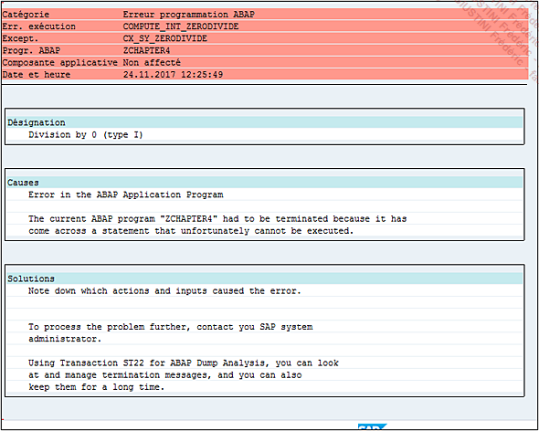

# **DUMP**

Dans l’éditeur `ABAP`, il a été vu qu’il était possible de contrôler le programme afin de s’assurer qu’il ne comporte pas d’erreurs de syntaxe comme dans l’exemple qui suit :

```JS
DATA: V_A      TYPE I,
      V_B      TYPE I,
      V_RESULT TYPE I.

V_A = 5.
V_B égal 0.

V_RESULT = V_A / V_B.
WRITE V_RESULT.
```

Le mot `égal` a été délibérément écrit ainsi. Une fois ces lignes insérées, le programme est sauvé puis contrôlé. Une liste d’erreurs et/ou de `warning` apparaît en bas de l’écran.


En double cliquant sur la ligne de description, l’éditeur va automatiquement se rendre au niveau du code avec un problème pour correction. Il est possible de tenter également d’activer le programme, mais cette fois, une fenêtre pop-up est affichée avec trois options possibles :


    1. `Activer` et donc ne pas tenir compte des erreurs, et continuer l’activation.

    2. `Traiter` pour afficher les erreurs en bas de l’écran comme lors du Contrôle.

    3. `Interrompre` pour terminer le processus d’activation.

Bien évidemment, l’option `Activer`, alors qu’il existe une erreur, est à bannir, elle ne doit jamais être choisie, excepté en de très rares occasions. Il faut à ce moment-là choisir Traiter et corriger ce qui ne va pas.

La ligne défectueuse est corrigée en remplaçant le mot `égal` par `EQ` ou `=`.

```JS
V_B = 0.
```

Le programme est de nouveau sauvegardé, puis contrôlé. Il est syntaxiquement correct et va être activé puis exécuté. Bien évidemment, le _dump_ suivant surgit.


Quelques précisions sur l’écran du _dump_ et pour ceci, il serait intéressant de cliquer sur le bouton `Texte descriptif` afin d’avoir tout le détail.


Le nouvel écran est quasiment identique au précédent et est divisé en plusieurs parties :



- `En-tête` avec la catégorie du _dump_ (erreur **ABAP**, de mémoire système, de [BASE DE DONNEES]()...), un code système d’erreur (COMPUTE*INT_ZERODIVIDE dans ce cas), la classe d’exception rencontrée par le noyau SAP pendant l’exécution du programme (CX_SY_ZERODIVIDE), le nom du programme ayant causé ce \_dump*, la date et l’heure.

- `Désignation` : affiche un bref descriptif de l’erreur.

- `Causes` : pourquoi **SAP** retourne cette erreur.

- `Solutions` : indique très succinctement les personnes à prévenir (ici le développeur).

- `Analyse des erreurs` : décrit l’erreur rencontrée par **SAP** avec un peu plus de précisions système.

- `Comment corriger l’erreur` (pour les personnes citées dans la partie Solutions) : indique ici que faire, par exemple, nous inviter à vérifier si **SAP** n’a pas un correctif s’il s’agit d’un programme standard (correctif appelé note OSS), ou bien, toujours dans le cas d’un programme standard, comment faire pour signaler cette erreur à **SAP** et quelles informations doivent être mises en avant...

- `Environnement système` est une liste technique regroupant tout le détail du système **SAP** : nom du serveur, nom de la [BASE DE DONNEES](), adresse IP, numéro d’installation **SAP**, nom du système de connexion...

- `Utilis. et transaction` regroupe les informations relatives au programme **SAP** : son nom, la [TRANSACTION]() appelée, le numéro d’écran...

- `Infos sur point d’interruption` : donne une précision sur l’endroit du programme, et l’événement lors duquel cela s’est produit.

- `Extrait code source` : affiche les lignes du programme avec l’indication `>>>>>` sur la ligne avec erreur.

- `Contenu zones systèmes` : affiche la table [SY]().

- `Appels/Événements actifs` : liste tous les programmes avant que le _dump_ surgisse. Dans ce cas, c’est assez simple, mais parfois pour des [TRANSACTIONS]() complexes (`MIGO`, `VA01`...) plusieurs programmes standards sont appelés et cette liste aide bien à savoir où localiser le problème et à quel niveau.

- `Variables sélectionnées` sont des [VARIABLES SYSTEME]() actives avant le _dump_.

- `Remarq. Internes` : situe à quel niveau du noyau **SAP** (**SAP kernel**) l’erreur s’est produite.

- `Appels actifs dans noyau SAP` : liste l’activité du noyau **SAP**.

- `Liste des programmes ABAP impliqués` est un journal avec date et heure de chaque programme exécuté avant le _dump_.

- `Répertoire des tables applicatives` : répertorie pour chaque programme, les tables utilisées et/ou mises à jour. Dans cet exemple, il s’agit uniquement des tables [SY]() et [SYST]() regroupant les mêmes informations système.

- `Blocs contrôle ABAP (CONT)` : relève toutes les informations relatives aux blocs de contrôle (processus, état, espace d’adressage...).

Tout en haut de l’écran se trouvent trois boutons.

- `Synthèse` affiche un volet de navigation regroupant les parties citées précédemment.

  `Saut - Synthèse` [F6]

- `ABAP Debugger` ouvre le programme sur la ligne avec erreur en mode débogage.

  `Saut - ABAP Debugger` [F7]

  

- `Affichage non mis en forme` offre une vision un peu brute du _dump_. Err.

  `exécution - Affichage non mis en forme` [F9]

Les _dumps_ peuvent être consultés via la [TRANSACTION ST22](../22_Transactions/TCODE_ST22.md).

Le programme ayant été développé, s’il retourne un _dump_, il doit être rapidement corrigé. Pour cela, la condition [IF](../05_Conditions/02_If_Endif.md) sera utilisée afin de vérifier que la [VARIABLE](../04_Variables/01_Variables.md) `V_B` est strictement supérieure à `0`.

```JS
DATA: V_A      TYPE I,
      V_B      TYPE I,
      V_RESULT TYPE I.

V_A = 5.
V_B = 0.

IF V_B GT 0.
  V_RESULT = V_A / V_B.
  WRITE V_RESULT.
ELSE.
  WRITE 'Opération impossible (division par 0)'.
ENDIF.
```

Une nouvelle fois, le programme est sauvegardé, contrôlé, activé puis exécuté. Cette fois-ci, pas de dump, le programme affiche bien le texte `Opération impossible (division par 0)`.


