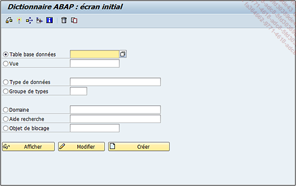

# **SE11**

## Features

- [TABLE DE LA BASE DE DONNEES](../09_Tables_DB/01_Tables.md) : la [TABLE](../09_Tables_DB/01_Tables.md) classique de la programmation où sont stockées toutes les informations du système ([TABLE](../09_Tables_DB/01_Tables.md) des _clients_, _fournisseurs_...).

- `Vue` : regroupement de plusieurs [TABLES](../09_Tables_DB/01_Tables.md) permettant d’accéder rapidement et simultanément à un large éventail d’informations.

- `Type de données` qui peut être un [ELEMENT DE DONNEES](./07_Elements_de_Donnees.md), une [STRUCTURE](../09_Tables_DB/11_Structures.md) ou un type de [TABLE](../09_Tables_DB/01_Tables.md).

- `Groupe de Types` : une sorte d’[INCLUDE](../17_Organisation/01_Organisation_Finale.md) où sont stockées plusieurs types de [VRIABLES](../04_Variables/01_Variables.md) ([CONSTANTES](../04_Variables/02_Constants.md), type de [TABLE](../09_Tables_DB/01_Tables.md)...).

- [DOMAINE](./08_SE11/02_Domaines.md).

- [AIDE RECHERCHE](./08_SE11/13_Aide_Recherche.md).

- `Objet de blocage` : permet le blocage d’une [TABLE](../09_Tables_DB/01_Tables.md)... si besoin. La création d’un objet de blocage va créer automatiquement deux [MODULES FONCTION](../13_Fonctions/01_Type.md) :

  - `ENQUEUE_nom-objet-blocage` (appel de cette fonction pour bloquer la [TABLE](../09_Tables_DB/01_Tables.md)...)

  - `DEQUEUE_nom-objet-blocage` (appel de cette fonction pour débloquer la [TABLE](../09_Tables_DB/01_Tables.md)...)

## Menu

- **Contrôler l’objet** - Objet du _Dictionnaire ABAP_ - Contrôler

  `Contrôler` [Ctrl][F2]

- **Activer** : Objet du _Dictionnaire ABAP_

  `Activer` [Ctrl][F3]

- **Cas d’Emploi** : qui, comme pour un programme, permet de savoir où est utilisé l’objet du [DDIC](../08_SE11/01_SE11.md) (dans des programmes, [FONCTIONS](../13_Fonctions/README.md), [CLASSES](../14_Classes/README.md), autres objets du _dictionnaire de données_...).

  `Utilitaires(M) - Cas d’Emploi` [Ctrl][Shift][F3]

- **Analyser l’environnement** : liste tous les composants **ABAP** que l’objet [DDIC](../08_SE11/01_SE11.md) utilise dans sa définition. Exemple pour une [TABLE](../09_Tables_DB/01_Tables.md), il va lister tous les éléments de données de la clé, les aides à la recherche, les références des tables externes...

  `Utilitaires(M) - Analyser l’environnement` [Ctrl][Shift][F4]

- **Aide à l’application** : Aide - Aide à l’application

  `Saut - Aide à l’application` [Ctrl][F8]

- **Supprimer un objet du DDIC**

  `Objet du Dictionnaire ABAP - Supprimer` [Shift][F2]

- **Copier un objet du DDIC**

  `Objet du _Dictionnaire ABAP_ - Copier...` [Ctrl][F5]

- **Objet du Dictionnaire ABAP**

  `Afficher(Z)` [F7]

- **Objet du Dictionnaire ABAP**

  `Modifier` [F6]

- **Objet du Dictionnaire ABAP**

  `Créer` [F5]
