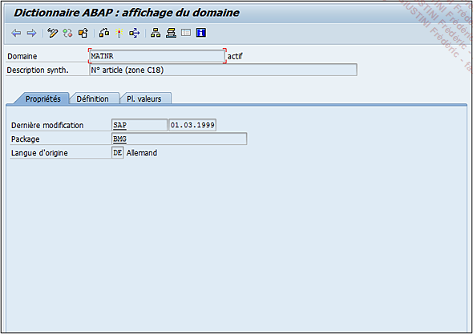

# **PROPRIETES**

Le premier volet (Propriétés) regroupe des informations diverses comme l’_utilisateur_ et la _date_ de la dernière modification, la _langue_ d’origine et la _classe_ de développement (`Package`).

Pour rappel, ce dernier est un regroupement technique de plusieurs objets ([DBTAB](01_SE11.md), [STRUCTURE](../09_Tables_DB/11_Structures.md), [PROGRAMME](), [CLASSE](../14_Classes/README.md), [MODULE FONCTION](../13_Fonctions/01_Type.md)...) ayant comme facteur commun un développement spécifique.

Par exemple, il y a les packages standards comme `COCB` regroupant tous les développements de la gestion des lots, `HR` pour les `Ressources humaines`, ou des packages spécifiques définis par chaque entreprise, par exemple :

- `ZFI` pour les développements

- `FI`

- `ZSD` pour la vente

- `ZDEV` pour tous les développements sans différence.
