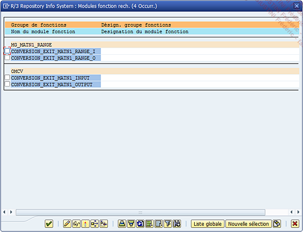

# **TYPE DE DONNEES**

On y retrouve le _type de données_ spécifié, puis vient le nombre de positions et les décimales à définir (dans le cas où le _type de données_ permet une décimale). Dans l’exemple choisi, le nombre de positions est de 18 comme longueur d’édition, et aucune décimale étant donné qu’il s’agit ici d’une chaîne de caractères. Tout en bas de l’écran viennent deux cases à cocher :

- Signe `+/-` si le champ utilisant le domaine a besoin d’afficher le signe négatif d’un nombre

- `Minuscules` si le champ texte doit être affiché uniquement en minuscules.

Il est également possible de définir une [ROUTINE DE CONVERSION](../17_Organisation/01_Organisation_Finale.md). Cette routine sera exécutée automatiquement lorsque le champ utilisant ce domaine sera mis à jour. Ici, cette [ROUTINE DE CONVERSION](../17_Organisation/01_Organisation_Finale.md) contient les [MODULES FONCTION](../13_Fonctions/01_Type.md) suivants (un double clic est suffisant pour en voir les détails) :

Ces [FONCTIONS](../13_Fonctions/01_Type.md) permettent d’ajouter ou de retirer des `0` sur la gauche sur une valeur unique ou un intervalle.

Exemple avec la [FONCTION](../13_Fonctions/01_Type.md) `CONVERSION_EXIT_MATN1_INPUT` :

Dans le cas du `n° d’article`, cette [FONCTION](../13_Fonctions/01_Type.md) complétera la valeur d’autant de `0` que nécessaire afin d’arriver au nombre de positions de `18` : `123456789` deviendra `000000000123456789`. Très utile pour homogénéiser les données, les gérer...
