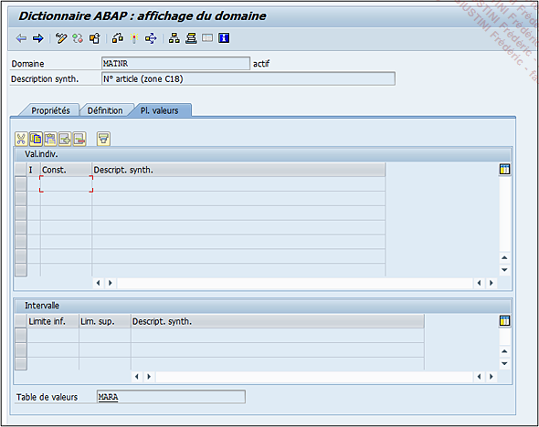
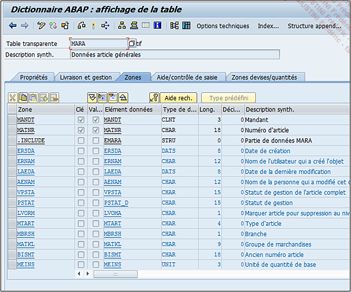

# **PLAGE DE VALEURS**

Le dernier onglet `Pl. Valeurs` pour `Plage de Valeurs`. Cette partie est divisée en trois sous-parties :

- `Valeur individuelle`

- `Intervalle`

- `Table de valeurs`

Lorsqu’un [CHAMP](../15_Screen/02_Champs/README.md) utilisant ce [DOMAINE](./02_Domaines.md) est mis à jour (par exemple lorsqu’une facture est éditée et que la liste des matériaux est dressée), le programme ira vérifier si la valeur existe comme valeur individuelle ou dans l’`intervalle` défini, ou dans la `table de valeurs`.

Dans le cas du `n° d’article`, il utilise la [TABLE](../09_Tables_DB/01_Tables.md) de valeurs `MARA`. Un double clic permet d’afficher le détail de celle-ci. Ainsi, le [CHAMP](../15_Screen/02_Champs/README.md) `MATNR` utilise l’[ELEMENT DE DONNEES](./07_Elements_de_Donnees.md) `MATNR` qui utilise à son tour le [DOMAINE](./02_Domaines.md) `MATNR`, et est défini en tant que [CLE](../10_Tables_Internes/06_Primary_Key.md) (cette notion sera développée dans la section [STRUCTURES](../10_Tables_Internes/01_Tables_Internes.md) et [TABLES](../10_Tables_Internes/01_Tables_Internes.md)).

De cette façon, à chaque fois qu’un _utilisateur_ emploiera un _numéro d’article_, **SAP** ira voir dans cette [TABLE](../10_Tables_Internes/01_Tables_Internes.md) si la valeur renseignée existe bien. Dans le cas contraire, il retournera un message d’erreur invitant l’_utilisateur_ à soit utiliser un autre _article_, soit créer celui qu’il voudrait employer.
