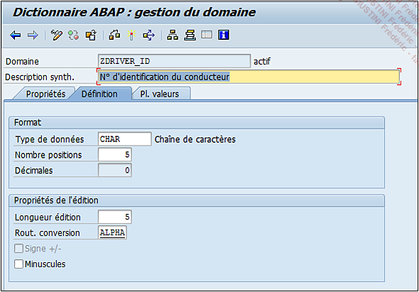

# **CREATION DE DOMAINE**

Il serait intéressant de voir maintenant comment créer un [DOMAINE](./02_Domaines.md) de type alphanumérique. Pour cela, il faut suivre les étapes suivantes :

1. Exécuter la [TRANSACTION `SE11`](./01_SE11.md).

2. Dans l’écran de gestion du [DDIC](./01_SE11.md), cocher l’option `Domaine`.

3. Entrer un `nom`, comme par exemple `ZDRIVER_ID` puis appuyer sur le bouton `Créer` (ou bouton raccourci-clavier [F5]).

4. Entrer une `description` (obligatoire), par exemple `N° d’identification du conducteur`.

5. Insérer les informations suivantes :

   - **Type de données** `CHAR`

   - **Nombre positions** `30`

   - **Longueur édition** `5`

   - **Rout. conversion** `ALPHA`

   

6. `Sauvegarder` (pour plus de commodité, le domaine sera créé en local).

7. `Contrôler`.

8. `Activer`.

Au lieu de faire les étapes `6`, `7` et `8`, il est possible également d’activer directement, car **SAP** va sauvegarder et contrôler l’[OBJET](../14_Classes/01_ABAP_Object/01_ABAP_Object.md) automatiquement pour s’assurer qu’il peut être activé en toute sécurité.

Le [DOMAINE](./02_Domaines.md) est maintenant actif et prêt à être utilisé.
