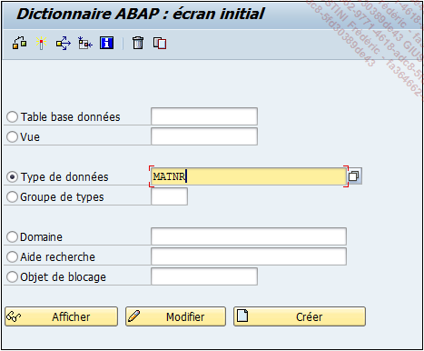
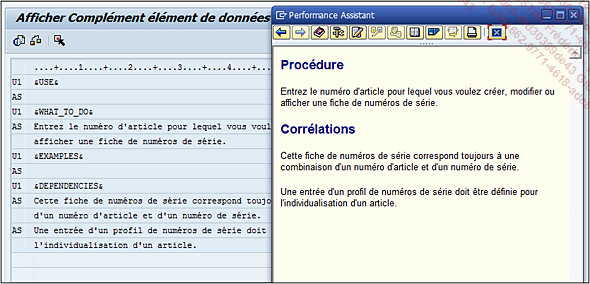

# **ELEMENTS DE DONNEES**

Le [DOMAINE](./02_Domaines.md) est la `caractéristique technique` d’un [CHAMP](../15_Screen/02_Champs/README.md) d’une [TABLE](../10_Tables_Internes/01_Tables_Internes.md), cependant il existe une autre couche afin d’en compléter sa définition : l’`élément de données`. Celui-ci est tout simplement l’[OBJET](../14_Classes/01_ABAP_Object/01_ABAP_Object.md) qui va définir le `visuel du champ` (`titre`, `nom des colonnes`...) et quelques caractéristiques additionnelles (aide à la recherche...).

Pour continuer avec l’exemple du code article, l’élément de données associé se nomme également `MATNR` (il n’est pas rare de rencontrer un nom de [DOMAINE](./02_Domaines.md) identique à celui de l’élément de données). Pour l’afficher, la [TRANSACTION `SE11`](./01_SE11.md) doit être exécutée à partir de la zone de commande ou par le menu **SAP** de l’écran d’accueil. Une fois sur l’écran de gestion du [DICTIONNAIRE ABAP](./01_SE11.md), il suffit de cocher l’option [TYPE DE DONNEES](./09_Elements_de_Donnees_Type.md), puis de renseigner le nom de l’[OBJET](../14_Classes/01_ABAP_Object/01_ABAP_Object.md). Un clic sur le bouton `Afficher` va permettre d’accéder au détail de l’[OBJET](../14_Classes/01_ABAP_Object/01_ABAP_Object.md).

## **DOCUMENTATION & DOCUMENTATION COMPLEMENTAIRE**

Comme pour le [DOMAINE](./02_Domaines.md), l’`écran de gestion de l’élément de données` est composé d’une barre d’outils quasiment identique. La différence majeure réside dans la présence de deux nouveaux boutons : `Documentation` et `Documentation complémentaire`.

Ils permettent de créer une aide pour l’`élément de données` créé.

Suivent ensuite quatre onglets :

- [PROPRIETES](./08_Elements_de_Donnees_Proprietes.md)

- [TYPE DONNEES](./09_Elements_de_Donnees_Type.md)

- [PROPRIETES SUPPLEMENTAIRES](./10_Elements_de_Donnees_Proprietes_Supplementaires.md)

- [DESCRIPTION DE ZONE](./11_Elements_de_Donnees_Description_Zone.md)
