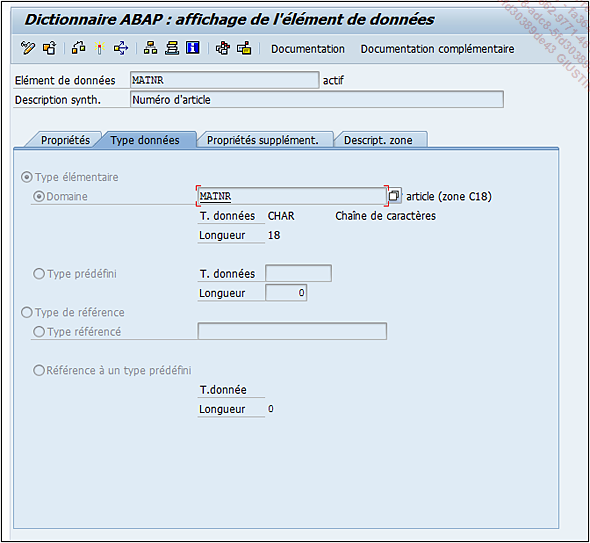

# **ELEMENT DE DONNEES - TYPE DE DONNEES**

Elle peut être définie par :

- `Type élémentaire`, à savoir un [DOMAINE](./02_Domaines.md) ou directement un _type de données_ avec sa longueur de [CHAMP](../15_Screen/02_Champs/README.md). Cette dernière option est plus utilisée pour des textes dont la valeur n’a pas besoin d’être vérifiée dans une plage de valeurs définie par un [DOMAINE](./02_Domaines.md).

- `Type de référence` : plus utilisée pour l’[ABAP OBJET](../14_Classes/01_ABAP_Object/01_ABAP_Object.md) où le type de référence peut être une [CLASSE](../14_Classes/README.md), une _interface_... ou un _type de données_ et sa longueur afin de définir un _type de référence_.
