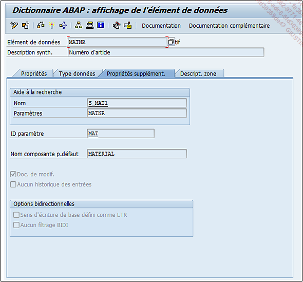

# **ELEMENT DE DONNEES - PROPRIETES SUPPLEMENTAIRES**

Il est possible d’y définir :

- Une [AIDE A LA RECHERCHE](./13_Aide_Recherche.md).

- Un `identifiant de paramètre` (`ID paramètre`) : il s’agit de définir une mémoire système où grâce aux commandes `SET` et `GET`, il est possible de stocker une valeur consultable dans plusieurs [TRANSACTIONS](../03_Programmation/03_Transactions.md) différentes. Par exemple, lorsque l’utilisateur crée un `code article` avec la [TRANSACTION MM01](), en exécutant la [TRANSACTION MM03]() pour en vérifier les informations, il verra que l’écran initial sera automatiquement renseigné avec le nouveau code article. La commande `SET` aura été exécutée pendant la [TRANSACTION MM01]() (stockage du code article dans la mémoire système grâce à l’instruction `SET MAT = n° article`) et un `GET` à l’exécution de la [TRANSACTION MM03]() (lecture de cette mémoire système avec l’instruction `GET MAT = n° article`).

- `Nom composante p.défaut` est une proposition d’appellation générique pour les [TABLES](../09_Tables_DB/01_Tables.md) ou [STRUCTURES](../09_Tables_DB/11_Structures.md). Ce nommage n’est pas du tout obligatoire et il est surtout trouvé dans des [TABLES](../09_Tables_DB/01_Tables.md) ou [STRUCTURES](../09_Tables_DB/11_Structures.md) de développements spécifiques ([BAPI]()...).

- `Doc. de modif.` (pour documents de modification) permet de mettre à jour des `tables de log` à chaque fois qu’un [CHAMP](../15_Screen/02_Champs/README.md) utilisant cet [ELEMENTS DE DONNEES](./07_Elements_de_Donnees.md) est créé, modifié, ou supprimé.

- `Aucun historique des entrées` : active ou désactive le mécanisme permettant de lister l’historique des valeurs déjà utilisées. Par exemple si un _utilisateur_ a déjà consulté trois _codes article_, lorsqu’il retournera à la [TRANSACTION MM03](), une liste contenant ces trois codes lui sera proposée lorsqu’il devra saisir l’article à consulter.

- `Options bidirectionnelles` : cette option définit si le sens d’écriture est de gauche à droite (Sens d’écriture de base défini comme `LTR`, `LTR` signifiant `Left To Right` de gauche à droite) ou si aucun _filtrage bidirectionnel_ ne doit être utilisé (Aucun filtrage `BIDI` pour `BI-DIrectional`).

      Ces dernières options sont le plus souvent utilisées pour des langues ayant une lecture différente que celle de gauche à droite (arabe, hébreux...).
