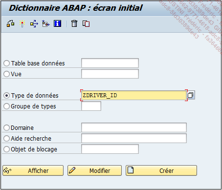
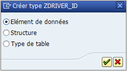
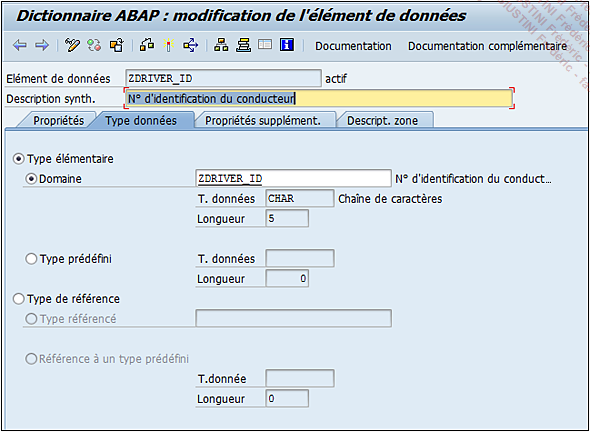
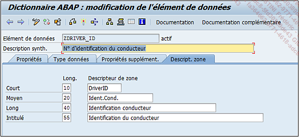

# **ELEMENTS DE DONNEES - CREATION**

Dans cette section, l’[ELEMENTS DE DONNEES](./07_Elements_de_Donnees.md) `ZDRIVER_ID` sera créé et utilisera le [DOMAINE](./02_Domaines.md) du même nom :

1. Exécuter la [TRANSACTION `SE11`](./01_SE11.md).

2. Dans l’écran de gestion du [DICTIONNAIRE ABAP](./01_SE11.md), cocher l’option `Type de données`.

3. Entrer le nom `ZDRIVER_ID` puis appuyer sur le bouton `Créer` (ou bouton raccourci-clavier `[F5]`).

   

4. Comme vu au début de ce chapitre, plusieurs choix sont alors possibles car cette option du [DICTIONNAIRE](./01_SE11.md) regroupe aussi bien les [ELEMENTS DE DONNEES](./07_Elements_de_Donnees.md), que les [STRUCTURES](../09_Tables_DB/11_Structures.md) ou les [TYPES DE TABLE](../10_Tables_Internes/README.md). Pour cet exemple, on va laisser sélectionné le premier choix puis `Valider`.

   

5. Entrer une `Description` (obligatoire), par exemple `N° d’identification du conducteur`.

6. Renseigner le `nom de domaine` `ZDRIVER_ID` puis valider par la touche `Entrée` (les informations du [DOMAINE](./02_Domaines.md) sont alors automatiquement renseignées).

   

7. Dans l’onglet `Descript. zone`, les textes suivants seront renseignés :

   | LONGUEUR   | NBR CARACTERES | NOM                          |
   | ---------- | -------------- | ---------------------------- |
   | `Court`    | 10             | DriverId                     |
   | `Moyen`    | 20             | Ident.Cond.                  |
   | `Long`     | 40             | Identification conducteur    |
   | `Intitulé` | 55             | Identification du conducteur |

   

8. `Sauvegarder `(pour plus de commodité, l’[ELEMENTS DE DONNEES](./07_Elements_de_Donnees.md) sera créé en local).

9. `Contrôler`.

10. `Activer`.
