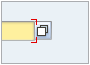
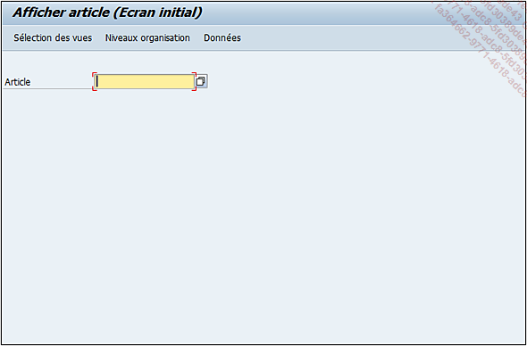
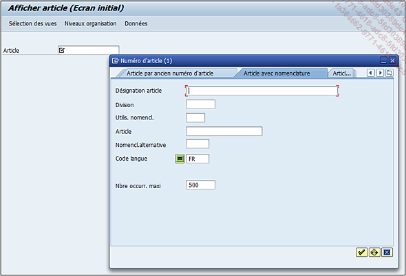
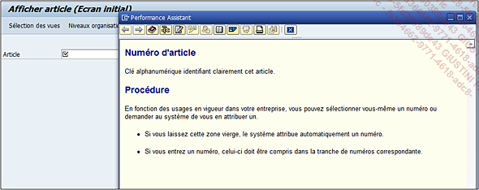
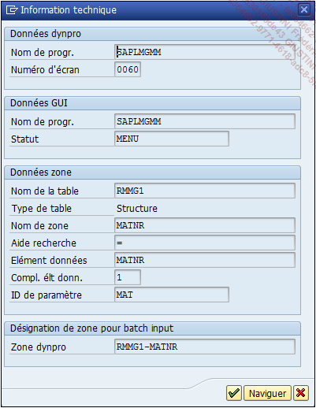

# **AIDE A LA RECHERCHE**

Un autre [OBJET](../14_Classes/01_ABAP_Object/01_ABAP_Object.md) faisant partie des types de données est l’`aide à la recherche`. C’est une interface assurant la cohérence entre un [CHAMP](../15_Screen/02_Champs/README.md) faisant référence à un [DOMAINE](./02_Domaines.md) et la liste des valeurs permises. L’aide à la recherche s’exécute lors d’une recherche de valeur sur un [CHAMP](../15_Screen/02_Champs/README.md) ayant une icône annexée (voir ci-dessous) ou plus communément avec la touche `raccourci-clavier [F4]`.

Par exemple : dans la zone de commande, la [TRANSACTION `/oMM03`]() va être renseignée afin d’afficher le détail d’un article, dans une nouvelle session. L’écran est alors composé d’un seul [CHAMP](../15_Screen/02_Champs/README.md) nommé `Article`.

Dans ce [CHAMP](../15_Screen/02_Champs/README.md) `Article`, une recherche peut être effectuée afin de sélectionner la valeur adéquate. La fenêtre de l’`aide à la recherche` apparaîtra donc (touche `[F4]` sur la cellule) et se présente ainsi :

Cette aide à la recherche est composée de plusieurs `sous-aides` à la recherche permettant d’aider au mieux l’utilisateur à affiner sa sélection.

Il serait intéressant de voir comment naviguer jusqu’aux objets qui nous intéressent pour un [CHAMP](../15_Screen/02_Champs/README.md) spécifique. Pour chaque [CHAMP](../15_Screen/02_Champs/README.md) de chaque écran sur **SAP**, il est possible de connaître sa référence technique. Pour cela, il suffit de cliquer avec le bouton droit sur ledit [CHAMP](../15_Screen/02_Champs/README.md), puis dans le menu, de choisir l’`Aide` (ou d’utiliser directement la touche raccourci-clavier `[F1]`).

Une fenêtre apparaît avec différentes informations. C’est cette description qui est définie dans l’`élément de données Documentation complémentaire` (cf. section sur Éléments de données de ce chapitre). Dans la barre d’outils se trouve une icône avec un marteau et une clé images/05RI27.png, permettant d’obtenir les informations techniques du [CHAMP](../15_Screen/02_Champs/README.md).

Voici pour celui de l’article de la [TRANSACTION `MM03`]() :

C’est une configuration typique des informations techniques divisée en quatre parties :

1. `Données dynpro` : renseigne sur le nom du programme principal et du numéro d’écran. Un programme peut posséder plusieurs écrans et il est donc nécessaire de les différencier pour ne pas mélanger les traitements. Par exemple, la [TRANSACTION `XK01`]() et la [TRANSACTION `XK02`]() permettant de créer et modifier un fournisseur. Ces deux [TRANSACTIONS]() utilisent le même programme principal (`SAPMF02K`) mais avec deux écrans différents (`n° 100` pour l’un et `101` pour l’autre). Ainsi le traitement pour la création d’un `fournisseur` sera bien distinct de celui de la `modification`.

2. `Données GUI` : tout d’abord, le **SAP GUI** (de l’anglais `Graphic User Interface` pour interface graphique utilisateur) est la couche graphique de **SAP**. C’est elle qui définit tout l’agencement visuel de **SAP** (barre de commande, barres d’outils, écrans, sous-écrans...). Dans les informations techniques, elle représente le nom de la barre d’outils liée à l’écran. Ici il s’agit du statut `MENU du programme SAPLMGMM`.

3. `Données zone` : c’est dans cette partie que toutes les informations liées au [DDIC](./01_SE11.md) sont renseignées. On y retrouve.

   - Le Nom de la [TABLE](../10_Tables_Internes/01_Tables_Internes.md) (plus communément il s’agit d’une [STRUCTURE](../10_Tables_Internes/01_Tables_Internes.md)) pris comme référence (`RMMG1`).

   - Le [NOM DE ZONE](./05_Domaines_Plage_de_Valeurs.md) de cette [STRUCTURE](../10_Tables_Internes/01_Tables_Internes.md) (`MATNR`) .

   - L’`Aide à la recherche` utilisée, attention dans ce cas, il s’agit de l’_aide à la recherche_ déclarée avec le [CHAMP](../15_Screen/02_Champs/README.md) de la [TABLE](../09_Tables_DB/01_Tables.md) ou [STRUCTURE](../09_Tables_DB/11_Structures.md) de référence. Il a été vu qu’il existe déjà une _aide à la recherche_ associée à l’[ELEMENT DE DONNEES](./07_Elements_de_Donnees.md).

   - L’[ELEMENT DE DONNEES](./07_Elements_de_Donnees.md).

   - Le `Complément de l’élément de données` est une information à utiliser notamment dans la `Documentation complémentaire`.

   - `ID de paramètre` est l’identifiant défini dans l’élément de données afin de renseigner une mémoire système.

4. `Désignation de zone pour batch input` est une indication rassemblant `nom_de_table + zone_de_table` utilisée lors d’un [BATCH INPUT]() : pouvant être traduit par `données en masse`, il s’agit d’une simulation de [TRANSACTION]() afin de remplir tous les [CHAMPS](../15_Screen/02_Champs/README.md) d’un écran et dont le but est de reproduire cette simulation dans un programme, mais avec une masse de données beaucoup plus importante. Il était souvent employé lors de mises à jour des données de références (`master data`).

Aujourd’hui, il est préférable de recourir à des [BAPIS]() ou des [METHODES](../14_Classes/03_Méthodes/01_Méthodes.md), car avec un [BATCH INPUT](), un simple message d’avertissement sur un système de connexion remettait en cause le programme et les chargements de données.
