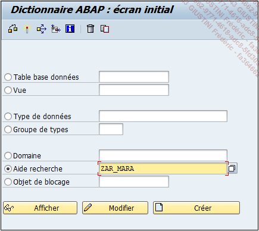
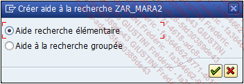
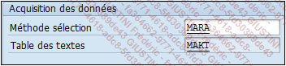
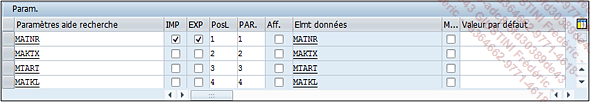
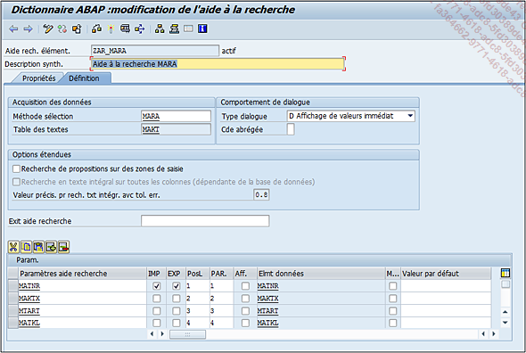
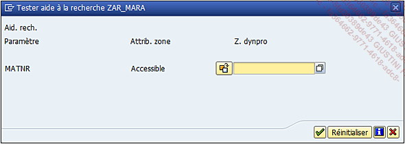

# **AIDE A LA RECHERCHE - CREATION**

La suite de cette section va lister toutes les étapes nécessaires à la création d’une aide à la recherche élémentaire de la [TABLE](../09_Tables_DB/01_Tables.md) `MARA` :

1. Exécuter la [TRANSACTION SE11](../22_Transactions/TCODE_SE11.md).

2. Dans l’écran de gestion du dictionnaire `ABAP`, cocher l’option `Aide recherche`.

3. Entrer le nom `ZAR_MARA` puis appuyer sur le bouton `Créer` (ou bouton raccourci-clavier `[F5]`).

   

4. Choisir `Aide recherche élémentaire`.

   

5. Entrer une `description` (obligatoire), par exemple `Aide à la recherche MARA`.

6. Renseigner la `méthode de sélection` avec la [TABLE](../09_Tables_DB/01_Tables.md) `MARA` puis confirmer par la touche `[Entrée]`. Automatiquement, `SAP` importe la [TABLE](../09_Tables_DB/01_Tables.md) des textes `MAKT`.

   

7. Choisir l’option `Affichage de valeurs immédiat` pour le Type de dialogue.

8. Cette aide à la recherche affichera les champs :

- `MATNR` (n° d’article) qui sera à la fois un champ d’`import` et d’`export`
- `MAKTX` (désignation de l’article)
- `MTART` (type d’article)
- `MATKL` (groupe marchandise)

Les paramètres ressembleront à ceci :

| CHAMP   | IMP | EXP | PosL | PAR. | Elmt données |
| ------- | --- | --- | ---- | ---- | ------------ |
| `MATNR` | X   | X   | 1    | 1    | MATNR        |
| `MAKTX` |     |     | 2    | 2    | MAKTX        |
| `MTART` |     |     | 3    | 3    | MTART        |
| `MATKL` |     |     | 4    | 4    | MATKL        |

9. `Sauvegarder` (pour plus de commodité, l’aide à la recherche sera créée en local).
10. `Contrôler`.
11. `Activer`.

Au final, l’aide à la recherche ressemblera à ceci :

Il est également possible de la tester avec le bouton `Tester...` de la barre d’outils, via le raccourci-clavier `[F8]` ou par le menu déroulant.

Aide à la recherche - Tester... `[F8]`

Il suffit alors de cliquer sur le petit bouton à droite du champ afin que l’aide à la recherche apparaisse.
