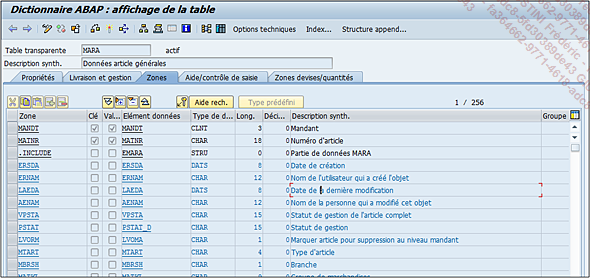
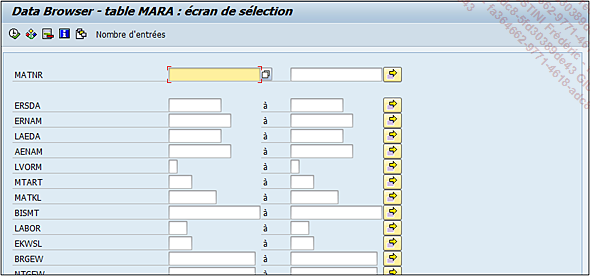
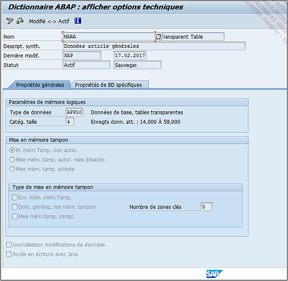
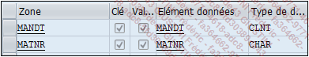
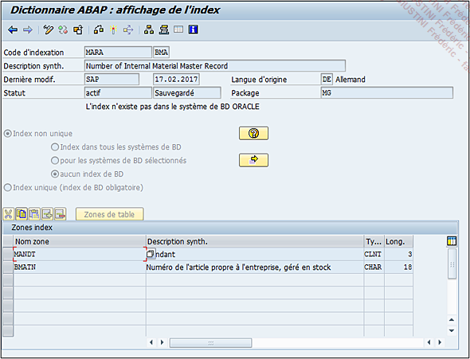

# **TABLES**

Cette partie développera la partie concernant les _tables_ et les [STRUCTURES](./11_Structures.md) car ces deux notions sont très similaires. En résumé, une [STRUCTURE](./11_Structures.md) est grossièrement une table qui ne stocke pas de données.

Cependant, comme la configuration d’une `table de données` est un peu plus complexe, il serait intéressant d’étudier son comportement et toutes ses options possibles.

Pour cela, la _table_ `MARA` vue dans les sections précédentes sera analysée. Il suffit d’exécuter la [TRANSACTION `SE11`](../08_SE11/01_SE11.md), puis dans la fenêtre d’accueil du gestionnaire du [DICTIONNAIRE ABAP](../08_SE11/README.md), de sélectionner l’option `Table base de données` et de renseigner la zone adjacente.

L’affichage de la _table_ `MARA` se présentera alors sous cette forme :

## Menu

Comme à l’accoutumée, la barre d’outils présente de nouvelles fonctionnalités, notamment les cinq dernières :

- `Graphique` donne une représentation graphique de la _table_ et de ses relations externes.

- `Contenu` affiche toutes les données sauvegardées.

  Utilitaires - Contenu de table - Afficher `[Ctrl][Shift][F10]`

Ainsi, pour la _table_ `MARA`, lorsque cette option est choisie, l’utilisateur arrive sur l’écran de sélection suivant :

Il s’agit simplement d’options de filtrage afin de réduire la sélection à celle qui nous intéresse en renseignant par exemple une date de création, un groupe de marchandises... Il est également possible de laisser tout à blanc et de tout sélectionner. Le processus de sélection s’effectue après avoir cliqué sur le bouton `Exécuter` tout en haut à gauche de l’écran, ou grâce à la touche raccourci-clavier `[F8]` (ou via le menu déroulant Programme - Exécuter `[F8]`).

Dans la barre d’outils, le bouton `Nombre d’entrées` est une option pratique également, permettant de vérifier très rapidement le nombre d’enregistrements pour une sélection donnée.

- `Options techniques` permet de renseigner des informations techniques supplémentaires.

  Saut - Options techniques `[Ctrl][Shift][F9]`

  

Dans les `Propriétés générales` sont regroupées toutes les informations concernant le volume de la _table_ et son comportement lors de sa manipulation (sélection, modification...) :

- `Type de données` définit le type de contenu qui sera stocké :

  - `APPL0` - Données de base, _tables_ transparentes. Pour des données de base - données auxquelles l’accès en lecture est effectué couramment, mais qui ne sont actualisées que rarement.

  - `APPL1` - Données altérables, _tables_ transparentes. Pour des données actualisées souvent.

  - `APPL2` - Organisation et customizing. Données saisies lors du paramétrage du système et qui par la suite sont rarement modifiées.

  - `DDIM` - _Tables_ des dimensions dans _Business Information Warehouse_.

  - `DFACT` - Table des valeurs fixes dans _Business Information Warehouse_.

  - `DDOS` - Table ODS dans _Business Information Warehouse_. Comme indiqué, ces types concernent uniquement des _tables_ de type _Business Information Warehouse_ (**BW**).

Il existe également des types de données système mais qui, comme pour ceux du **BW**, ne seront pas détaillés.

- `Mise en mémoire tampon`, appelée également `buffer`, est une zone de mémoire utilisée pour stocker temporairement des données (utile lorsque deux traitements utilisent les mêmes mais à un rythme différent par exemple). Plusieurs types peuvent être choisis :

  - `Mise en mémoire tampon non autorisée` et donc ne s’activera pas pour la _table_.

  - `Mise en mémoire autorisée mais désactivée`, bufferisation d’une _table_ possible, mais non active actuellement (si après analyse, il était avantageux d’activer cette mise en mémoire tampon, alors l’_équipe Basis_ peut le faire via la [TRANSACTION `ST02`]()).

  - `Mise en mémoire tampon autorisée`, il est alors obligatoire dans ce cas, d’indiquer le Type de mise en mémoire tampon, à savoir :

    - `Enregistrement individuel mémoire tampon` signifiant que sont bufférisées uniquement les données sélectionnées via une requête (cf. chapitre [12_INSTRUCTIONS_SQL](../12_Instructions_dbtab/README.md)), permettant ainsi d’économiser de l’espace par rapport à l’option dite intégrale.

    - `Dom. générique mis mém. tampon` (mise en mémoire tampon générique) : sont mises en mémoire tampon toutes les données ayant des clés identiques, défini dans le champ `Nombre de zones clés`. Exemple : si une _table_ de données est définie avec 6 clés (voir la suite du chapitre), le nombre de zones clés de la mise en mémoire générique, sera compris entre un minimum de 1 et au maximum, un nombre inférieur au nombre de clés de la _table_. Pour cet exemple, il sera donc défini à 5. Ainsi seront stockées dans la mémoire tampon, toutes les données ayant les cinq clés identiques.

    - `Mise en mémoire tampon complète` : toutes les données de la _table_ sont stockées dans la mémoire tampon.

- `Journalisation modifications de données` permet d’enregistrer toute mise à jour des donnés de la _table_ dans un journal ou un `LOG`. Les données de ce journal sont stockées dans la _table_ `DBTABLOG` ou peuvent être consultées et analysées via la [TRANSACTION `SCU3`]().

- `Accès en écriture avec Java` autorise la modification du contenu de la _table_ uniquement avec le langage de programmation `Java`. Avec les _tables_ de données [HANA](), un deuxième onglet est désormais disponible. Propriétés de BD spécifiques va définir le type de stockage à adopter à savoir un stockage en colonnes (Stk or. Col. - spécifique à [HANA]()) ou en lignes (St.or.li.).

- `Index... utilitaire` améliorant la rapidité de lecture et de sélection des données de la _table_. Saut - Index `[Ctrl][F5]`. En effet, la ta_ble `MARA` pour continuer cet exemple, possède deux champs [CLES](../10_Tables_Internes/06_Primary_Key.md) : le mandant (`MANDT`) et le numéro d’article (`MATNR`).

## Navigation

Dans un programme, lorsque les données de la _table_ `MARA` sont sélectionnées, il est préférable pour une question d’optimisation de lecture, d’utiliser cette [CLES](../10_Tables_Internes/06_Primary_Key.md). Cependant, il arrive que le développeur doive effectuer une sélection n’utilisant pas cette [CLES](../10_Tables_Internes/06_Primary_Key.md). Si la _table_ contient peu de valeurs, il n’y aura aucune incidence. Cependant, si c’est le contraire, alors cette sélection peut prendre beaucoup de temps, créant même parfois un dump de type `TIMEOUT`. Il est alors recommandé de créer un `INDEX` avec les champs de la sélection.

Exemple : sélection dans la _table_ `MARA` avec le champ `BMATN`. En cliquant sur l’option `Index...`, il sera possible d’en créer un avec ce champ ou d’utiliser celui déjà existant, nommé `BMA`, et qui sera appelé ensuite lors d’une requête [SQL](../12_Instructions_dbtab/README.md). Cette notion sera développée dans le chapitre correspondant (cf. chapitre [12_INSTRUCTIONS_SQL](../12_Instructions_dbtab/README.md)).

- `Structure Append...` permet d’ajouter un append de structure. Saut - Structure Append... [F5]
