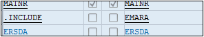

# **INCLUDE**

Deux notions très importantes du [DDIC](../08_SE11/README.md) sont : l’`INCLUDE` (pouvant être traduit par `inclusion` en français) et l’[APPEND](./03_Tables_Append.md) (`ajout`) de [STRUCTURE](./11_Structures.md). Ces deux notions ont le même but, qui est de rajouter des champs supplémentaires.

L’`INCLUDE` et l’[APPEND](./03_Tables_Append.md) sont aussi bien utilisés pour une [TABLE](./01_Tables.md) que pour une [STRUCTURE](./11_Structures.md). Ce qui sera traité maintenant vaut donc également pour les [STRUCTURE](./11_Structures.md) du [DDIC](../08_SE11/01_SE11.md).

- `INCLUDE de structure` : additionne les champs venus d’une [STRUCTURE](./11_Structures.md) existante. Par exemple, la [TABLE](./01_Tables.md) `MARA`, utilise l’`INCLUDE EMARA` pour insérer tous les champs existants de cette [STRUCTURE](./11_Structures.md). Ainsi si cette dernière est mise à jour (suppression, ajout ou modification de champs), la [TABLE](./01_Tables.md) `MARA` sera impactée et subira automatiquement cette même actualisation.

  

Lors de l’utilisation d’un `INCLUDE` ou d’un [APPEND](./03_Tables_Append.md), les champs listés sont de couleur bleue, signifiant qu’ils ne sont pas directement liés à la [TABLE](./01_Tables.md) mais qu’ils font partie d’un ensemble extérieur.

Même si cette modification reste propre à la [TABLE](./01_Tables.md) ou [STRUCTURE](./11_Structures.md), il est possible d’imaginer, pour reprendre l’exemple de la [TABLE](./01_Tables.md) `MARA` et de son `INCLUDE EMARA`, le degré d’impact qu’aurait l’ajout d’un [APPEND](./03_Tables_Append.md) de [STRUCTURE](./11_Structures.md) à cette dernière. Il resterait local mais aurait automatiquement des répercussions sur la [TABLE](./01_Tables.md) `MARA`.

    L’include et l’append sur des structures ou tables standards sont des cas très sensibles du DDIC qui doivent être manipulés avec beaucoup de précaution.
