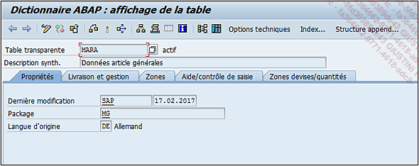

# **TABLES - PROPRIETES**

Comme à l’accoutumée, le premier onglet est celui des `propriétés de l’objet` avec l’utilisateur et la date de la dernière modification, le `nom du package` utilisé et la langue de création.

Dans l’exemple de la [STRUCTURE](./11_Structures.md) `MARA`, et dans beaucoup d’autres cas de programmes, tables, etc. l’utilisateur **SAP** indique que l’objet a été mis à jour après une actualisation complète du noyau appelé également `upgrade`.

