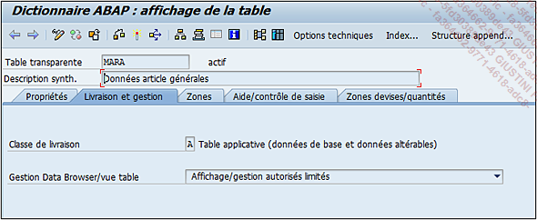
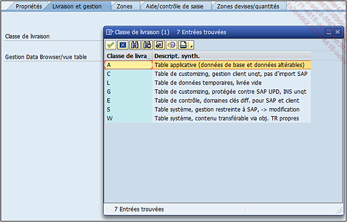
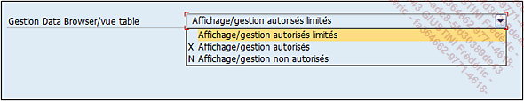

# **TABLES - LIVRAISON ET GESTION**

Vient ensuite l’onglet `Livraison et gestion` où figure le type même de la [TABLE](./01_Tables.md).

Dans le chapitre traitant du [MANDANT](../03_Programmation/01_Mandant.md) **SAP**, un type de [TABLE](./01_Tables.md) a été évoqué : la [TABLE](./01_Tables.md) de [CUSTOMIZING](). En fait, il existe plusieurs types à savoir :

- `A - Table applicative` (données de base et données altérables) : contient des données modifiables dans chaque système de connexion. La [TABLE](./01_Tables.md) `MARA` par exemple est de ce type, ainsi ses données sur le système de développement sont différentes de celle de la production car l’_utilisateur_ peut créer directement un article en production sans pour autant le répliquer sur le système de développement.

- `L - Table de données temporaires`, livrée vide : utile pour la gestion de données qui doivent être utilisées dans plusieurs programmes différents mais qui n’ont pas vocation à rester : par exemple, création des données dans l’un et suppression après utilisation dans l’autre...

- `G - Table de customizing`, protégée contre **SAP UPD**, **INS unqt** : [TABLE](./01_Tables.md) de [CUSTOMIZING]() où les données ne peuvent pas être mises à jour ni supprimées, mais uniquement insérées. Ces tables en général sont celles qui ne possèdent pas de nombreux changements comme par exemple la [TABLE](./01_Tables.md) des codes `ISO` pour les unités de mesure (`T006I`) .

- `E - Table de contrôle, domaines clés diff.` pour **SAP** et client est une autre [TABLE](./01_Tables.md) de [CUSTOMIZING]() réagissant comme une [TABLE](./01_Tables.md) applicative (de type `A`) mais dont les données seront écrasées lors d’une mise à jour complète de **SAP** (upgrade). Par exemple, la [TABLE](./01_Tables.md) `T005` contenant la liste des pays, possède le champ `ADDRS` utilisant un [DOMAINE](../08_SE11/02_Domaines.md) du même nom. Les valeurs de celui-ci (cf. section Les [DOMAINES](../08_SE11/02_Domaines.md)) sont contenues dans la [TABLE](./01_Tables.md) `T005A` (routines d’adresse) déjà installée avec des données par défaut. Un _utilisateur_ peut les modifier mais après un upgrade, elles seront perdues.

- `S - Table système`, gestion restreinte à **SAP**, -> modification  : les données ne peuvent être modifiées que par **SAP** comme la [TABLE](./01_Tables.md) des codes de langue `T002` dont les données sont impossibles à altérer sauf lors d’un upgrade.

- `W - Table système`, contenu transférable via obj. TR propres  : il s’agit d’une [TABLE](./01_Tables.md) système dont les données sont transférées par des objets de transfert propres. Exemple : la [TABLE](./01_Tables.md) `TADIR` contient les objets **SAP** (programmes, [CLASSES](../14_Classes/README.md), [INCLUDES](./02_Tables_Include.md)...) existants et dont le contenu sera modifié lors de leur création (ceux supprimés sont toujours contenus dans cette [TABLE](./01_Tables.md) mais avec une information de suppression).

  > En général, les classes de livraison les plus utilisées pour un développement spécifique, sont les `classes A` (`Applicative`) et `C` ([CUSTOMIZING]()).

  Ensuite l’option Gestion Data Browser/vue [TABLE](./01_Tables.md) indique si les données d’une [TABLE](./01_Tables.md) peuvent être modifiables ou non dans le navigateur de données (Data Browser) exécutable avec la [TRANSACTION `SE16`]() ou la [TRANSACTION `SE16N`]().

