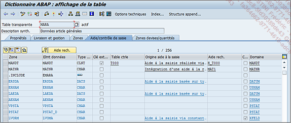
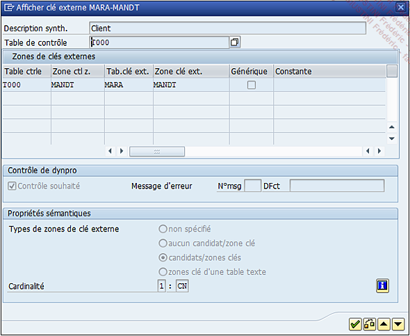
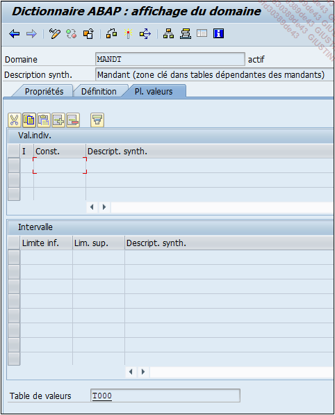
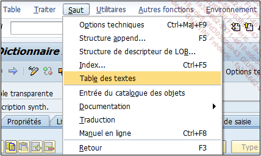
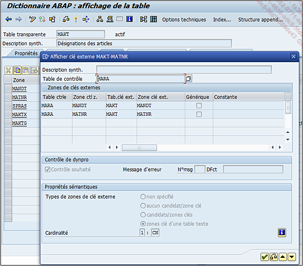

# **TABLES - AIDE/CONTROLE DE SAISIE**

`Aide/contrôle de saisie` est le quatrième onglet et rassemble les informations nécessaires au contrôle des enregistrements insérés.

Il est à son tour composé d’une barre d’outils mais sans grande nouveauté. Il va lister les zones de la [TABLE](./01_Tables.md) avec les informations suivantes :

- `Zone - Elément de données - Type de données` comme indiqué dans l’onglet Zones.

- `Clé externe` indique si la zone est liée à une `table de contrôle` définie dans un domaine. Dans l’exemple de la [TABLE](./01_Tables.md) `MARA`, le champ du [MANDANT](../03_Programmation/01_Mandant.md) (`MANDT`) fait appel à la [TABLE](./01_Tables.md) `T000` pour vérifier ces valeurs. Concernant le numéro d’article (`MATNR`), cette indication n’est pas renseignée, ce qui paraît logique car l’élément de données `MATNR` utilise le domaine `MATNR` ayant `MARA` pour `TABLES DE VALEURS`. L’utiliser comme `clé externe` créerait une référence cyclique provoquant ainsi une erreur à chaque création d’un numéro d’article et rendant donc cette étape impossible. Mais par sécurité, **SAP** sait repérer ce genre de cas et ne permet pas de les sauvegarder.

      Il serait intéressant cependant de voir le détail de la clé externe. Il suffit de sélectionner le champ (par exemple MANDT) puis de cliquer sur le bouton de la clé. Une nouvelle fenêtre s’ouvre avec les informations suivantes :

  

- `Description synthétique de la clé`.

- `Table de contrôle` correspondant à la `TABLE DE VALEURS` définie dans le domaine (ici, il s’agit de `T000`), automatiquement importée par **SAP**.

  

- La `liste des champs utilisés dans la table de contrôle`, là encore, **SAP** importe automatiquement les champs qui sont en règle générale les `clés` de la `table de contrôle`, il faudra s’assurer alors de toutes les renseigner.

- `Contrôle souhaité` (par défaut cette option est cochée) permettant ainsi que ce champ soit vérifié dans les [DYNPROS]() (écran spécifique à un programme).

- `Message d’erreur` - **SAP** en utilise un par défaut mais il est aussi possible d’en attribuer un autre. Il est composé d’un numéro (`N°msg`) et d’une classe de message (`DFct`) et est géré via la [TRANSACTION `SE91`]().

- `Types de zones de clé externe` est une information sur sa caractéristique. Elle peut être :

  - `non spécifié` (par défaut).

  - `aucun candidat/zone clé` signifie que le champ de la _table_ n’est pas défini en tant que `clé` mais qu’elle en est une de la `table de contrôle`.

  - `candidats/zones clés` signifie que le champ de la _table_ est défini en tant que `clé` et qu’elle l’est également dans la `table de contrôle`.

Pour ces deux dernières options, un exemple serait de prendre la [TABLE](./01_Tables.md) `BKPF` (En-tête des documents comptables). Tous les champs clés ont une `clé externe` définie comme `candidats/zones clés`, et les autres en ont une définie comme `aucun candidat/zone clé`.

- `zones clé d’une table texte.` Certaines [TABLES](./01_Tables.md) ont des tables textes associées, comme par exemple `MARA` associée à `MAKT`. Pour y accéder, il est possible d’utiliser la [TRANSACTION `SE11`]() (Table base de données puis `MAKT`) ou de passer par l’écran de gestion du dictionnaire `ABAP` de `MARA`, en utilisant le menu Saut - Table des textes.

  

  La `clé externe` du champ `MATNR` sera sur la `table de contrôle` `MARA` mais comme `zone clé` d’une table texte.

  

- `Cardinalité` définit le nombre d’occurrences entre le champ de la [TABLE](./01_Tables.md) et celui de la `clé externe`, basé sur un rapport `n : m`, `n` représentant le nombre d’occurrences de la `table contrôlée` et `m` celui de la `table de contrôle`. Ainsi, n peut prendre comme valeur :

  - `1` - Pour une et une seule occurrence de la `table contrôlée` (s’applique généralement pour les `zones clés` de la [TABLE](./01_Tables.md)).

  - `C` - Pour une occurrence possible de la [TABLE](./01_Tables.md) (s’applique généralement pour les zones non clés de la [TABLE](./01_Tables.md)). Quant à `m`, il peut avoir les valeurs suivantes :

    - `1` - il existe une et une seule occurrence dans la `table de contrôle`.

    - `C` - il ne doit pas y avoir plus d’une occurrence dans la `table de contrôle`.

    - `N` - il doit y avoir au moins une occurrence dans la `table de contrôle`.

    - `CN` - il n’y a pas de limite, autant d’occurrences sont possibles.

- De retour à l’onglet `Aide/contrôle de saisie`, les caractéristiques se poursuivent avec [TABLE](./01_Tables.md) `ctrle` indiquant donc la [TABLE](./01_Tables.md) de référence pour vérification des données.

- `Origine` aide à la saisie en décrit sa provenance si bien sûr elle existe.

- L’`Aide recherche` est renseignée s’il en existe une dans la `table de contrôle`. Comme cette dernière information n’est pas informée pour le champ `MATNR` alors l’aide à la recherche a été associée manuellement via le bouton correspondant de la barre d’outils de l’onglet.

- `Constantes` indique si la plage de valeurs du [DOMAINE](../08_SE11/02_Domaines.md) a été définie par des constantes. Il est possible de voir un exemple toujours dans la [TABLE](./01_Tables.md) `MARA`, avec le champ `AEKLK` (un clic sur le bouton avec l’icône des jumelles, de la barre de commande tout en haut de l’écran permet de faire une recherche sur ce champ). Cette information est visible en double cliquant sur le [DOMAINE](../08_SE11/02_Domaines.md) associé au champ puis onglet Pl. valeurs, section Val. Indiv..

- `Domaine` renseigne le domaine lié à la zone.
