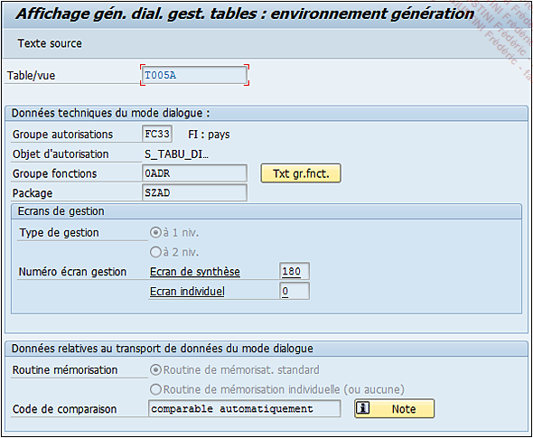
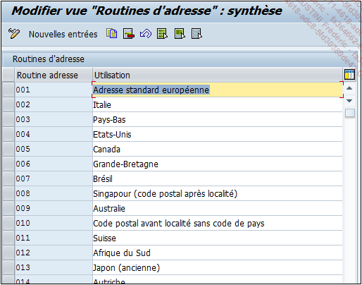
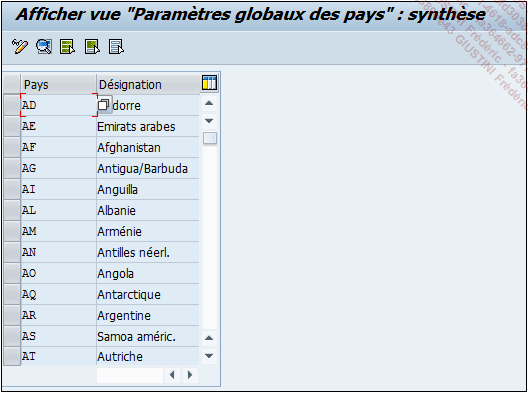
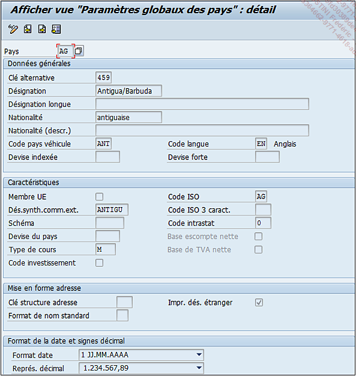

# **GESTION DE TABLE**

Une [TABLE](./01_Tables.md) peut avoir pour but d’afficher uniquement des données mais elle peut permettre aussi de les modifier (comme indiqué avec l’option `Gestion Data Browser/vue table` de l’onglet `Livraison et gestion`).

Par exemple, la [TABLE](./01_Tables.md) `T005A` (routine d’adresse) ayant une gestion des données définie à `Affichage/gestion autorisés`, est associée à des écrans permettant de modifier les données. Il est possible d’en voir le détail en utilisant la fonction du menu déroulant suivante :

`Utilitaires - Générateur de gestion de table`

_L’écran suivant s’affiche :_

La `barre d’outils` se compose d’un seul bouton `Texte source` mais il ne sera pas traité dans ce chapitre. Ensuite se trouvent les options suivantes :

- `Groupe autorisations` : sécurise l’accès et la gestion de la [TABLE](./01_Tables.md), bien qu’elle soit définie comme affichage et gestion autorisés, elle est cependant limitée aux _utilisateurs_ possédant ces _autorisations_. Pour information, si l’_utilisateur_ ne les possède pas, il doit en faire la demande. Pour des [TABLES](./01_Tables.md) spécifiques, le groupe utilisé est souvent `&NC&` (sans _groupe d’autorisation_).

- `Objet d’autorisation` est donc l’objet associé au _groupe d’autorisation_.

- `Groupe fonctions` est un objet technique regroupant plusieurs autres objets techniques tels que des [INCLUDES](./02_Tables_Include.md), des [MODULES FONCTION](../13_Fonctions/01_Type.md)... et notamment les écrans de gestion de la [TABLE](./01_Tables.md). Au cours du chapitre Les fonctions, la notion de [GROUPE DE FONCTIONS](../13_Fonctions/01_Type.md) sera développée.

- Le bouton associé, `Txt gr.fnct.` affichera les détails du [GROUPE DE FONCTIONS](../13_Fonctions/01_Type.md) et permettra également de naviguer pour en voir le détail.

- `Package` ou `classe de développement`, comme nous l’avons vu dans le chapitre de création de programme (cf. chapitre [03_PROGRAMMATION](../03_Programmation/04_Hello_World.md)).

- `Type de gestion` : définit le nombre de niveaux (un seul ou deux uniquement) nécessaires pour la gestion des données. Cette information est associée au numéro d’écran :

  - Un `niveau de gestion` : uniquement l’écran de synthèse.

  - `Deux niveaux` : l’écran de synthèse et l’écran individuel doivent être renseignés.

En fin de section, un exemple plus concret concernant le type de gestion sera développé.

- `Numéro écran de gestion` : il s’agit simplement d’attribuer un numéro d’écran au choix. Si ce numéro est déjà pris, **SAP** en informera le développeur. Il est également possible que **SAP** affecte automatiquement ce numéro (voir la partie suivante sur la création d’une [TABLE](./01_Tables.md)).

- `Routine mémorisation` peut être :

  - Une `routine de mémorisation standard`, définie par **SAP**.

  - Une `routine de mémorisation individuelle` (ou aucune). Cette dernière est définie par un ou des événements contenant une `routine` (traitement spécifique), et qui définira le comportement de l’enregistrement des modifications. Dans ce cas-ci, cette ou ces `routines` sont les composants principaux et si elle(s) n’existe(nt) pas, alors les données ne seront pas sauvegardées.

- `Code de comparaison` est un identifiant permettant de modifier le comportement de contrôle des données à enregistrer.

Pour utiliser un écran de gestion, il suffit d’exécuter la [TRANSACTION `SM30`]() dans la barre de commande, de renseigner le nom de la [TABLE](./01_Tables.md) dans la zone appropriée (Table/vue) et de cliquer sur le bouton `Afficher` ou `Gérer` (pour créer, modifier ou supprimer les enregistrements contenus dans la [TABLE](./01_Tables.md)) :

Le `premier niveau d’écran` apparaît. Il s’agit de l’écran de synthèse comme défini dans le type de gestion.

Il a été vu également qu’une gestion pouvait contenir deux niveaux : un écran de synthèse et un écran individuel. Un exemple pour illustrer ce cas avec la `V_T005` (de nouveau exécution de la [TRANSACTION `SM30`](), puis le bouton `Afficher` après avoir renseigné la zone `Table/vue`). Comme vu précédemment, la gestion de la [TABLE](./01_Tables.md) s’ouvre automatiquement sur le premier niveau (écran de synthèse).

En double cliquant sur n’importe quel enregistrement, le `deuxième niveau` apparaît (écran individuel) avec beaucoup plus de détails et une meilleure mise en forme.

La gestion des données sur `deux niveaux` s’adresse principalement aux [TABLES](./01_Tables.md) ayant beaucoup de zones, facilitant ainsi la lecture et donc la maintenance des données.
