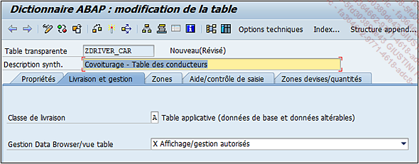
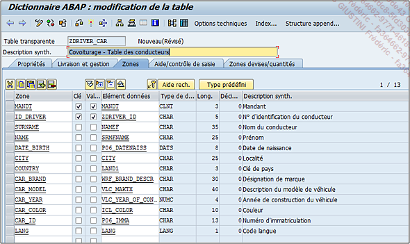
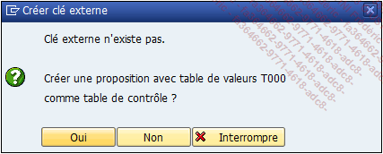
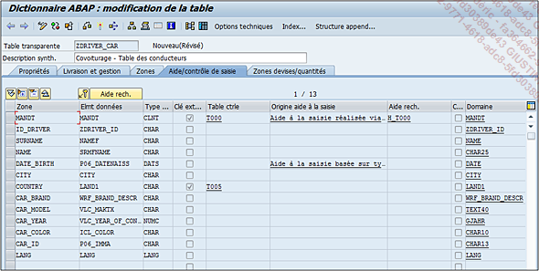
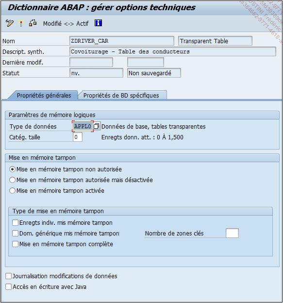
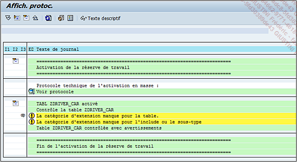
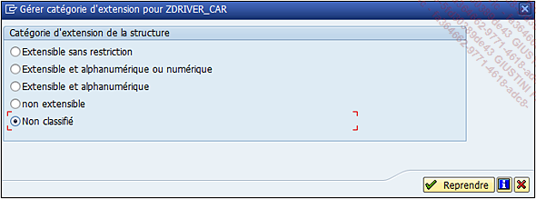
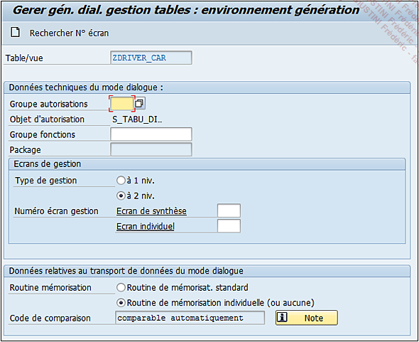

# **CREATION DE TABLE**

Afin de compléter ce chapitre, il serait intéressant de voir comment créer une [TABLE](./01_Tables.md). Elle listera la liste des conducteurs d’un système de covoiturage. Pour ceci, les étapes suivantes sont nécessaires :

- Exécuter la [TRANSACTION `SE11`]().

- Sélectionner l’option `Table base données`, puis insérer le nom `ZDRIVER_CAR`.

- Insérer une `description` comme `Covoiturage` - [TABLE](./01_Tables.md) des conducteurs.

- Dans l’onglet `Livraison et gestion`, utilisez la `classe A` pour la première, puis `Affichage/gestion` autorisés comme gestion des données.

Dans la partie Zones, les champs suivants seront insérés :

| `Zone`     | `Clé` | `Val.` | `Elément de données`     |
| ---------- | ----- | ------ | ------------------------ |
| MANDT      | X     | X      | MANDT                    |
| ID_DRIVER  | X     | X      | ZDRIVER_ID               |
| SURNAME    |       |        | NAMEF                    |
| NAME       |       |        | SRMFNAME                 |
| DATE_BIRTH |       |        | P06_DATENAISS            |
| CITY       |       |        | CITY                     |
| REGION     |       |        | REGIO                    |
| COUNTRY    |       |        | LAND1                    |
| CAR_BRAND  |       |        | WRF_BRAND_DESCR          |
| CAR_MODEL  |       |        | VLC_MAKTX                |
| CAR_YEAR   |       |        | VLC_YEAR_OF_CONSTRUCTION |
| CAR_COLOR  |       |        | ICL_COLOR                |
| CAR_ID     |       |        | P06_IMMA                 |
| LANG       |       |        | LANG                     |

Il va falloir maintenant s’occuper des `clés externes` à commencer par la zone `MANDT`. Il suffit pour cela de sélectionner la ligne puis de cliquer sur le bouton `Clé externe`. À l’invite de confirmation, cliquez sur `Oui`.

Automatiquement, **SAP** génère la `Clé externe` avec la [TABLE](./01_Tables.md) de contrôle `T000`. Renseignez le `type de zone de Clé externe` comme candidats/zones clés, puis une cardinalité à `1:CN`. Faites de même avec le champ suivant :

| `Table de contrôle` | `Types de zones de clé externe` | `Cardinalité` |
| ------------------- | ------------------------------- | ------------- |
| LAND1               | Aucun candidat/zone clé         | 1:CN          |

-> Vérifiez les [TABLES](./01_Tables.md) de contrôle dans l’onglet `Aide/contrôle de saisie` qui devra ressembler à ceci :

- Aucune information à renseigner dans l’onglet `Zones devises/quantités` étant donné qu’il n’y a aucune unité de mesure nécessaire.

- `Sauvegarder` la [TABLE](./01_Tables.md) (la définir comme `objet local`), puis cliquer sur `Options techniques`. Comme il s’agit d’une petite [TABLE](./01_Tables.md), elle sera de type `APPL0` et catégorie de `taille 0`. Les autres resteront comme prédéfinies par défaut. `Sauvegarder` et cliquer sur la `flèche verte` de retour arrière pour revenir à l’écran précédent.

- De retour à l’écran initial de la gestion du `dictionnaire ABAP`, `activer` la [TABLE](./01_Tables.md).

- Il se peut qu’un message de `warning` (avertissement) apparaisse. Il est possible d’afficher le protocole d’activation pour voir une description détaillée.

Il est indiqué que la `catégorie d’extension` est manquante pour la [TABLE](./01_Tables.md). Elle n’est pas obligatoire mais recommandée car elle définit le type de champs qui composeront la table (extension de la [TABLE](./01_Tables.md) doit être compris par ajout de champs dans la [TABLE](./01_Tables.md) directement ou grâce à un [APPEND](./03_Tables_Append.md) dans le cas de [TABLES](./01_Tables.md) standards).

L’`extension de table` s’applique également pour les `structures`.

Cette fonctionnalité se situe dans le menu déroulant `Autres fonctions` - `Catégorie d’extension`... et peut prendre les valeurs suivantes :

- `Extensible sans restriction` : pas de règle pour l’extension de la [TABLE](./01_Tables.md) ou de la [STRUCTURE](../09_Tables_DB/11_Structures.md).

- `Extensible et alphanumérique ou numérique` : tous les champs devront être soit `alphanumériques`, soit `numériques`. La différence avec `Extensible sans restriction` est qu’il ne sera pas possible d’ajouter des champs de type date ou heure (par exemple) dans un [APPEND](./03_Tables_Append.md) ou un [INCLUDE](./02_Tables_Include.md).

- `Extensible et alphanumérique` : la [TABLE](./01_Tables.md) ou la [STRUCTURE](../09_Tables_DB/11_Structures.md) ne sera composée que de champs `alphanumériques` et une erreur sera retournée si un champ est défini comme `numérique` (il sera alors possible de modifier le type d’extension).

- `Non extensible` : il sera possible d’ajouter un champ directement à la [TABLE](./01_Tables.md) ou la [STRUCTURE](../09_Tables_DB/11_Structures.md) initiale, mais impossible via un [APPEND](./03_Tables_Append.md). Ainsi, comme l’[APPEND](./03_Tables_Append.md) est l’unique moyen d’ajouter un champ à une [TABLE](./01_Tables.md) standard, il n’y aura aucune possibilité pour accomplir cette tâche.

- `Non classifié` (par défaut), aucune extension n’a été définie pour la [TABLE](./01_Tables.md) ou la [STRUCTURE](../09_Tables_DB/11_Structures.md).

Dans la [TABLE](./01_Tables.md) `ZDRIVER_CAR`, il n’y aura pas besoin de restriction, l’option `Extensible sans restriction` sera donc choisie.

- `Activer` de nouveau, le message d’avertissement n’apparaît plus et la [TABLE](./01_Tables.md) est maintenant créée.

- Comme cette [TABLE](./01_Tables.md) doit être gérée via la [TRANSACTION `SM30`](), exécutez le `générateur de gestion de table` dans le menu `Utilitaires` - `Générateur de gestion de table` puis renseignez les champs de cette façon :

  - `Groupe autorisations` : &NC&

  - `Groupe fonctions` : ZCAR

  - `Type de gestion` : à 1 niv

- Il existe deux possibilités pour définir l’`écran de synthèse` ; le mettre à `1` (comme le [GROUPE DE FONCTIONS](../13_Fonctions/01_Type.md) est nouveau), ou cliquer sur le bouton `Rechercher N° écran` pour que **SAP** lui en attribue un automatiquement.

  

- Cliquer ensuite sur l’option `Créer de la barre d’outils` () ou via le menu déroulant suivant : `Objets générés` - `Créer [F6]`
- La gestion des écrans étant indépendante de la définition de [TABLE](./01_Tables.md), le `package` devra être renseigné ainsi qu’un autre (package) pour le [GROUPE DE FONCTIONS](../13_Fonctions/01_Type.md). Pour plus de facilité, l’option `Objet local` sera de nouveau choisie.

Il arrive que des [TABLES](./01_Tables.md) aient une `classe de développement` définie mais des écrans de gestion en local. Il s’agit souvent de [TABLES](./01_Tables.md) de `customizing` pour les `données de référence`, ne pouvant être mises à jour que sur le système de développement.

La table `ZDRIVER_CAR` est maintenant créée avec une gestion des écrans. Des tests peuvent être exécutés avec la [TRANSACTION `SM30`]() pour insérer des données et vérifier que les [TABLE](./01_Tables.md) de contrôle fonctionnent.
