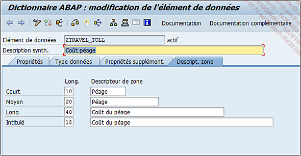
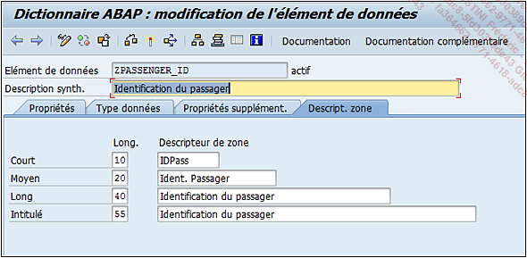
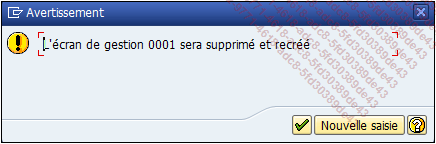
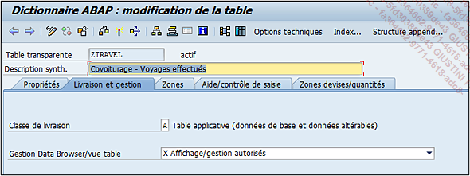

# **DDIC SUPPLEMENTAIRES**

Pour la suite, trois autres [TABLES](./01_Tables.md) sont créées pour former ainsi une sorte de petit projet que l’on pourra malmener à souhait sans risquer d’impacter d’autres objets techniques.

## Eléments de données

Deux [ELEMENTS DE DONNEES](../08_SE11/07_Elements_de_Donnees.md) seront créés en suivant les étapes ci-dessous :

- Exécuter la [TRANSACTION `SE11`]()

- Dans l'écran initial du gestionnaire du [DDIC](../08_SE11/01_SE11.md), cocher l'option `Type de données` et renseigner la zone avec le nom de l'élément de données.

- Cliquer sur `Créer`

- Dans la fenêtre pop-up, cocher l'option `Element de données` puis valider.

  - `ZTRAVEL_TOLL`

Cet [ELEMENT DE DONNEES](../08_SE11/07_Elements_de_Donnees.md) devra ressembler à ceci une fois activé (seuls les onglets `Type de données` et `Descript. Zone` sont renseignés) :

- `ZPASSENGER_ID`

  Cet [ELEMENT DE DONNEES](../08_SE11/07_Elements_de_Donnees.md) devra ressembler à ceci une fois activé (seuls les onglets `Type données` et `Descript. zone` sont renseignés) :

  

  

  Tous les autres éléments de données utilisés seront standards.

## Tables

Comme indiqué, trois nouvelles tables sont à créer. Pour rappel, les étapes suivantes devront être exécutées :

Un seul [ELEMENT DE DONNEES](../08_SE11/07_Elements_de_Donnees.md) sera créé en suivant les étapes suivantes :

- Exécuter la [TRANSACTION `SE11`]()

- Dans l'écran initial du gestionnaire du [DDIC](../08_SE11/01_SE11.md), cocher l'option `Table base de données` et renseigner la zone avec le nom de la [TABLE](./01_Tables.md).

- Cliquer sur `Créer`

Une petite aide est proposée dans le fichier [DDIC.xlsx](../ressources/DDIC.xlsx) pour la construction des [TABLES](./01_Tables.md).

### Table ZCAR_BRAND_MOD

_Zone de la table_

| **Zone**     | **Clé** | **Val.** | **Elément de données**   |
| ------------ | :-----: | :------: | ------------------------ |
| `MANDT`      |    X    |    X     | MANDT                    |
| `BRAND`      |    X    |    X     | WRF_BRAND_DESCR          |
| `MODEL`      |    X    |    X     | VLC_MAKTX                |
| `MODEL_YEAR` |    X    |    X     | VLC_YEAR_OF_CONSTRUCTION |

#### Livraison et gestion

#### Zones

#### Aide/contrôle de saisie

#### Zones devises/quantités (pas de changement)

Maintenant que la [TABLE](./01_Tables.md) des véhicules a été créée, il serait intéressant de contrôler si le véhicule existe losque les enregistrement de la [TABLE](./01_Tables.md) `ZDRIVER_CAR` sont édités.

- Pour ce faire, retourner dans la [TABLE](./01_Tables.md) `ZDRIVER_CAR` en mode `modification`.

- Sélectionner la ligne de la zone `CAR_BRAND` et cliquer sur `Clés externes`.

- La fenêtre n'importe pas automatiquement la `table de contrôle`, il va donc falloir la renseigner dans le champ approprié puis cliquer sur le bouton `Générer proposition`.

- Comme il y a trois zones clés dans la [TABLE](./01_Tables.md) `ZCAR_BRAND_MOD`, elles seront donc importées et renseignées avec les champs de la [TABLE](./01_Tables.md) `ZDRIVER_CAR`.

  

- Enfin, les `Propriétés sémantiques` seront renseignées de la façon suivante :

  

- Activer

- Cette table ayant une gestion via la [TRANSACTION `SM30`](), il faudra l'actualiser avec les nouvelles informations. Pour ceci, aller dans le menu `Utilitaires - Générateur de gestion de table`.

- Cliquer sur `Modifier` (bouton avec l'icône du crayon dans la barre d'outils).

- Une liste de choix apparaît dans une fenêtre pop-up et comme il n'y a pas eu de modification ou suppression de zone, seules ces options seront à cocher.

  

- Dans la nouvelle fenêtre pop-up, cocher `Ecran de synthèse`.

  

  Et à l'avertissement de la suppresion de l'écran `0001`, cliquer sur `valider`.

  

La gestion de table est maintenant à jour.

### Table ZPASSENGER

_Zones de la table :_

| **Zone**       | **Clé** | **Val.** | **Elément de données** |
| -------------- | :-----: | :------: | ---------------------- |
| `MANDT`        |    X    |    X     | MANDT                  |
| `ID_PASSENGER` |    X    |    X     | ZPASSENGER_ID          |
| `SURNAME`      |    X    |    X     | S_PASSNAME             |
| `NAME`         |    X    |    X     | S_PASSNAME1            |
| `DATE_BIRTH`   |         |          | P06_DATENAISS          |
| `CITY`         |         |          | CITY                   |
| `COUNTRY`      |         |          | LAND1                  |
| `LANG`         |         |          | LANG                   |

#### Livraison et gestion

#### Zones

#### Aide/contrôle de saisie

#### Zones devises/quantités (pas de changement)

Là aussi, comme pour la [TABLE](./01_Tables.md) `ZDRIVER_CAR`, il serait utile de créer une gestion de [TABLE](./01_Tables.md) avec les caractéristiques suivantes :

### Table ZTRAVEL

_Zones de la table :_

| **ZONE**        | **CLE** | **VAL.** | **ELEMENTS DE DONNEES** |
| --------------- | :-----: | :------: | ----------------------- |
| `MANDT`         |    X    |    X     | MANDT                   |
| `DATE_TRAVEL`   |    X    |    X     | LEAVE_DATE              |
| `HOUR_TRAVEL`   |    X    |    X     | S_DEP_TIME              |
| `ID_DRIVER`     |    X    |    X     | Z_DRIVER_ID             |
| `ID_PASSENGER1` |         |          | ZPASSENGER_ID           |
| `ID_PASSENGER2` |         |          | ZPASSENGER_ID           |
| `ID_PASSENGER3` |         |          | ZPASSENGER_ID           |
| `CITY_FROM`     |         |          | S_FROM_CIT              |
| `COUNTRY_FROM`  |         |          | FPM_CTRYFR              |
| `CITY_TO`       |         |          | S_TO_CITY               |
| `COUNTRY_TO`    |         |          | FPM_CTRYTO              |
| `KMS`           |         |          | ICL_MILEAGE             |
| `KMS_UNIT`      |         |          | ICL_MILEAGEUNIT         |
| `DURATION`      |         |          | N1DAUER                 |
| `TOLL`          |         |          | ZTRAVEL_TOLL            |
| `GAZOL`         |         |          | RKESKWFULK              |
| `UNIT`          |         |          | WAERS                   |

#### Livraison et gestion

#### Zones

#### Aide/contrôle de saisie

Clé externe pour la zone `ID_DRIVER` :

Clé externe pour les zones `ID_PASSENGER1`, `ID_PASSENGER2` et `ID_PASSENGER3` :

#### Zones devises/quantités

