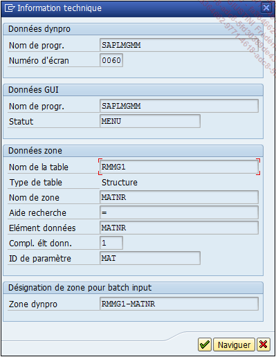
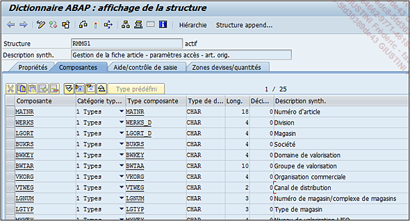
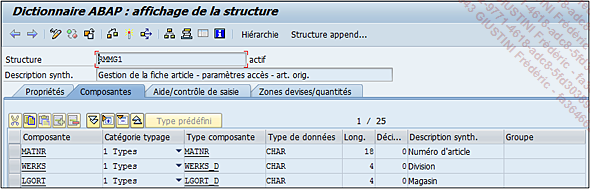

# **STRUCTURES**

Les `structures` se composent de la même manière que les [TABLES](./01_Tables.md) à quelques détails près par exemple :

- les `structures` ne contiennent pas de données

- Les `structures` n’auront pas de gestion d’écrans

Ce qui induit qu’il n’y a pas de type de structure (`Applicative`, `Customizing`)...

Pour reprendre l’exemple développé dans la section `Aide à la recherche`, il a été vu comment obtenir les informations techniques d’un champ d’un écran utilisé par une transaction.

    Pour rappel :

    1. Exécuter la transaction MM03

    2. Cliquer sur la zone intitulée Article

    3. Appuyer sur la touche [F1] ou clic droit puis Aide

    4. Dans la fenêtre d'aide, cliquer sur l'icône du marteau et de la clé à molette

    5. Une nouvelle fenêtre apparaît avec les informations techniques du champ.

Dans la partie sur les données de la zone est indiqué le nom d'une `structure`. Par un double-clic, le détail de celle-ci s'affiche.

Tout d'abord, la barre d'outils ne présente pas de grandes différences avec ce qui a été vu à part deux nouvelles fonctionnalités :

- `Hiérarchie` affiche de manière plus graphique la `structure`, ce qui est pratique lorsqu'elle est constituée d'[INCLUDE](./02_Tables_Include.md) et d'[APPEND](./03_Tables_Append.md). `[Autres fonctions] - [Hiérarchie]` ou `[ctrl][shift][F12]`

- `Structure Append...` permet d'ajouter un append de `structure` comme nous l'avons vu dans la section précédente concernant les [TABLES](./01_Tables.md) de base de données. `[Saut] - [Structure Append...]` ou `[F5]`

L'écran de gestion des `structures` est composé de quatre onglets avec comme d'habitude :

- `Propriétés` : regroupant les mêmes informations que celles vues précédemment

- `Composantes` : regroupe tous les champs de la `structure` (l'équivalent à l'onglet `Zones` pour les [TABLES](./01_Tables.md)). Il y a là aussi une barre mais dont les fonctionnalités sont identiques à celles de la [TABLES](./01_Tables.md) de la base de données.

Sous cette barre d'outils se trouve donc la liste des champs de la `structure`. Elle est composée :

- `Composante` (ou `nom`)

- `Catégorie Typage`

- `Type de la composante` qui est l'élément de données utilisé remplissant ainsi automatiquement les chalos `Type de données`

- `Type de données`

- `Longueur du champ`

- `Décimales`

- `Description synthétique` (sauf en cas de `Type prédéfini`)

- `Groupe` qui est spécifique aux [INCLUDES](./02_Tables_Include.md) et permet de leur attribuer un groupe

La `catégorie de typage` est une classification des types de référence. On en compte trois pour les champs d’une `structure` :

1. `Types` fait référence directement aux `type`, `longueur` et `décimales` si renseignés, d’un élément de données composé d’un `domaine`.

2. `Réf. type` à, quant à lui, se réfère au type de référence défini dans l’élément de données (cf. section Éléments de données) ou alors directement à une [CLASSE](../14_Classes/README.md) ou une _interface_ (cf. chapitre [15_CLASSES]()).

3. `Types... boxed` est la même chose que `Types` sauf que la zone aura une mémoire du système allouée seulement lors d’un changement de sa valeur, au contraire d’un champ `Types` qui lui, aura une mémoire allouée dès le début du traitement. Ce type est utilisé pour des champs d’une `structure` qui sont peu ou ne seront pas utilisés dans le programme, réduisant ainsi l’allocation mémoire lors du traitement et améliorant indirectement son optimisation.

Enfin les deux derniers onglets sont encore une fois identiques à ceux de la [TABLE](./01_Tables.md) de la base de données. Pour plus de détails, se référer au chapitre en question.
