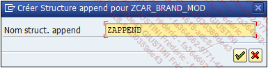
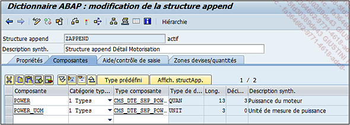
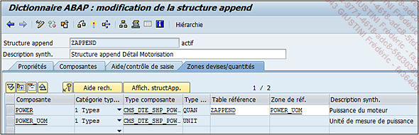
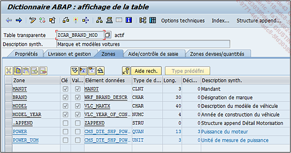
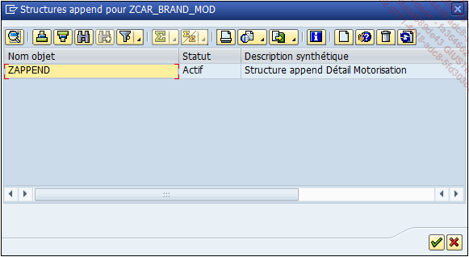

# **STRUCTURE - CREATION D'UN APPEND**

Au lieu de voir comment créer une [STRUCTURE](./11_Structures.md), il serait mieux d’étudier la création d’un [APPEND](./03_Tables_Append.md) de structure dans une [TABLE](./01_Tables.md) combinant ainsi les deux éléments.

Pour cela, la [TABLE](./01_Tables.md) `ZCAR_BRAND_MOD`, créée à la section [DDIC](./10_Tables_DDIC.md), sera utilisée. Un [APPEND](./03_Tables_Append.md) de structure lui sera associé et contiendra deux champs supplémentaires : un sur la puissance du moteur et un autre sur l’unité de mesure de la puissance.

- Exécuter la [TRANSACTION SE11](../22_Transactions/TCODE_SE11.md).

- Cocher l’option [TABLE](./01_Tables.md) base de données, renseigner `ZCAR_BRAND_MOD` et cliquer sur le bouton `Afficher ou Modifier` (le choix n’a pas d’importance dans ce cas).

- Cliquer sur le bouton `Structure Append`.

- Une fenêtre pop-up va apparaître afin d’indiquer le nom de la `Structure Append` comme par exemple `ZAPPEND`.

  

- L’écran de création d’une [STRUCTURE](./11_Structures.md) va alors apparaître. Indiquer une description brève (`Structure append Détail Motorisation` par exemple).

- Dans l’onglet Composantes, insérer les champs suivants en respectant les informations données :

  | **Composante** | **Catégorie typage** | **Type composante**   |
  | -------------- | -------------------- | --------------------- |
  | `POWER`        | Types                | CMS_DTE_SHP_POWER     |
  | `POWER_UOM`    | Types                | CMS_DTE_SHP_POWER_UOM |

  

- Dans l'onglet `Zones devises/quantités`, indiquer la [TABLE](./01_Tables.md) et la zone de référence du champ `POWER`.

  

- Indiquer une extension avec le menu `[Autres fonctions]` - `[Catégorie d’extension...]` (la définir en `Extensible sans restriction` par exemple).

- `Sauvegarder` puis `activer`.

- Revenir à la gestion de la [TABLE](./01_Tables.md) (via la touche raccourci-clavier `[F3]` ou le bouton vert de retour arrière de la barre de commande).

- De retour à la [TABLE](./01_Tables.md) `ZCAR_BRAND_MOD`, l’[APPEND](./03_Tables_Append.md) apparaît bien en fin de liste, et en utilisant la fonction `Développer tout`, le champ de l’[APPEND](./03_Tables_Append.md) apparaît.

  

  Cliquer à nouveau sur le bouton `Structure Append` pour faire apparaître tous ceux créés pour la [TABLE](./01_Tables.md).

  

Dans la barre d'outils, deux fonctionnalités sont à connnaître :

- L'icône représentant une feuille blancge pour créer une `Structure d'Append`

- L'icône de la poubelle pour la supprimer
